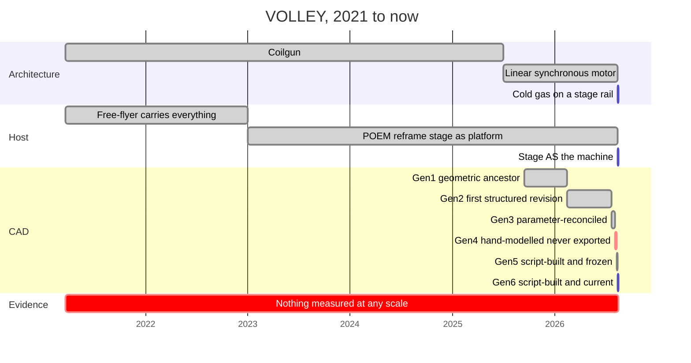
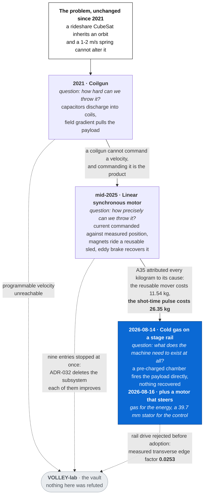
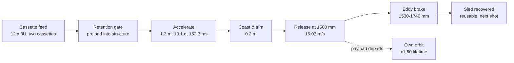
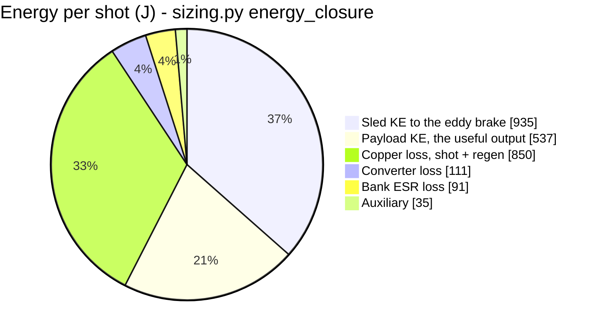
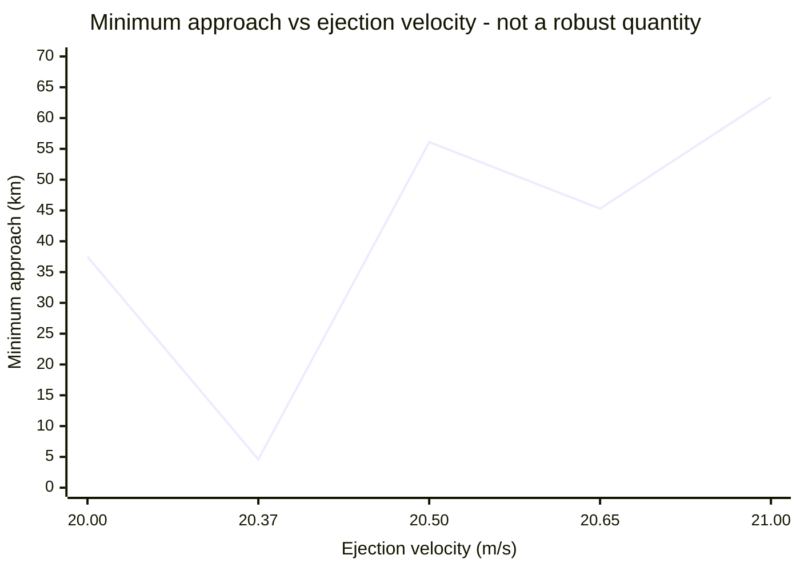

# VOLLEY

**An electromagnetic deployer that gives a rideshare CubeSat an orbit its host was not going to.**

<p align="center">
  
</p>

[](LICENSE)
[](requirements.txt)
[](OPEN_PROBLEMS.md)
[](docs/PROVENANCE.md)

Secondary payloads inherit the orbit of whoever paid for the launch. The spring that ejects them
gives 1–2 m/s — enough to clear the stage, not enough to change where they end up. Ninety-two
percent of CubeSats carry no propulsion, so that is where they stay.

VOLLEY replaces the spring with a linear motor and a magazine. Twelve satellites, one at a time,
each at a velocity commanded for it. **The satellite is never modified** — no armature, no
plating, no electrical interface.

**This repository is the engineering record, not a brochure.** Every analysis declares what would
count as failure *before* it runs, every defect is numbered including the ones that damage the
work's own claims, and nothing here has been built, fired or measured.

| | |
|---|---|
| **[What it is, and why](docs/CONCEPT.md)** | The idea, before the machine |
| **[Where it stands](docs/STATE_OF_THE_PROJECT.md)** | Open decisions, crossed thresholds, what would settle each |
| **[What could kill it](docs/KILL_CRITERIA.md)** | Seven thresholds, three of them crossed |
| **[The defect register](OPEN_PROBLEMS.md)** | 116 numbered entries, 48 live |
| **[One page](SUMMARY.md)** | If you only read one file |
| **[Repository descriptions](docs/REPO_METADATA.md)** | The About text, which lives outside git and must be applied by hand |

---

## Status

> ## The design is frozen at Gen5, and the record is closed on it
>
> *(Closed 2026-08-13 as "Phase I". The two-phase model was retired the same day —
> [ADR-031](docs/adr/031-four-repositories-not-two-phases.md) — and the programme is now
> described by the four repositories and their roles.)*
>
> **The design is frozen at Gen5.** Categories A, B and C of
> [`docs/PHASE_I_CLOSURE.md`](docs/PHASE_I_CLOSURE.md) are closed; **E4 — nothing built, fired or
> measured at any scale — stays open**, along with the items that need hardware, a vendor
> quotation or a host data exchange. **Three kill criteria remain crossed at the 3U design
> point** and are stated rather than solved. *(Two of the three are deleted rather than solved by
> ADR-032 below — a weaker kind of good news, and it is recorded that way.)*
>
> **The last four deferred decisions were taken together** in
> [ADR-030](docs/adr/030-apply-the-depth-resolved-thrust-constant.md), and **every headline number
> moved the wrong way**: K_t 11.03 → **10.54 N per kA/m**, exit velocity 16.388 → **16.029 m/s**,
> efficiency 21.0 → **18.8 %**, deployer mass per 3U satellite 6.378 → **10.547 kg**. Nothing
> improved. That is what the corrections cost.
>
> **The design target moved on 2026-08-14, and Gen5 stays the measured baseline.**
> [ADR-032](docs/adr/032-gen6-stage-integrated-gas-store.md): **Gen6 is the payload accelerated
> directly, by cold gas, along a rail a spent upper stage provides.** No mover, no pulse-power
> chain, no brake, no return stroke. **29.75 kg is deleted, 43.33 kg becomes stage structure,
> 11.45 kg of containment and about 3 kg of store remain.**
>
> Five runs built it and none set out to: **A35** attributed every kilogram to the requirement
> causing it and found **49.23 kg survives every requirement deletion in all 64 corners**;
> **A36** closed the manifest route; **A37** made the stage the machine; **A38** showed tip-off
> does not bind; **A39** replaced the spring with gas at **2.98 kg**.
>
> **What it does not do.** Kill criterion 1 is **not declared met** — 1.608 kg per satellite on
> added mass against **10.547 kg on dry mass**, both reported, threshold unmoved. Nothing in Gen6
> is measured, its fluid system is unsized, its cradle mechanism does not exist, and no launch
> provider has agreed to lend a stage. **[`docs/B1_ORDER.md`](docs/B1_ORDER.md)** is still the one
> action that changes the category of evidence rather than its degree.

> **Numerical audit correction, 2026-08-03.** I corrected the winding-thickness quadrature
> and propagated the rated point to **10.54 N per kA/m, 16.029 m/s, 10.07 g, 20.99% net
> efficiency, and 65.552 N s per shot**. I also corrected A13's internal-momentum physics,
> replaced A6's fixed-shape covariance claim with a valid current-geometry slab bound,
> extended A12's stress plane, removed a 0.344 kg brake-fin double count, and corrected the
> fin thermal mass. Superseded values remain visible in their validation records and
> change log.

## Design point

| | | Source |
|---|---|---|
| Thrust constant | 10.54 N per kA/m, ±1.01 % ripple | `analysis/motor_model.py`, A1 |
| Exit velocity, 3U | **16.03 m/s at 10.1 g** | `analysis/motor_model.py` |
| Acceleration zone / track | 1.3 m / 1.5 m | `cad/parameters.json` |
| Closed-loop dispersion | 0.0274 m/s (3σ) at a 15.8 m/s setpoint | `analysis/motor_model.py` |
| **Mass, dry / loaded** | **126.6 kg / 174.6 kg** | `analysis/mass_properties.py` |
| Deployer mass per 3U satellite | **10.547 kg** | `analysis/payload_family.py` |
| **Energy drawn per shot** | **2.78 kJ gross, 2.74 kJ net of regeneration** | `analysis/motor_model.py` |
| Delivered to payload | 514 J — **18.5 % electrical-to-payload** | `analysis/motor_model.py` |
| Recoil per shot | 64.1 N·s | `analysis/astro.py` |
| Magazine | 12 × 3U, two transverse cassettes | `cad/parameters.json` |

**TRL 2–3. Nothing has been built, fired, or measured at any scale.** Fifty-three validation
run sheets exist, each against an acceptance band declared *before* the run; **three failed
outright**, several missed individual bands, and **three times a declared band caught a bug in
the analysis rather than in the design**. Read [`docs/PROVENANCE.md`](docs/PROVENANCE.md) before
citing anything here.

## Against a spring dispenser

**A rideshare CubeSat does not choose its orbit. It inherits whoever paid for the launch** — and
about ninety-two percent of catalogued nanosatellites carry no propulsion to change it. A spring
delivers 1–2 m/s, which exists to create clearance from the stage, not to change an orbit, and
its designed differential between satellites is zero. **That is not a deployment problem, it is
a distribution problem**, and it is the one axis where a spring does not compete at any price:
**deterministic orbit seeding rather than orbit inheritance**, at a velocity programmable per
satellite.

The metrics on which the two differ. Losses are in the same table as the wins.

| | Spring dispenser | VOLLEY | |
|---|---|---|---|
| Exit velocity | ~2 m/s (NRCSD-E specifies 0.5–2.5) | **16.03 m/s** | 6.4× |
| Commanded differential between satellites | **zero by design** | per shot, continuous | categorical |
| Semi-major axis change | **0 m** — a spring imparts none | **+28.8 km** | `analysis/astro.py`, A21-R |
| 30° of in-track phase | **468 s of waiting** | 468 s of waiting | **no advantage; see P56** |
| Orbital life delivered, per satellite | 1.41 yr | **2.11 yr** | 1.495× |
| Deployer mass per 3U satellite | ~6 kg, canisterised class | 10.547 kg | **1.76×, spring wins** |
| Maturity | **TRL 9** | TRL 2–3 | spring wins |
| Elements whose single failure forfeits the remaining manifest | **0** | **9 of 13** | spring wins, `docs/FMEA.md` |
| Reliability needed to match it on delivered life | — | **r ≥ 0.99326** per element per cycle, **unmeasured** | `docs/FMEA.md` |

A cold-gas module beats both on mass at 3U by 7.5× (`validation/A21_comparators.md`), and a
~1.8 kg staged spring reaches the same velocity inside the g-cap
(`validation/A27_actuator_trade.md`). **What VOLLEY sells is a fleet distributed on a schedule**
— see [`docs/CASE_STUDY.md`](docs/CASE_STUDY.md).

> **Deciding whether to use it?** **[`docs/CASE_STUDY.md`](docs/CASE_STUDY.md)** is the case for
> VOLLEY written for an operator rather than a reviewer: a worked twelve-satellite mission —
> **+60.2 % of orbital life against a spring's +8.2 %** — with the losses stated in the same voice as
> the wins, because an operator who finds the losses themselves discounts the wins too.

> **Reviewing it?** **[`docs/REVIEW_RESPONSES.md`](docs/REVIEW_RESPONSES.md)** answers
> thirty-five reviewer questions, or concedes them. **Fourteen have no answer in this repository
> at all**, and they are listed as openly as the eleven that do. Three of the answers are losses:
> a cold-gas module beats this design at 3U by 8.3×, the satellite leaves permanently magnetised,
> and a payload's magnetometer is unusable inside the deployer.

> **Judging how far along this is?** **[`docs/BUILD_READINESS.md`](docs/BUILD_READINESS.md)**
> goes subsystem by subsystem and says, for each, whether it is frozen as a design, analysed
> against a band declared before the analysis, or neither — and for everything unfinished,
> whether the answer comes from **more computation or from metal**. It names the least finished
> subsystem rather than leaving it to be found. **Nothing has been built or measured at any
> scale**, and the order that would change that costs ₹22,000 and has not been placed.

> **Building it, or modelling it?** Start at **[`CAD_BRIEF.md`](CAD_BRIEF.md)** — object,
> coordinate frame, part list and assembly order, which dimensions cannot move and which are
> free, the tolerances that matter, and **a table resolving every place where two files in this
> repository disagree**, with the side to build. Then
> [`cad/DIMENSIONS.md`](cad/DIMENSIONS.md) and [`cad/BOM.md`](cad/BOM.md), both built from
> [`cad/parameters.json`](cad/parameters.json) so they cannot drift from it.

**[Phase I closure](docs/PHASE_I_CLOSURE.md)** · **[Gen6 architecture](docs/adr/032-gen6-stage-integrated-gas-store.md)** · **[State of the project](docs/STATE_OF_THE_PROJECT.md)** · **[Figure index](docs/FIGURE_INDEX.md)** · **[The case](docs/CASE_STUDY.md)** · **[Review responses](docs/REVIEW_RESPONSES.md)** · **[Build readiness](docs/BUILD_READINESS.md)** · **[CAD brief](CAD_BRIEF.md)** · **[Dimensions](cad/DIMENSIONS.md)** · **[BOM](cad/BOM.md)** · **[The concept](docs/CONCEPT.md)** · **[One-page summary](SUMMARY.md)** · **[Frozen baseline](docs/BASELINE.md)** · **[Lineage](docs/LINEAGE.md)** · **[Generations](docs/GENERATIONS.md)** · **[Generation archive](docs/generations/README.md)** · **[Gen6 closure](docs/GEN6_CLOSURE.md)** · **[Gen4 status](docs/GEN4_STATUS.md)** · **[Roadmap](docs/ROADMAP.md)** · **[Open problems](OPEN_PROBLEMS.md)** · **[Validation](docs/VALIDATION_REPORT.md)** · **[Manufacturing](docs/MANUFACTURING.md)** · **[ADRs](docs/adr/)** · **[Literature](docs/LITERATURE.md)** · **[Research position](docs/RESEARCH_POSITION.md)** · **[Velocity ceiling](docs/VELOCITY_CEILING.md)** · **[Kill criteria](docs/KILL_CRITERIA.md)** · **[Structural gap](docs/STRUCTURAL_GAP.md)** · **[Payload classes](docs/PAYLOAD_CLASSES.md)** · **[Payload environment](docs/PAYLOAD_ENVIRONMENT.md)** · **[B-1 order](docs/B1_ORDER.md)** · **[Market](docs/MARKET.md)**

<!-- PROGRAMME-HEADER-START -->
| Repository | Role | You are here |
|---|---|---|
| **[VOLLEY](https://github.com/aaaaaaaaaaaavm/VOLLEY)** | Main: the authoritative engineering record. Improved continuously | |
| [VOLLEY-paper](https://github.com/aaaaaaaaaaaavm/VOLLEY-paper) | The concept at its most reliable, as a conference contribution. **Frozen when published** | |
| [VOLLEY-thesis](https://github.com/aaaaaaaaaaaavm/VOLLEY-thesis) | The same concept as a full submission. **Frozen when presented** | |
| [VOLLEY-lab](https://github.com/aaaaaaaaaaaavm/VOLLEY-lab) | The vault: ideas that never became a complete thing, and why each stopped | |
<!-- PROGRAMME-HEADER-END -->

Four repositories, one programme, see **[`docs/PROGRAMME.md`](docs/PROGRAMME.md)**.

## Background

Rideshare secondaries inherit the primary customer's orbit, and about 92 % of flown CubeSats
carry no propulsion to change it. An ironless double-sided Halbach linear synchronous motor
drives a reusable sled along the track; the magnets ride the sled, so the customer satellite
takes no armature, no plating and no electrical interface.

The concept is a **last-mile delivery vehicle** rather than a deployer bolted to a passive host:
a spent upper stage repositions between altitude shells on its own reaction control and fires
satellites at individually commanded velocities at each station, then deorbits.
**[`docs/CONCEPT.md`](docs/CONCEPT.md)** states it with the boundary attached — altitude and
phase are in, **plane change is not**, at 133 m/s per degree.

<table>
<tr>
<td width="50%"><a href="cad/renders/hero_open.png"></a><br><sub><b>Interior.</b> Track, stator belts, sled and cassette, enclosure open. The payload leaves along the track axis at 16.029 m/s.</sub></td>
<td width="50%"><a href="cad/renders/espa_interface.png"></a><br><sub><b>Aft mounting.</b> Ø460 mm ring flange, Ø400 mm bolt circle, 24 holes. The payload departs <b>away from</b> the flange, out the muzzle.</sub></td>
</tr>
<tr>
<td width="50%"><a href="cad/renders/track_stator.png"></a><br><sub><b>Track and stator.</b> Side elevation. Gen4 stows the sled at s = 300 mm and releases at s = 1200 mm.</sub></td>
<td width="50%"><a href="cad/renders/brake.png"></a><br><sub><b>Brake.</b> The sled is arrested by the eddy brake after the payload has gone. Gen4 brake-fin entry at s = 1222 mm.</sub></td>
</tr>
<tr>
<td width="50%"><a href="cad/renders/sled_detail.png"></a><br><sub><b>Sled.</b> Reusable, 488 mm. The magnets ride the sled and never leave the machine.</sub></td>
<td width="50%"><a href="cad/renders/magazine_feed.png"></a><br><sub><b>Down the bore.</b> Axial view along the departure axis, cassette feeding transversely into the breech.</sub></td>
</tr>
</table>

<sub>Renders are from the Gen4 Fusion model, cropped and annotated by
<a href="cad/tools/prepare_renders.py"><code>cad/tools/prepare_renders.py</code></a> from the
uncropped frames in <a href="cad/renders/source/"><code>cad/renders/source/</code></a>.
<b>Gen4 has no committed STEP export</b>, so these show geometry no file in <code>cad/step/</code>
matches — see <a href="docs/GEN4_STATUS.md">docs/GEN4_STATUS.md</a>, ADR-019 and P43.
<b>Gen4 stations are not the analysis model's</b>: Gen4 releases at s = 1200 mm where
<code>analysis/</code> assumes 1500 mm, and Gen4's 340 mm Halbach array leaves the stator edge at
s = 1051.5 mm, so no performance number on this page is taken from Gen4 and none should be.
<code>exploded_view.png</code> is retained from Gen3 because Gen4 has no equivalent shot. The
payload is a plain rectangular 3U proxy, not a modelled satellite.
<b>The velocity annotated on these images is read from
<code>analysis/results/motor_results.json</code> at render time.</b> It was hard-coded until
2026-08-16 and said <b>16.388 m/s</b> — a figure withdrawn twice — while every sentence around it
was correct, because no propagation here reads an image (<b>P72</b>).
<b>Gen4 is not the current design.</b> See
<a href="docs/GENERATIONS.md">docs/GENERATIONS.md</a> for what each generation was for, with
Gen5 and Gen6 rendered beside it.</sub>

## Five years, three architectures, six CAD generations



<sub><b>Dates carry the precision <a href="docs/HISTORY.md">docs/HISTORY.md</a> records, and not
more.</b> <b>Documented:</b> the 2021-03-22 concept, the 2026-07-23 Gen3 build, and everything from
2026-07-29 on, which is in git. <b>Approximate:</b> the mid-2025 motor decision, Gen1 and Gen2,
whose build history was never reconstructed — <code>cad/CHANGELOG_CAD.md</code> gives Gen1 a range
of 2021–2025 and is the authority if this disagrees. <b>Inferred:</b> the 2023 host reframe has a
year and no month in the record; it is drawn at the start of that year and the bar's left edge
should not be read as a date. Bar <i>lengths</i> are spans between milestones, not durations of
work.</sub>

**The Host lane is the one with a direction.** **[ADR-002](docs/adr/002-host-is-a-spent-upper-stage.md),
2023** — *"Learning of ISRO's POEM, a spent PSLV fourth stage operated as a stabilised platform,
reframed the problem"* — set it, and every architecture decision since has moved the design from
*riding* a stage to *being* one. **[`docs/LINEAGE.md`](docs/LINEAGE.md)** is that through-line,
with what each CAD generation assumed about the vehicle underneath it.

**The bottom bar is the one that matters.** Five years, three architectures, six CAD
generations, forty-six analyses — and **not one measurement**. That is `OPEN_PROBLEMS.md` **E4**,
it is open, and nothing above it changes that.

### Which generation is which

**The pictures on this page are Gen4. The numbers on this page are Gen5. The design target is
Gen6.** That is confusing enough to state plainly rather than leave a reader to infer.

| | **[Gen4](docs/GEN4_STATUS.md)** | **Gen5** | **[Gen6](docs/adr/032-gen6-stage-integrated-gas-store.md)** |
|---|---|---|---|
| | *last drawn by hand* | ***the frozen baseline*** | ***the current target*** |
| **How it was built** | nine Fusion documents | script, from [`cad/parameters.json`](cad/parameters.json) | same |
| **Committed STEP** | **none — P43** | eight parts | six parts |
| **Rebuildable byte-identically** | no | **yes** | **yes** |
| **Drive** | linear motor | linear motor | **cold gas, with a motor that steers** |
| **Energy store** | supercapacitor bank | supercapacitor bank | **2 L chamber at 50 bar** |
| **Arrest** | eddy brake | eddy brake | **none — nothing to stop** |
| **Structure** | its own track | its own track | **a rail the host stage provides** |
| **Exit velocity** | *not established* | **16.029 m/s at 10.07 g** | **30.535 m/s at 25 g** (29.009 with friction) |
| **Dispersion, 3σ** | — | **0.0274 m/s** | **1.113 % open-loop; 0.0274 m/s with the trim stage** ([ADR-033](docs/adr/033-gen6-trim-stage.md)) |
| **Per 3U satellite** | — | 10.547 kg dry | **1.431–3.299 kg added**, plus a pulse store nobody has weighed |

**Gen6 traded away the thing this is sold on, and [ADR-033](docs/adr/033-gen6-trim-stage.md)
buys it back.** Gen5 commanded velocity through a designed loop; Gen6's shot is **133 ms of
open-loop expansion** whose spread is **93.4 % a seal friction nobody has measured** (**P67**).
**A 39.7 mm stator at the muzzle — 1.822 % of the stroke, 0.340 kg — corrects the velocity the gas
actually produced**, because a loop reading a *measured* velocity does not care that gas set it.
**Gas supplies the energy; the motor supplies the control.**

> **It is adopted on a number nobody has weighed, and that is stated rather than buried.** The
> correction is **37.7 J at 28 kW** — requirement **C3**, *the energy arrives during the shot*,
> which A35 prices at 26.35 kg and ADR-032 deleted. At a fiftieth of Gen5's energy, but **pulse
> hardware scales with current, not energy.** That is ADR-033's first falsifier, and **the
> precedent is A39**, which chose gas while assuming a regulator it never named and was killed by
> A40 at 14.16 m/s against a 30 m/s band.

**And three of Gen5's crossed kill criteria are dissolved by Gen6 rather than passed** — a
criterion that no longer applies has not been met. **[A47](validation/A47_gen6_fmea.md) then found
the reliability gain is incidental**: deleting six shared elements removed one, and **a per-cell
backup ejector is worth six times the entire architecture change** (**P75**).

<table>
<tr>
<td width="33%"><a href="cad/renders/hero_open.png"></a><br><sub><b>Gen4.</b> Hand-modelled, more detail than any generation since, and no committed export.</sub></td>
<td width="33%"><a href="cad/renders/gen5/hero_open.png"></a><br><sub><b>Gen5.</b> Eight parts from the parameter file. Plainer because every feature must trace to a parameter.</sub></td>
<td width="33%"><a href="cad/renders/gen6/hero_open.png"></a><br><sub><b>Gen6.</b> What is left after deletion: a rail, a tube, a chamber. <b>The difference is the architecture, not the renderer.</b></sub></td>
</tr>
</table>

**[The full comparison, with what each generation fixed and what it cost →](docs/GENERATIONS.md)** · **[the per-generation archive, one file each →](docs/generations/README.md)**

> ### Getting Gen6 to frozen
>
> **Gen5 earned that label on five properties. Gen6 has two of them** — it is script-built and it
> rebuilds byte-identically. **It does not yet carry the headline numbers, has no second
> implementation checking it, and has A35–A48 behind it against Gen5's twenty-four run sheets,
> structural FEA, circuit simulation and designed control loop.**
>
> **[`docs/GEN6_CLOSURE.md`](docs/GEN6_CLOSURE.md) is what closing that costs**, in Phase I's own
> categories. **Seven analyses are computation and can start now**; four decisions are the
> owner's; and **the highest-leverage action is not analysis at all** — measuring the seal friction
> (**P67**) can *delete* the trim stage and its unweighed store rather than validate them.
>
> **"Final" is a stronger word than this project has used.** Phase I froze Gen5 **with three kill
> criteria crossed and stated as such**, and that is the honest target here too.

### What each change actually changed

**The three architectures are not three ways to build one machine. They are three different
readings of what the problem is.**



**The arc is `how hard` → `how precisely` → `what can be deleted`.** Each step kept the problem
and threw away the previous answer's central assumption.

| | The approach | How the machine works | What it gave up |
|---|---|---|---|
| **Coilgun** | throw it fast | capacitor bank discharges into coils; the payload is pulled by a field gradient | **velocity you can command.** A coilgun's exit speed is set by the discharge, not by a loop |
| **Linear motor** | throw it *accurately* | a synchronous machine drives current against measured position; magnets ride a **reusable sled**, an eddy brake recovers it | **simplicity.** Every subsystem that follows — bank, power electronics, brake, return stroke — exists to serve the sled. A35 prices that at **11.54 kg**, against **26.35 kg** for insisting the energy arrive *during* the shot |
| **Cold gas + trim** | throw it with *the least machine*, then steer it | a **2 L chamber at 50 bar** fires the payload along a rail the spent stage already is; **nothing is recovered**; a **39.7 mm stator** corrects the result | **the pulse, partly.** The trim stage is 37.7 J at 28 kW — C3 returning at a fiftieth of the energy, on hardware nobody has weighed |

**The third row is the honest cost of the third column.** Gen5 held 0.0274 m/s at 3σ because a
loop corrected the shot as it happened. Gen6 has 133 ms of open-loop expansion and **1.113 %**,
and **93.4 % of that is a seal friction nobody has measured.**


<sub><b>Those are kilograms, not percentages, and deliberately.</b> A35's shares were published as
percentages of a 84.53 kg rollup; <a href="validation/A46_enclosure_buildup.md">A46</a> moved the
rollup to 126.6 kg on 2026-08-16, so every percentage of dry mass fell without a single kilogram
moving. <b>The attributed masses are what the run actually measured</b> and they do not move with
the denominator. The ordering is unchanged and the margin widened: the pulse costs
<b>2.28×</b> the mover, where at the old rollup it was 2.07×. <b>P73.</b></sub>

### The branches that stopped — and why they are kept

**[VOLLEY-lab](https://github.com/aaaaaaaaaaaavm/VOLLEY-lab) is the vault**, and its one rule is
that every entry states why it stopped. **Not one of these was refuted.** Each is a correct
analysis of a part that no longer exists, and a vault whose entries vanish when the design moves
is a graveyard.

| Branch | What it was | Why it stopped |
|---|---|---|
| **[PII-19](https://github.com/aaaaaaaaaaaavm/VOLLEY-lab/blob/main/PII-19_induction_drive_gen6.md)** · induction drive | the Gen6 that *was* adopted, 2026-08-13 | Superseded in a day. **The mover it spent its whole effort making lighter costs 11.54 kg, against 26.35 kg for the pulse it kept** |
| **[PII-16](docs/GEN6_RAIL_DRIVE.md)** · satellite's own CDS rails as the motor secondary | 116 cm² of conductive rail every customer already owns | **Rejected before adoption.** A30 measured a transverse edge factor of **0.0253** |
| **PII-1** · momentum-transfer release | the project's self-declared strongest idea | **Deleted by arithmetic it wrote itself.** Δv scales with the mover mass *M*; with no mover, M = 0 |
| **PII-7** · a bank that can source the shot | four parallel strings, the fix for **P26** | **No bank.** The largest live defect the project carried, answered by an architecture whose electrical demand A51 measures at **0.26 W average** |
| **[PII-11](https://github.com/aaaaaaaaaaaavm/VOLLEY-lab/blob/main/PII-11_deployable_track.md)** · deployable track | fold the 1.8 m track for launch | The stage is already deployed, already long and already straight |
| **[PII-14](https://github.com/aaaaaaaaaaaavm/VOLLEY-lab/blob/main/PII-14_cable_driven_gondola.md)** · cable-driven gondola | +49.7 % exit velocity in the same track | **The headline assumed zero rotating inertia.** Realistically +15 to +30 %, possibly zero |
| **PII-2, -3, -4, -12, -17, -18** | ribbed chassis, two-layer stator, repackaged envelope, block commutation, departing mover, 0.25 kg shuttle | No sled, no stator, no envelope, no mover — **nine entries stopped on one day, for a reason none of them anticipated** |

**Two got closer rather than stopped.**
**[PII-8](https://github.com/aaaaaaaaaaaavm/VOLLEY-lab/blob/main/PII-8_free_flyer.md)**, the
free-flyer, had airgap straightness over a deployed structure as its hardest problem — **Gen6 has
no airgap.** And
**[PII-9](https://github.com/aaaaaaaaaaaavm/VOLLEY-lab/blob/main/PII-9_lunar.md)**, the lunar case,
never depended on this architecture at all.

**[The full vault, with the close condition each entry must meet to come back →](docs/VAULT.md)**


**Spin it in the browser:** [`cad/stl/EMOCD_Assembly_Gen3.stl`](cad/stl/EMOCD_Assembly_Gen3.stl)
and [`cad/stl/EMOCD_Sled_Gen3.stl`](cad/stl/EMOCD_Sled_Gen3.stl), GitHub renders STL
natively, so click either and drag. They are derived meshes; `cad/step/gen3/` is the master
geometry ([why](cad/stl/README.md)).

## How a shot works



The satellite is never modified: the magnets ride the sled, not the payload. The sled leaves
release carrying 1268 J; 240 mm of stator past that point takes **291 J of it back into the
bank**, and the eddy brake absorbs the remaining 935 J. Efficiency is quoted
electrical-to-payload, net of that credit.

## Headline results (all model outputs, not measurements)

> ### The pulse-power chain does not close on purchasable cells
>
> **Found 2026-07-30, and stated here rather than left in the defect log.** The supercapacitor
> bank is modelled at 12 mΩ. Commercial cells of this capacitance give **116 to 185 mΩ**, and
> the shot stops completing above **65 mΩ**: a source behind resistance R cannot deliver more
> than V²/4R, and this one is asked for 30 kW.
>
> **Exit velocity, stroke time and dispersion are unaffected** and the mechanical design is not
> implicated. What is affected is that the rated point assumes a bank nobody can buy. Fixing it
> is a sizing decision, costed at four parallel strings in `docs/VAULT.md` PII-7, and it is
> **not** silently applied here. See **P26**.


| Quantity | Value | Source |
|---|---|---|
| Thrust constant | 10.54 N per kA/m, ±1.01 % ripple | `analysis/motor_model.py`, A2 |
| — its centre-plane value | 11.03 N per kA/m, **independently computed by a 2-D FEM to 0.03 %** | `analysis/motor_model.py`, A1 |
| Exit velocity, 3U | **16.03 m/s at 10.1 g** | `analysis/motor_model.py` |
| Electrical to payload efficiency | 18.5 % (2.74 kJ net of regeneration, 514 J delivered) | `analysis/motor_model.py` |
| Closed-loop dispersion | 0.0274 m/s (3σ) at a 15.8 m/s setpoint to ±0.10 km apogee | `analysis/motor_model.py` |
| Orbital lifetime multiplier | x1.60 at mean activity, **not invariant, see P16** | `analysis/astro.py` |
| Semi-major axis change | **+28.8 km**, unreachable by waiting or by drag | `analysis/astro.py`, A21-R |
| Dry / loaded mass | 126.6 kg / 174.6 kg | `analysis/mass_properties.py` |
| Recoil per shot | 64.1 N·s | `analysis/astro.py` |
| Track first mode | 109 Hz fixed-fixed (target >70) | `analysis/sizing.py` |
| Energy closure | 100.0 % accounted | `analysis/sizing.py` |

> ### These numbers moved on 2026-07-29, downward
>
> The headline used to read **20.37 m/s at 16.3 g**, computed against a 4.86 kg parametric
> sled. Exact solid volumes from the Gen3 CAD give **9.445 kg**: the plates are drawn
> solid, with no pocketing (P15).
>
> That was not resolved by picking a number.
> [`validation/A4_sled_structural.md`](validation/A4_sled_structural.md) fixed the
> consequence of each outcome **before** the structural analysis ran:
>
> | Measured mass | Declared consequence |
> |---|---|
> | ≤ 5.35 kg | parametric model stands, 20.37 m/s holds |
> | 5.35-6.80 kg | neither estimate right |
> | **≥ 6.80 kg** | **the headline changes and the paper changes materially** |
>
> A4 has since run, the drawn plate passes all three structural bands, so nothing forces a
> lighter chassis, and the CAD result landed in the third branch. The scripts moved
> first, then the paper. Writing the rule down in advance is what made that a procedure
> rather than a preference.
>
> **What this costs and does not cost.** Exit velocity is down 19 % and efficiency from
> 32 % to 20 %, and to 19 % after the ESR correction of 2026-07-30 (P24); regeneration
> then took it to 21.2 % (A11); the corrected quadrature now gives 18.5 %. The lifetime multiplier is down only 10 %, x1.80 to x1.60, because lifetime
> is a weak function of Δv, the mission case survives better than the machine spec does.
> 9.445 kg is the **as-drawn, unpocketed** geometry, and A4 reports a 17x stress margin, so
> a rib-stiffened chassis would recover mass. Nobody has designed one
> ([`docs/ROADMAP.md`](docs/ROADMAP.md)).
>
> Ways to recover the velocity, pocketing, sheet current, stroke length, a two-layer
> stator, and a momentum-transfer release that buys it all back for 1.6 % of the shot
> energy, are costed in
> [`docs/DESIGN_OPTIONS_exit_velocity.md`](docs/DESIGN_OPTIONS_exit_velocity.md).

Three results have independent cross-checks: the Halbach field model (analytic vs
magpylib, agreeing to three digits, and again vs a meshed magnetostatic FEM, a PDE
solve rather than another superposition, agreeing on the corrected thrust constant to 0.03 %),
and orbital decay (orbit-averaged vs Cowell RK4, 99.4 %). Everything else is
single-sourced.

## Reproducing

```bash
pip install -r requirements.txt
cd analysis
python3 verify_field.py && python3 mass_properties.py && python3 motor_model.py && python3 sizing.py && python3 astro.py
```

Results land in `analysis/results/*.json`.

The analysis layer needs nothing but `requirements.txt`. The **validation** layer needs
external solvers, gmsh and scikit-fem for the magnetostatic FEM, GetDP, CalculiX,
ngspice, and a LaTeX install for the manuscript. `tools/env-setup.sh` installs all of
them on a Debian/Ubuntu machine and verifies each one before exiting.

## Results

**Every image below is a script output.** Nothing here has been measured — see
**[`docs/FIGURE_INDEX.md`](docs/FIGURE_INDEX.md)** for each figure's generator, its source data
and its class of evidence, and note that the class for *measured* has **zero members**.

<table>
<tr>
<td width="50%"><br><sub><b>The shot.</b> Force, velocity and current through the 162.3 ms stroke (<code>motor_model.py</code>).</sub></td>
<td width="50%"><br><sub><b>Lifetime.</b> Boosted vs unboosted decay; the x1.60 multiplier at mean activity is the model result, not the absolute years (<code>astro.py</code>).</sub></td>
</tr>
<tr>
<td width="50%"><br><sub><b>The velocity loop, A28.</b> The gain published until 2026-08-13 put the crossover at <b>557 Hz</b> — above both track modes — with <b>-50.4&deg;</b> of phase margin. The designed gain is 195 s<sup>-1</sup>: +82.2&deg;, +21.2 dB, and the dispersion does not move (<code>control_design.py</code>).</sub></td>
<td width="50%"><br><sub><b>The stability floor.</b> The old gain crosses into instability at <b>0.35 ms</b> of sensor delay. Its dispersion figure came from a simulation that fed back an undelayed state (<b>P47</b>).</sub></td>
</tr>
<tr>
<td colspan="2"><br><sub><b>CFD, A29 — the full report, not just the answer.</b> <b>(a)</b> the solve <i>does not converge</i>, which is what a steady solver does on a separated wake, so the force is a windowed mean; <b>(b)</b> that mean, 1.734 &plusmn; 0.144 N; <b>(c)</b> surface pressure — forward faces push, the base sucks, the sides do nothing, with a peak C<sub>p</sub> of <b>0.975</b> where stagnation should approach 1. Meshed by <code>snappyHexMesh</code> from the <b>script-built Gen5 CAD</b>, not an idealised box.</sub></td>
</tr>
<tr>
<td width="50%"><br><sub><b>What air costs a ground test.</b> The machine flies in vacuum; the full-scale test fires in a room. The deficit is <b>5.1 mm/s</b> — 0.031 % of the design point, but <b>19 % of the dispersion the test exists to resolve</b>. No vacuum chamber needed; an air correction on every measured velocity is.</sub></td>
<td width="50%"><br><sub><b>Dispersion.</b> 800 Monte Carlo runs, 0.0274 m/s (3&sigma;) about a 15.8 m/s setpoint. The gain behind it is now <i>designed against margins</i> rather than asserted (<b>ADR-027</b>).</sub></td>
</tr>
</table>

**[Every figure &rarr;](figures/)** &middot; **[what stands behind each one &rarr;](docs/FIGURE_INDEX.md)**

## Validation

**[`docs/VALIDATION_REPORT.md`](docs/VALIDATION_REPORT.md)**: every claim, independently checked
where possible. Four analyses were actually run; three could not be.

- **Reproducibility holds exactly**: 173 values re-computed from clean, 173 identical.
- **GMAT falsified the invariance claim.** It reproduced the old x1.80 multiplier at mean
  and high solar activity but gave 2.074 at low, an 18.5 % spread against a ≤5 % band.
  `astro.py` varies solar activity by scaling density uniformly, and ballistic coefficient
  enters the same multiplicative slot, so *both* halves of that claim were tested by a sweep
  that could not have detected a problem (**P16**).
- **CalculiX** cleared the chassis on all three structural bands, which is what settled the
  sled mass at the CAD-derived **9.445 kg** and moved the headline to 16.388 m/s (**P15**), before the quadrature correction moved it to 16.03 m/s.
- **ngspice** reproduced the then-current shot model to 0.03 % and then, re-run at the then-current operating
  point, found a loss the analytic model had no term for at all: the bank's own series
  resistance, 86 J a shot (**P24**). Corrected, the two methods agree on peak current to
  0.01 %. It also found the quoted bank sag is state-of-charge, not the terminal voltage the
  drive sees.
- **A1 and A10--A13 have been propagated to the corrected point. A5 and the ngspice A8 run predate it** (**P19**) and needs
  re-running. A4 survives, its load being magnetostatic and velocity-independent.
- **A1 has run (2026-07-29).** A meshed 2-D magnetostatic FEM gives K<sub>t</sub> = 11.026 N
  per kA/m against the model's 11.03, **ratio 0.9997**, ripple 0.97 % against 0.99 %. The
  number every headline descends from is no longer checked only analytic-against-analytic.
  Two of seven bands missed, both with identified causes and neither a model error (P20, P21).
- **Not run:** A6, A7, A9.

## Charts

Full set in **[`docs/RESULTS.md`](docs/RESULTS.md)**: all drawn by GitHub from text, no image files.
Two that carry the argument:



514 J reaches the payload out of a **net 2735 J**: 2782 J leaves the bank and 291 J returns.
That is the 18.5 %. Efficiency fell with the heavier sled twice over, because more of the same
mechanical work goes into a mass that is then braked away and the longer 162 ms pulse accrues
more copper loss at unchanged current density. Regeneration is the first thing that has moved
it the other way.

**This page said "no regeneration credit" until 2026-07-31**, on the strength of a 2025
decision that argued the motor cannot *arrest* the sled. It cannot, and the brake stays. It was
never shown that no energy could be recovered, and
[`validation/A11_regen_braking.md`](validation/A11_regen_braking.md) found 23.0 % of the sled's
energy available inside the existing envelope at the existing current rating.

The 86 J ESR slice was not here until 2026-07-30. No script modelled the bank's series
resistance, so the loss existed in the hardware and nowhere in the accounting. A circuit
simulation found it (P24).



A ±2.5 % velocity change moves the conjunction minimum from 4.6 km to 63.4 km. That is why
the paper's safety claim rests on the realignment period, now 9.9 days at the current
operating point, instead of a single distance (P1). The sweep above was computed at the
superseded 20.37 m/s point and is kept as the evidence for P1; the fragility it demonstrates
is a property of the beat geometry, not of any one velocity.

## Validation status

Each analysis has its acceptance band declared **before** the run, in
[`validation/`](validation/). A5 has now been run under GMAT; the rest have not. A cross-check whose target is chosen after
seeing the answer proves nothing.

| Analysis | Tool | Closes | Status |
|---|---|---|---|
| A1 airgap field | FEMM | E1 (2-D half), E2 | specified |
| **A4 sled chassis** | CalculiX ccx 2.21 | **P5, P8** | **run**: as-drawn plate passes; mass unchanged |
| A5 lifetime & seeding | GMAT R2022a | E6 | **run**: see [`docs/RESULTS.md`](docs/RESULTS.md) |
| A6 conjunction Pc | NASA CARA | P1 | specified |
| A7 separation & tip-off | Project Chrono | E7 | specified |
| A8 pulse-power chain | ngspice 42 | E17 | **run**: bands met, 2 findings |

## Host integration, worked against real vehicles

The interface asks four things of any host: mass and control authority, a 150-300 W recharge
feed, a serial command link, and an authorized firing window. Two Indian candidates are
worked as examples in the paper because both exist today.

**ISRO's POEM** is the flown precedent, a spent PS4 stage operated as a three-axis-stabilized
hosted platform with solar power, NavIC navigation and helium attitude thrusters, retired by
controlled reentry. It supplies everything the attached variant borrows, and its zero-debris
closeout is the regulatory template.

**Skyroot Aerospace's Vikram-1** carries a restartable liquid Orbit Adjustment Module, one
Raman-2 engine, four Raman Mini thrusters, eight cold-gas thrusters, stage-tested through more
than a thousand pulses, whose stated multi-orbit deployment role is functionally the PS4's.
Against the vehicle's published 350 kg LEO capacity, a loaded VOLLEY is **34 %**, falling to
**22 %** and **13 %** on the announced 550 kg and 900 kg family members. Early flights are
therefore dedicated demonstrations and later ones ordinary manifest items.

One integration quantity cannot be closed from public data: the OAM's mass and control
authority are undisclosed, which is why the recoil budget is parametric. Obtaining stage mass,
thruster impulse budget and coast duration is the single data exchange that converts this
analysis from parametric to specific, for any candidate vehicle, Indian or otherwise.

Recoil is the satellite's momentum only, **64.1 N·s** per shot, nulled by a few grams of cold
gas. Comparison against fielded deployers and transfer vehicles, including Dhruva Space's
flown DSOD, is in [`docs/LANDSCAPE.md`](docs/LANDSCAPE.md).

## Repository layout

- `analysis/`, current scripts; these reproduce the numbers above
- `analysis/femm/`, FEMM magnetostatics package: `emocd_cross_section.dxf` + `FEMM_RUN_SHEET.md` (analysis A1, not yet run)
- `cad/`, Fusion 360 CAD: `parameters.json` (geometry source of truth, 9 documents),
  `step/gen1|gen2|gen3/` exports (**Gen3 current**), `stl/` (browser-viewable meshes),
  `renders/`, `CHANGELOG_CAD.md` (generation history and per-file defect list)
- `legacy/`, superseded scripts, kept for history, **do not cite**
- `figures/`, every result figure, regenerated from `analysis/` by `tools/make_figures.py`
- **No LaTeX lives here.** The IEEE manuscript, its `.cls`, the built PDF and the CV are
  authored in **[VOLLEY-paper](https://github.com/aaaaaaaaaaaavm/VOLLEY-paper)** (ADR-028)
- `validation/`, independent cross-check plan (FEMM, CalculiX, Orekit, CARA, Chrono),
  each with an acceptance band declared before the run; nothing run yet
- `docs/`, computation notes, FEMM run sheet, related work and comparator sources
- `docs/PROJECT_NOTES.md`, working context: ground rules, layout, locked decisions
- `docs/LANDSCAPE.md`, how this compares with deployers that actually fly
- `docs/DESIGN_OPTIONS_exit_velocity.md`, options for the P15 velocity shortfall, costed
- `docs/INVENTORY.md`, complete indexed catalogue of every calculation, decision and artifact
- `docs/DECISION_LOG.md`, why each design change happened, including two self-corrections
- `docs/PROVENANCE.md`, what came from where, and what was never verified
- `OPEN_PROBLEMS.md`, known errors in the paper, and unsolved engineering
- `docs/PROGRAMME.md`, the four repositories and how they relate
- `docs/BASELINE.md`, the frozen Phase I baseline (generated) and its change-control rule
- `docs/GEN4_STATUS.md`, provisional open-assembly geometry and the export/performance gate
- `docs/HISTORY.md`, project timeline since 2021, and how the git history was reconstructed
- `docs/programme/`, the governing dossier, adopted verbatim, plus its amendment record
- `docs/adr/`, thirty-three architecture decision records
- `docs/VAULT.md`, deferred work and the gate it must clear to return
- `docs/MANUFACTURING.md`, tolerance stack, assembly hazard, make-vs-buy
- `docs/CROSS_INDUSTRY.md`, which open items are actually solved elsewhere
- `docs/QUALIFICATION_PLAN.md`, environmental and qualification campaign, specified not run
- `docs/BENCHTOP_TESTS.md`, four cheap sub-scale experiments, bands declared in advance
- `analysis/cost.py`, parametric BOM; every price assumed, structure is the deliverable

## Known issues

The published paper previously contained four numbers its own scripts did not reproduce
(conjunction minimum, peak current, far-field stray values, brake fin temperature rise),
all found by reconstructing the analysis from scratch. **All four were corrected in
`paper/paper.tex` on 2026-07-23 to match the scripts**, and the conjunction claim was
additionally reframed because that minimum is not a robust quantity. Note that
`paper/archive/EMOCD_submission_uncorrected.pdf` still carries the uncorrected values,
whether that build is the one that was submitted is open (`OPEN_PROBLEMS.md` P11). Full record with
cause, before/after, and references is in `CHANGELOG.md`; the original defects remain
documented in `OPEN_PROBLEMS.md` P1, P4 for the audit trail.

**Two issues are live rather than historical, and both sit in the paper:**

- **P16, the invariance claim in the abstract is falsified.** GMAT reproduces the x1.80
  lifetime multiplier at mean and high solar activity but gives x2.074 at low, an 18.5 %
  spread against a ≤5 % band. The reason is that `astro.py` varies solar activity by scaling
  density uniformly, which preserves a ratio *by construction*, and the ballistic-coefficient
  half of the same sentence is the identical construction, since `scale` and `1/BC` occupy the
  same slot in the drag term. Neither half of that claim was ever tested by a method capable
  of falsifying it. **`paper/paper.tex` still asserts it in five places, including the
  abstract**, because there is no TeX engine here and editing the source without rebuilding
  the PDF would split the two.
- **P11, which build was actually submitted is unresolved.** Until that is answered, it is
  not known whether the version of record carries P1, P4 *and* the falsified abstract claim.

Newest entries: **P26** (the supercapacitor bank cannot source the shot on purchasable
cells), **P28** (the regeneration stator and the eddy fin do not both fit the arrest section)
and **P29** (the paper says the winding is segmented; the model charges copper for all
1.3 m). Most recently closed: **P17**, the inter-array attraction feeding the A4 FEA, 37 %
high — resolved by A12, which also found that P17's *explanation* of its own finding was
backwards.

## Licence

**The whole of this repository is CC BY 4.0** — a single licence at the root, no directory
split. Full text in [`LICENSE`](LICENSE), attribution form in [`NOTICE`](NOTICE), scope and
reasoning in [`LICENSING.md`](LICENSING.md).

**This is not retroactive.** Snapshots taken before this change — clones, forks, archives, and
every commit reachable before it — **remain available under the MIT licence** they carried at
the time; that text is kept at [`LICENSE-MIT-superseded`](LICENSE-MIT-superseded).

The IEEE manuscript, which now lives in [VOLLEY-paper](https://github.com/aaaaaaaaaaaavm/VOLLEY-paper), is a separate case: **an IEEE copyright transfer on acceptance
would supersede this licence for the accepted version.** See [`LICENSING.md`](LICENSING.md).

### Across the programme

| Repository | Licence | Why |
|---|---|---|
| **[VOLLEY](https://github.com/aaaaaaaaaaaavm/VOLLEY)** | **CC BY 4.0** | The engineering record. One licence, no directory split — `analysis/` is the design expressed executably, not tooling around it |
| [VOLLEY-thesis](https://github.com/aaaaaaaaaaaavm/VOLLEY-thesis) | CC BY 4.0 | Generated companion; documents |
| [VOLLEY-lab](https://github.com/aaaaaaaaaaaavm/VOLLEY-lab) | CC BY 4.0 | Phase II research track; documents |
| [pulsed-linear-motor-design-lab](https://github.com/aaaaaaaaaaaavm/pulsed-linear-motor-design-lab) | CC BY 4.0 | Carries `reference/volley/motor_model.py` — **the invention.** A patent-granting licence was considered and rejected |
| [orbital-deployment-trade-study](https://github.com/aaaaaaaaaaaavm/orbital-deployment-trade-study) | CC BY 4.0 | Same: carries `motor_model.py` and `astro.py` |
| [engineering-evidence-toolkit](https://github.com/aaaaaaaaaaaavm/engineering-evidence-toolkit) | **Apache-2.0** | The only repository containing no part of the deployer design. Its code is `src/engtrace/`; its `reference/volley/` copies are repository tooling. **Apache §3 grants patent rights**, so it is used only where nothing is disclosed |
| **[VOLLEY-paper](https://github.com/aaaaaaaaaaaavm/VOLLEY-paper)** | **MIT — held** | Relicensing it would set terms for a manuscript whose rights may transfer to IEEE on acceptance. **The hold is enforced by the export manifest**, not by discipline: that companion's `LICENSE` is sourced from `LICENSE-MIT-superseded`, so a routine regeneration cannot relicense it by accident |

**CC BY 4.0 does not license patent rights** (§2(b)(2)), and that is deliberate across six of the
seven. Apache-2.0 does, which is why it appears exactly once.

## Using this work

This work is intended to be built, not only read. I am available to work on it with anyone who
is building it. Contact: **Adityavardhanmishra@icloud.com**.
Attribution is required under CC BY 4.0, including an indication of what was changed.

## Author

**Adityavardhan Mishra**: Department of Mechanical Engineering, Symbiosis Institute of
Technology, Symbiosis International (Deemed University), Pune. Project begun April 2021.

 [adityavardhanmishr@gmail.com](mailto:adityavardhanmishr@gmail.com)

Questions, corrections and reproduction attempts are all welcome, particularly reproduction
attempts. If a number in this repository does not reproduce for you, that is a defect and I
want to know. See [`docs/CONTRIBUTING.md`](docs/CONTRIBUTING.md).
