# VOLLEY

**An electromagnetic deployer that gives a rideshare CubeSat an orbit its host was not going to.**

<p align="center">
  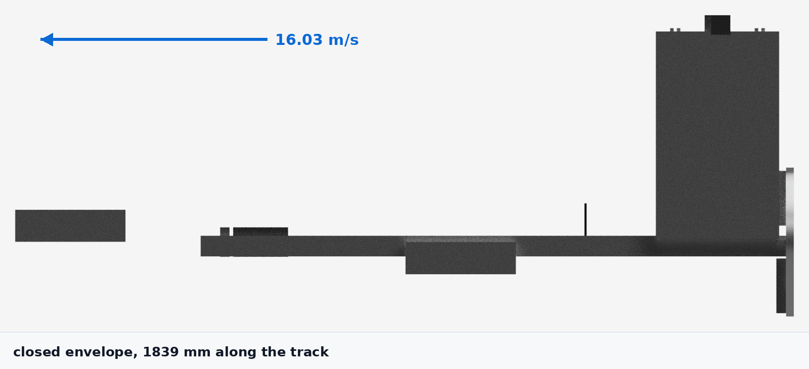
</p>

[](LICENSE)
[](requirements.txt)
[](OPEN_PROBLEMS.md)
[](docs/PROVENANCE.md)

Secondary payloads inherit the orbit of whoever paid for the launch. The spring that ejects them
gives 1 to 2 m/s. That is a real change in orbital energy (at 2.5 m/s it extends orbital lifetime
by 8.2 %), but it is sized for separation rather than for orbit shaping, it falls two orders of
magnitude short of the latter, and every satellite in the manifest gets the same value. Of more
than 4,800 nanosatellites and CubeSats catalogued as of January 2026, on the order of 222 carry a
propulsion system. The rest stay where they were dropped.

VOLLEY replaces the spring with a magazine and a commanded shot: twelve satellites, one at a time,
each leaving at a velocity chosen for it, from a spent upper stage that was going to be debris
anyway and that can reposition between altitude shells on its own reaction control between
deployments. The satellite is never modified mechanically or electrically. No armature, no
plating, no harness, no separation system.

That claim does not extend to magnetics, and this page will not pretend otherwise. The array is a
permanent magnet, so the payload envelope sits at 611x a representative magnetometer full
scale at its near face, continuously rather than only during a shot
([P34](OPEN_PROBLEMS.md), [`docs/ICD_COMPLIANCE.md`](docs/ICD_COMPLIANCE.md)).

What a spring cannot do at any price is give two satellites different velocities. Every number on
this page exists to support that one capability or to qualify it.

## The mission

VOLLEY flies as a secondary system on the launch vehicle's final stage. The vehicle flies its
primary mission and the primary spacecraft separates first. Only after that does VOLLEY's mission
begin: where the vehicle and its mission rules permit it, the spent stage stays powered,
navigated, attitude-controlled and commandable, and becomes a temporary orbital delivery vehicle.
It can deploy the manifest immediately, or reposition between deployments over hours to days. The
stage does the coarse orbital placement; VOLLEY does the fine per-satellite release velocity. The
stage then passivates and re-enters.

That mission was chosen in 2023, not in 2026.
[ADR-002](docs/adr/002-host-is-a-spent-upper-stage.md) rejected a dedicated free-flyer, on the
grounds that *"it must carry its own attitude control, power and recoil management, which is most
of a spacecraft"*, and put VOLLEY on a spent upper stage instead. What has changed across six
generations is how much of the machine VOLLEY builds for itself: Gen5 carries its own track,
drive, store and brake aboard the platform, while Gen6 makes the stage's own structure and length
part of the machine. [`docs/LINEAGE.md`](docs/LINEAGE.md) keeps the mission column and the
integration column apart, because collapsing them produces a false history.

> Three resources get collapsed into one in casual descriptions of this, and they are not the
> same thing. The host stage's propulsion reserve belongs to the launch provider and cannot be
> assumed. The host's attitude, navigation and power is what keeps the stage usable past
> passivation. VOLLEY's own 2 litres of nitrogen produces a payload's separation condition and
> could not raise an orbit if it tried. For the full concept, the host classes and the price of a
> plane change, see
> [`docs/MISSION_ARCHITECTURE.md`](docs/MISSION_ARCHITECTURE.md).
>
> One degree of inclination costs about 133 m/s at 500 km, against 5.5 m/s for ten
> kilometres of altitude. The stage delivers altitude, phase and orbital energy. It does not
> deliver planes, and this repository will not imply that it does.

> ### Where the current architecture stands, 2026-08-22
>
> Gen6, the stage-integrated gas architecture, is the design target, and four runs this week found
> two problems with its guided interface.
>
> [A67](validation/A67_guided_contact.md) modelled the payload's travel through the 8 m bore for
> the first time and missed the 2.0 deg/s tip-off band.
> [A68](validation/A68_contact_law.md) then measured how much of that was the contact law rather
> than the machine, and got 65.8 %, so the magnitude is unresolved
> ([P108](OPEN_PROBLEMS.md)). [A69](validation/A69_tube_centreline.md) computed the tube's actual
> shape and found that at 0 g its own weight contributes nothing at all: the centreline is set by
> thermal bow and support placement rather than by structure or stiffness.
>
> [A70](validation/A70_guided_contact_derived.md) reported a geometric interference at a 1 K
> gradient, and a review the same day found it was an artefact of A69's thermal construction,
> which had kinked a continuous tube at every support. On the corrected continuous solve the
> piston clears at every gradient tested up to 5 K with a factor of two in hand, and the corrected
> figure agrees with the closed form kappa*L^2/8 to 0.2 %. [P109](OPEN_PROBLEMS.md) is withdrawn
> and [P110](OPEN_PROBLEMS.md) records why. What survives is a ceiling on long land separations:
> 400 mm is inadmissible at 1 K, which is a limit on a trade rather than a design failure.
>
> The review turned up something more general, and it is worth more than the result it deleted.
> The one band that would have caught the kink was implemented as `b4 = True`, a verdict assigned
> rather than computed, so every gate in this repository passed while the physics was wrong.
> [`tools/check_bands.py`](tools/check_bands.py) now refuses a band verdict that is a literal
> unless it is declared report-only with a reason. It scanned 104 scripts, and A69 and A70 were
> the only two.
>
> Gen5 remains the frozen, fully analysed baseline and is what the manuscript reports.
> [`docs/GEN6_FUSION_BUILD_PACKAGE.md`](docs/GEN6_FUSION_BUILD_PACKAGE.md) is the handoff for
> building the authoritative Fusion assembly: assembly tree, datums, every CAD-driving parameter
> with its status, and a list of what must stay parametric until P108 lands.
> [`docs/HUMAN_ACTIONS.md`](docs/HUMAN_ACTIONS.md) is the other side of that boundary, the work no
> further computation can do. [`docs/COMPUTATIONAL_CLOSURE.md`](docs/COMPUTATIONAL_CLOSURE.md)
> counts what is left before hardware: 17 questions that are still calculations, and ten that
> are not.

> This is an engineering record rather than a brochure. Every analysis declares what would count
> as failure before it runs, every defect is numbered including the ones that damage the work's
> own claims, and nothing here has been built, fired or measured.
>
> What that has produced, which is the part worth judging: 66 run sheets covering 67 analyses A1
> to A71 (A3, A26, A60 and A66 were numbered and never written), each against a band written down
> before its script existed. Three failed outright, one of them falsifying a claim in this
> project's own abstract. On three further occasions a declared band caught a bug in the analysis
> rather than in the design. Every correction is dated, and none of them improved a number.
>
> Phase I closes on Gen5. [`docs/GEN5_CLOSURE.md`](docs/GEN5_CLOSURE.md) is the whole case on one
> page, including the one defect still blocking it.

### Where to go from here

| If you are | Read |
|---|---|
| checking whether Gen5 closes | [`docs/GEN5_CLOSURE.md`](docs/GEN5_CLOSURE.md), the whole Phase I case, what failed, and what is deliberately left open |
| here for one page | [`SUMMARY.md`](SUMMARY.md), the whole thing with its caveats attached |
| here for the idea | [`docs/CONCEPT.md`](docs/CONCEPT.md), and [`docs/LINEAGE.md`](docs/LINEAGE.md) for how it got there |
| deciding whether to use it | [`docs/CASE_STUDY.md`](docs/CASE_STUDY.md), a worked twelve-satellite mission at +60.2 % of orbital life against a spring's +8.2 %, with the losses written in the same voice as the wins |
| reviewing it | [`docs/REVIEW_RESPONSES.md`](docs/REVIEW_RESPONSES.md), thirty-five reviewer questions answered or conceded, fourteen of which have no answer in this repository at all. Then [`docs/PROVENANCE.md`](docs/PROVENANCE.md) for what stands behind each claim |
| checking what outside evidence could settle | [`docs/EXTERNAL_EVIDENCE.md`](docs/EXTERNAL_EVIDENCE.md), which live entries a published source can close, which it can only inform, and which need hardware and cannot be read away |
| looking for what is broken | [`OPEN_PROBLEMS.md`](OPEN_PROBLEMS.md), 147 numbered entries of which 56 are live. [`docs/KILL_CRITERIA.md`](docs/KILL_CRITERIA.md), seven thresholds of which three are crossed |
| deciding what to do next | [`docs/STATE_OF_THE_PROJECT.md`](docs/STATE_OF_THE_PROJECT.md) and [`docs/GEN6_CLOSURE.md`](docs/GEN6_CLOSURE.md) |
| building on it | [`docs/BUILD_READINESS.md`](docs/BUILD_READINESS.md), [`cad/`](cad/), and [Reproducing](#what-stands-behind-the-numbers) below |

---

## What it is

Two machines share this repository, and every number belongs to one of them.

| | Gen5, the frozen baseline | Gen6, the current design target |
|---|---|---|
| What accelerates the payload | an ironless double-sided Halbach linear synchronous motor, over 1.3 m | cold gas, over 8.0 m of the host stage's own length |
| What it is mounted on | its own track and enclosure, on an ESPA port | a rail a spent upper stage already is |
| Electromagnetics | the whole machine | a short trim stator at the muzzle, sized at 144.01 mm and suspended by [ADR-036](docs/adr/036-seal-specification-and-the-trim-stage.md). At the specified seal it may not be needed at all ([P67](OPEN_PROBLEMS.md)) |
| What the motor does | delivers the energy and commands the velocity | commands the velocity only |
| Evidence behind it | every headline number, structural FEA, CFD, a designed control loop, a second CAD implementation | A35 to A53. No FEA, no circuit model, no CFD, and no second implementation |

Gen5 is what every headline number is still computed against; Gen6 is where the design is going.
[ADR-032](docs/adr/032-gen6-stage-integrated-gas-store.md) made the stage the machine rather than
the host, and [ADR-034](docs/adr/034-gen6-long-stroke-design-point.md) took the stroke to the
stage's whole 8.0 m. [`docs/GENERATIONS.md`](docs/GENERATIONS.md) compares all six generations,
and [`docs/GEN6_CLOSURE.md`](docs/GEN6_CLOSURE.md) lists what Gen6 still owes.

### Gas supplies the energy; the motor supplies the control

That division is [ADR-033](docs/adr/033-gen6-trim-stage.md)'s, and it is deliberate. A gas store
charges slowly from solar and releases fast, which makes it a good energy store and a poor servo.
A linear machine is the reverse. Gen6 uses each for what it is good at.

At 1.8 % of the stroke the motor still does real work. Gen6's shot is a single open-loop expansion
dispersing at 3.980 % (3-sigma) at ADR-034's stroke, of which 98.7 % is a seal friction nobody has
measured, and [A44](validation/A44_gen6_dispersion.md) found no instrumentation route out: a
fivefold better pressure transducer moves it 0.008 %. The stator is what recovers the commanded
velocity the whole idea rests on.

> ### The stator is suspended, and the seal may delete it: [ADR-036](docs/adr/036-seal-specification-and-the-trim-stage.md), 2026-08-20
>
> That 3.980 % is computed at A41's friction *allowance*, which is a ceiling and not a
> measurement. [A61](validation/A61_seal_class.md) asked instead what the loosest seal is that the
> design can survive, and found the binding requirement is thermal: a 2 g seal must stay within
> 50 K of its own friction heating, which needs 17.8 N, or 4.00 % of the piston's pressure force.
>
> The trim stage stops earning its mass at 22.3 N. Since 17.8 < 22.3, any seal that survives its
> own heat also makes the stator unnecessary, with dispersion falling to 0.9051 % and the
> authority needed to 0.2982 m/s, below what even [A48](validation/A48_trim_stage.md)'s superseded
> 39.7 mm section gave.
>
> So the stage is suspended rather than built or deleted. Deleting it on a specification would
> repeat ADR-033's own error of adopting before its falsifier was answered.
> [P67](OPEN_PROBLEMS.md) decides it: at or below 17.8 N the stator goes, above 22.3 N it is
> needed.
>
> The honest limit is that 0.9051 % is still short of the declared 0.5 % band. A specified seal
> makes Gen6 cheaper without making it accurate.

### Why the store is gas

[A39](validation/A39_store_trade.md) ran the trade and gas won by a factor of four, against a
12.55 kg budget for store plus mechanism, at 32.7 m/s:

| | store | mechanism | total | busts the budget at |
|---|---:|---:|---:|---:|
| Steel spring | 7.13 | 4.28 | 11.41 kg | 34.3 m/s |
| Cold gas | 0.63 | 2.34 | 2.98 kg | 89.4 m/s |
| Keep the motor *(control)* | 23.76 | | 23.76 kg | every velocity |

Energy density is not what decides it. The spring can store the energy; what costs it 4.28 kg is
having to be cocked twelve times. Gas separates the store from the actuator, so re-arming is a
valve and one bottle runs the whole manifest.

**Every alternative was screened by a run that is on the record**, so the trade cannot be read as
having considered only two:

| | Why not | |
|---|---|---|
| Supercapacitor bank plus full motor | The bank cannot source the shot on cells anyone sells. ESR x C is roughly constant within a cell technology: the shot needs 68 milliohm or less, and a real 32 x 190 F string is 116 to 185 milliohm. That is a physics limit rather than an engineering gap | P26, [A10](validation/A10_bank_esr.md) |
| Flywheel | The one live alternative. It clears the electrical ceiling at 35 milliohm against 68, but at mass parity rather than a saving. Coupling it through a cable or drum refers rotating inertia straight onto the moving mass | [A25](validation/A25_flywheel_store.md), P45 |
| Lead screw | DN limit exceeded 8x, whirling 36x | [A27](validation/A27_actuator_trade.md) |
| Rack and pinion | Contact drive at full speed in vacuum | A27, E21 |
| Induction drive on a passive mover | Was Gen6 for a single day. The mover it worked to lighten costs 11.54 kg against 26.35 kg for the pulse it kept | `VOLLEY-lab` PII-19 |

Deleting gas takes the architecture with it rather than one component. Requirement C3, that the
energy arrives during the shot, comes back, and [A35](validation/A35_constraint_ledger.md) prices
it at 26.35 kg. That deletion is most of the 50 % cut in added mass per satellite. Gas is what
buys the stage-integrated architecture.

Gas has also already failed once here. [A39](validation/A39_store_trade.md) chose it while
assuming a regulator it never named, and [A40](validation/A40_blowdown_transient.md) killed that
implementation at 14.16 m/s against a 30 m/s band, because a fixed orifice cannot hold force over
a stroke: the cylinder volume grows faster than the orifice can fill it. A41's pre-charged chamber
is the repair. Charge slowly, fire as a closed expansion, and the flow-rate problem disappears by
construction.

It is not free either. A spring holds its energy indefinitely and a gas store leaks; the seal that
has to hold from launch to the last shot is the same one that owns the dispersion, and nobody has
measured it (P67). A39's own run sheet records that its reservoir vessel is underestimated 4 to 6x
against real hardware, and that its 1.5 kg allowance for piston, seals and plumbing is the largest
guess in the run.

## How a shot works

Two machines, two shots. Gen5 is the frozen baseline and every headline number is computed against
it; Gen6 is the current design target. What changes is where the energy comes from, not what the
customer buys.

### Gen5, where the motor does the work and the job

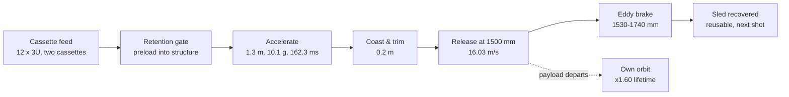
```mermaid
flowchart LR
    A["Cassette feed<br/>12 x 3U, two cassettes"] --> B["Retention gate<br/>preload into structure"]
    B --> C["Accelerate<br/>1.3 m, 10.1 g, 162.3 ms"]
    C --> D["Coast &amp; trim<br/>0.2 m"]
    D --> E["Release at 1500 mm<br/>16.03 m/s"]
    E --> F["Eddy brake<br/>1530-1740 mm"]
    F --> G["Sled recovered<br/>reusable, next shot"]
    E -.->|"payload departs"| H["Own orbit<br/>x1.60 lifetime"]
```

The satellite is never modified: the magnets ride the sled, not the payload. The sled leaves
release carrying 1213 J; the 39 mm of stator past that point takes 47 J of it back into the bank,
and the eddy brake absorbs the remaining 1162 J. Efficiency is quoted electrical-to-payload, net
of that credit. A11 measured 291 J against a 240 mm regenerative section, and ADR-030 removed it
because it and the 300 mm eddy fin were oversubscribed in a 339 mm airgap. Recovery is 3.9 % of
the sled's energy rather than 23 % ([P97](OPEN_PROBLEMS.md)).

### Gen6, where gas does the work and the motor does the job

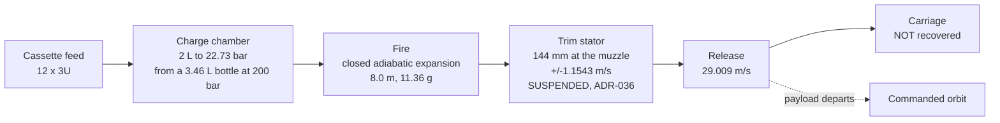
```mermaid
flowchart LR
    A["Cassette feed<br/>12 x 3U"] --> B["Charge chamber<br/>2 L to 22.73 bar<br/>from a 3.46 L bottle at 200 bar"]
    B --> C["Fire<br/>closed adiabatic expansion<br/>8.0 m, 11.36 g"]
    C --> D["Trim stator<br/>144 mm at the muzzle<br/>+/-1.1543 m/s<br/>SUSPENDED, ADR-036"]
    D --> E["Release<br/>29.009 m/s"]
    E --> F["Carriage<br/>NOT recovered"]
    E -.->|"payload departs"| G["Commanded orbit"]
```

Gas is the only thing that throws the payload, and the trim stator is the only thing that commands
it. The carriage does not come back: Gen6 has no return stroke and no brake, because there is no
reusable sled to arrest. The trim section is energised only after the gas has finished, which is
what lets a section three orders of magnitude shorter than a full stator recover a precision the
full stator used to provide.

The section is 144.01 mm, not the 39.7 mm this page carried until 2026-08-19.
[A55](validation/A55_trim_authority.md) re-ran it at ADR-034's stroke and found the stage
under-authority by 3.57x, which is P83, confirmed and closed. It grew in almost exact proportion
to the stroke, 1.822 % to 1.800 %. Whether any of it gets built is
[ADR-036](docs/adr/036-seal-specification-and-the-trim-stage.md)'s open question.

There is no Gen6 efficiency figure of the Gen5 kind, because the energy arrives as a ground-filled
bottle rather than as electricity. [A51](validation/A51_gen6_power.md) measures what the machine
actually draws: 311.76 J per shot, 0.26 W averaged, 36 W peak. The 25 to 131 W this page quoted
until 2026-08-16 was a spring-winding figure for a machine with no spring (P80).


## The numbers

These are all model outputs. Nothing on this page has been measured at any scale. Where a
generation has no figure, the cell says so rather than being left blank.

| | Gen5, the baseline | Gen6 at ADR-034 | Source |
|---|---|---|---|
| Exit velocity, 3U | 16.029 m/s at 10.07 g | 34.280 m/s zero-friction, 29.009 at the friction allowance, at 11.36 g | `motor_model.py`, [A49](validation/A49_design_surface.md) |
| Dispersion, 3-sigma | 0.0274 m/s at a 15.8 m/s setpoint, to +/-0.10 km apogee | 3.980 % open-loop at ADR-034's stroke; 0.0274 m/s with a trim stage resized to 144 mm ([A55](validation/A55_trim_authority.md)), whose store is about 70 g rather than A54's 23 to 37 kg ([A64](validation/A64_pulse_store_technology.md), P86 closed). The stage itself is suspended by [ADR-036](docs/adr/036-seal-specification-and-the-trim-stage.md) | `motor_model.py`, [A44](validation/A44_gen6_dispersion.md) |
| Acceleration length | 1.3 m accelerating, 1.5 m track | 8.0 m, the host stage's whole usable length | `cad/parameters.json` |
| Thrust constant | 10.54 N per kA/m, +/-1.01 % ripple | same machine, trim section only | `motor_model.py`, A2 |
| its centre-plane value | 11.03 N per kA/m, independently computed by a 2-D FEM to 0.03 % | | `motor_model.py`, A1 |
| Energy per shot | 2.78 kJ gross, 2.74 kJ net of regeneration | 311.76 J | `motor_model.py`, [A51](validation/A51_gen6_power.md) |
| Efficiency | 18.8 % electrical-to-payload net of regeneration, 514 J delivered | no equivalent figure exists, because the energy arrives as a ground-filled bottle rather than as electricity | `motor_model.py`, A51 |
| Electrical demand | 150 to 300 W recharge feed | 0.26 W average, 36 W peak | A51 |
| Mass, dry / loaded | 126.6 kg / 174.6 kg | 11.45 kg added, plus 3.1216 kg of store ([A56](validation/A56_reservoir_resized.md), sized) | `mass_properties.py` |
| Per 3U satellite | 10.547 kg dry | 1.2145 kg added ([A45-R2](validation/A45R2_stage_credit_resized_store.md), at A56's sized store, or 1.3173 if the suspended trim stage is built), and up to 3.0827 read hostilely (P68) | `payload_family.py`, [A45](validation/A45_stage_credit.md) |
| Recoil per shot | 64.1 N.s | 116.03 N.s, a factor of 1.81, and the thrust line must pass within 10.7 mm of the host centre of mass | `astro.py`, [A52](validation/A52_gen6_recoil.md) |
| Orbital lifetime multiplier | 1.60x at mean activity, and not invariant (P16) | unchanged in kind | `astro.py` |
| Semi-major axis change | +28.8 km, unreachable by waiting or by drag | | `astro.py`, A21-R |
| First bending mode | 109 Hz fixed-fixed, target above 70 | 1.67 Hz unsupported over 8.0 m, so the tube needs a support every metre ([A59](validation/A59_tube_structure.md)) | `sizing.py`, A59 |
| Energy closure | 100.0 % accounted | | `sizing.py` |
| Magazine | 12 x 3U, two transverse cassettes | 12 x 3U, cassette carried across | `cad/parameters.json` |

> One number is deliberately absent, the Gen6 stroke duration. It read 133 ms until 2026-08-19,
> which is the figure for the 2.18 m stroke ADR-034 superseded, and the 8.0 m figure has not been
> run; A55 produces it. A number whose consequences have not been computed does not get published
> here, even when the old one is only a little wrong.

Read [`docs/PROVENANCE.md`](docs/PROVENANCE.md) before citing any of it. Sixty-four validation run
sheets exist, each against an acceptance band declared before the run. Three failed outright,
several missed individual bands, and on three occasions a declared band caught a bug in the
analysis rather than in the design.

## Against a spring dispenser

Deterministic orbit seeding at a velocity programmable per satellite, rather than orbit
inheritance, is the one axis where a spring does not compete at any price.

The figures below are Gen5's, because Gen5 is what the comparators were computed against. Losses
sit in the same table as the wins.

| | Spring dispenser | VOLLEY | |
|---|---|---|---|
| Exit velocity | about 2 m/s (NRCSD-E specifies 0.5 to 2.5) | 16.03 m/s | 6.4x |
| Commanded differential between satellites | zero by design | per shot, continuous | categorical |
| Semi-major axis change | 0 m, a spring imparts none | +28.8 km | `analysis/astro.py`, A21-R |
| 30 degrees of in-track phase | 468 s of waiting | 468 s of waiting | no advantage, see P56 |
| Orbital life delivered, per satellite | 1.41 yr | 2.11 yr | 1.495x |
| Deployer mass per 3U satellite | about 6 kg, canisterised class | 10.547 kg | 1.76x, spring wins |
| Maturity | TRL 9 | TRL 2 to 3 | spring wins |
| Elements whose single failure forfeits the remaining manifest | 0 | 9 of 13 | spring wins, `docs/FMEA.md` |
| Reliability needed to match it on delivered life | | at least 0.99326 per element per cycle, unmeasured | `docs/FMEA.md` |

A cold-gas module beats both on mass at 3U by 12.4x (`validation/A21_comparators.md`; the 7.5x
this page carried until 2026-08-16 was pre-[A46](validation/A46_enclosure_buildup.md), which is
P69), and a 1.8 kg staged spring reaches the same velocity inside the g-cap
(`validation/A27_actuator_trade.md`). What VOLLEY sells is a fleet distributed on a schedule, and
[`docs/CASE_STUDY.md`](docs/CASE_STUDY.md) works one.


> The reliability row is the one Gen6 improves least. [A47](validation/A47_gen6_fmea.md) counted 8
> manifest-forfeiting elements against Gen5's 9, so deleting six subsystems removed exactly one
> shared failure and added the host stage's keep-alive agreement, which no launch provider has
> given. A per-cell backup ejector is worth six times the whole architecture change, and
> [A53](validation/A53_backup_ejector.md) found that a spring does not fit a sealed tube (P81). A
> spring dispenser still forfeits nothing, and that row does not move.
>
> A53 closed that as architectural, when it was a store choice
> ([A65](validation/A65_pyrotechnic_ejector.md), 2026-08-20). A spring stores 4.5 J against the
> 667.2 J of clearing the 8 m tube, short by a factor of 148. A solid-propellant gas generator of
> the automotive restraint class delivers 2331.6 J at the smallest charge in the published range,
> after cooling to the tube's own 473 K ceiling, which is 3.49x over. The mass argument inverts
> too: A53's tube-clearing spring re-crossed the kill criterion at 2.129 kg per satellite, and
> this is 1.6496. Band 4 still misses A53's inherited 0.25 kg per-cell threshold at 0.4350 kg, and
> 46.6 % of that is a minimum-gauge steel plenum rather than anything pyrotechnic (P91). It is the
> same mistake A54 made about the pulse store, pricing the only technology this repository
> happened to have data for.

## What stands behind the numbers

Three results have independent cross-checks. The Halbach field model runs analytic against
magpylib, agreeing to three digits, and again against a meshed magnetostatic FEM, which is a PDE
solve rather than another superposition, agreeing on the corrected thrust constant to 0.03 %.
Orbital decay is checked orbit-averaged against Cowell RK4 at 99.4 %. Everything else is
single-sourced.

[`docs/VALIDATION_REPORT.md`](docs/VALIDATION_REPORT.md) checks every claim where it can.
[`docs/FIGURE_INDEX.md`](docs/FIGURE_INDEX.md) gives each figure's generator, source data and
class of evidence, and the class for *measured* has zero members.

### Until 2026-08-20 every number here came from inside this repository

[`docs/EXTERNAL_EVIDENCE.md`](docs/EXTERNAL_EVIDENCE.md) is the survey of what outside sources can
settle, what they can only inform, and what they cannot touch. It exists because of one result.
[A54](validation/A54_pulse_chain.md) priced the trim store at 23 to 37 kg and was correct in every
calculation, but it had priced an EDLC, because that was the only store technology in this
repository. Against published pulsed-power capacitor data,
[A64](validation/A64_pulse_store_technology.md) returns about 70 g, which is 522 times lighter,
and P86 is closed.

A second map looks sideways rather than up, at automotive and motorcycle engineering, where
several live entries describe components road vehicles build in tens of millions: fork and damper
rod seals against the 17.8 N of P67 and P88, pyrotechnic gas generators against P81, film DC-link
capacitors against P86, and variable-reluctance speed sensing against the velocity sensor Gen6 has
never had. Every one of them is lubricated, cyclic and atmospheric, while VOLLEY is dry, in
vacuum, and fires twelve times ever. That limit is stated next to each transfer.

> The vault was re-read the same way on 2026-08-20, and the finding was not in the vault. Three
> parked entries had each stopped partly on the capacitor bank not being able to source the shot,
> and ADR-032 deleted the bank. One retirement had retired a blocker in three separate entries,
> and none of them had been re-read since. A stop is not scripture either.

### What each independent check actually returned

[`docs/VALIDATION_REPORT.md`](docs/VALIDATION_REPORT.md) checks every claim independently where
possible. Four analyses were actually run; three could not be.

- Reproducibility holds exactly: 173 values re-computed from clean, 173 identical.
- GMAT falsified the invariance claim. It reproduced the old 1.80x multiplier at mean and high
  solar activity but gave 2.074 at low, an 18.5 % spread against a band of 5 % or less.
  `astro.py` varies solar activity by scaling density uniformly, and ballistic coefficient enters
  the same multiplicative slot, so both halves of that claim were tested by a sweep that could not
  have detected a problem (P16).
- CalculiX cleared the chassis on all three structural bands, which is what settled the sled mass
  at the CAD-derived 9.445 kg and moved the headline to 16.388 m/s (P15), before the quadrature
  correction moved it to 16.03 m/s.
- ngspice reproduced the then-current shot model to 0.03 % and then, re-run at the then-current
  operating point, found a loss the analytic model had no term for at all: the bank's own series
  resistance, 86 J a shot (P24). Corrected, the two methods agree on peak current to 0.01 %. It
  also found the quoted bank sag is state-of-charge rather than the terminal voltage the drive
  sees.
- A1 and A10 to A13 have been propagated to the corrected point. A5 and the ngspice A8 run predate
  it (P19) and need re-running. A4 survives, its load being magnetostatic and velocity-independent.
- A1 has run (2026-07-29). A meshed 2-D magnetostatic FEM gives K<sub>t</sub> = 11.026 N per kA/m
  against the model's 11.03, a ratio of 0.9997, with ripple 0.97 % against 0.99 %. The number
  every headline descends from is no longer checked only analytic against analytic. Two of seven
  bands missed, both with identified causes and neither a model error (P20, P21).
- Not run: A6, A7, A9.

### External tools, and which have actually run

Each analysis has its acceptance band declared before the run, in [`validation/`](validation/).
A cross-check whose target is chosen after seeing the answer proves nothing.

| Analysis | Tool | Closes | Status |
|---|---|---|---|
| A1 airgap field | FEMM | E1 (2-D half), E2 | specified |
| A4 sled chassis | CalculiX ccx 2.21 | P5, P8 | run: as-drawn plate passes, mass unchanged |
| A5 lifetime and seeding | GMAT R2022a | E6 | run: see [`docs/RESULTS.md`](docs/RESULTS.md) |
| A6 conjunction Pc | NASA CARA | P1 | specified |
| A7 separation & tip-off | Project Chrono | E7 | specified |
| A8 pulse-power chain | ngspice 42 | E17 | run: bands met, 2 findings |

### Reproducing


```bash
pip install -r requirements.txt
cd analysis
python3 verify_field.py && python3 mass_properties.py && python3 motor_model.py && python3 sizing.py && python3 astro.py
```

Results land in `analysis/results/*.json`.

The analysis layer needs nothing but `requirements.txt`. The validation layer needs
external solvers, gmsh and scikit-fem for the magnetostatic FEM, GetDP, CalculiX,
ngspice, and a LaTeX install for the manuscript. `tools/env-setup.sh` installs all of
them on a Debian/Ubuntu machine and verifies each one before exiting.


## Results

Every image below is a script output. Nothing here has been measured; see
[`docs/FIGURE_INDEX.md`](docs/FIGURE_INDEX.md) for each figure's generator, its source data and
its class of evidence, and note that the class for *measured* has zero members.

<table>
<tr>
<td width="50%">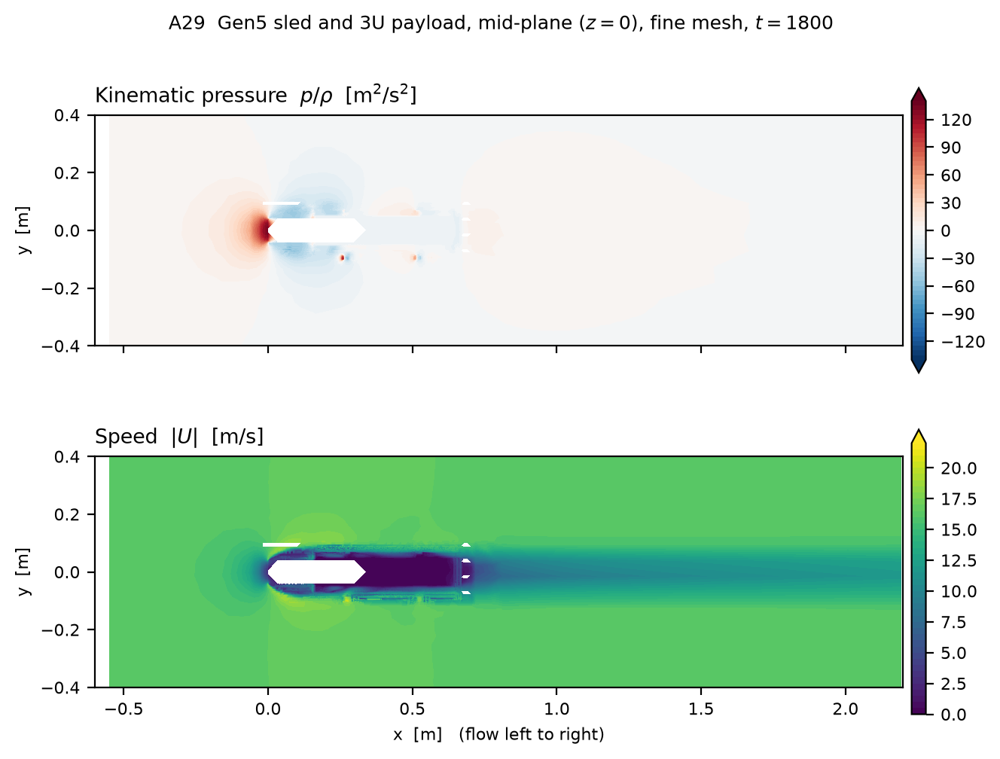<br><sub>The flow, A29. Mid-plane slice of the converged fine mesh, showing stagnation on the forward face, separation at the shoulders, and a wake that has not recovered by x = 2.2 m. 581 779 cells, <code>simpleFoam</code> k-omega SST. The pressure term is integrated from the solved field; the viscous term is not solved and is bounded by a flat-plate correlation, because <code>wallShearStress</code> aborts in this OpenFOAM build. Parsed out of the case in pure Python (<code>validation/cfd/fields.py</code>).</sub></td>
<td width="50%"><br><sub>The field, A2 and A3. The physics every Gen5 number descends from. Left, B<sub>y</sub> across the 12 mm gap with the 10 mm winding marked; right, the profile through the array's 90 mm depth. Sampling the centre plane and multiplying gives 0.5041 T; the depth mean is 0.4759 T. That assumption cost K<sub>t</sub> 4.42 % and moved every dependent number with it.</sub></td>
</tr>
<tr>
<td width="50%">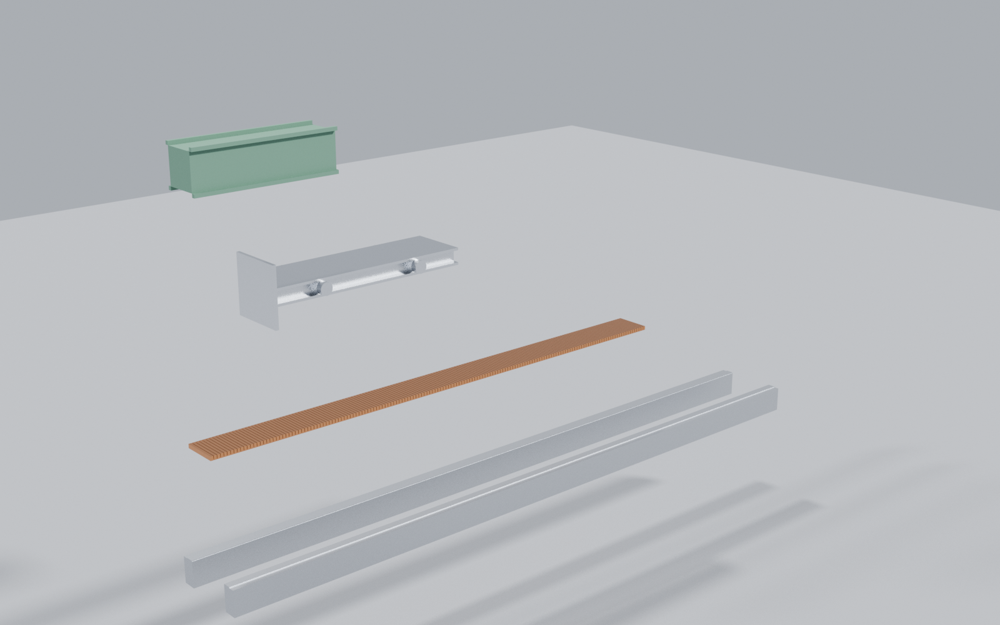<br><sub>The drive stack, exploded: track, stator winding, sled and payload, in the order it assembles. Rendered in Blender from the same STLs <code>cad/build_gen5.py</code> writes from <code>parameters.json</code>, so the geometry is the geometry rather than an illustration of it.</sub></td>
<td width="50%"><br><sub>The mass that will not go away, A35. Every kilogram attributed to the requirement causing it, then every requirement deleted in all 64 corners. 88.67 kg, or 70.06 %, survives all of them, which is 7.39 kg per satellite against a 2.0 kg criterion. Three of the six requirements carry no mass on their own. A35's run sheet still reads 49.23 kg at the pre-A46 dry mass (P95).</sub></td>
</tr>
<tr>
<td width="50%">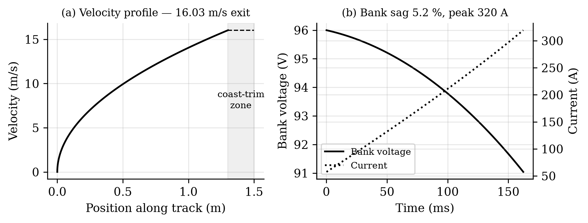<br><sub>The shot. Force, velocity and current through the 162.3 ms stroke (<code>motor_model.py</code>).</sub></td>
<td width="50%"><br><sub>Lifetime. Boosted against unboosted decay; the 1.60x multiplier at mean activity is the model result, not the absolute years (<code>astro.py</code>).</sub></td>
</tr>
<tr>
<td width="50%">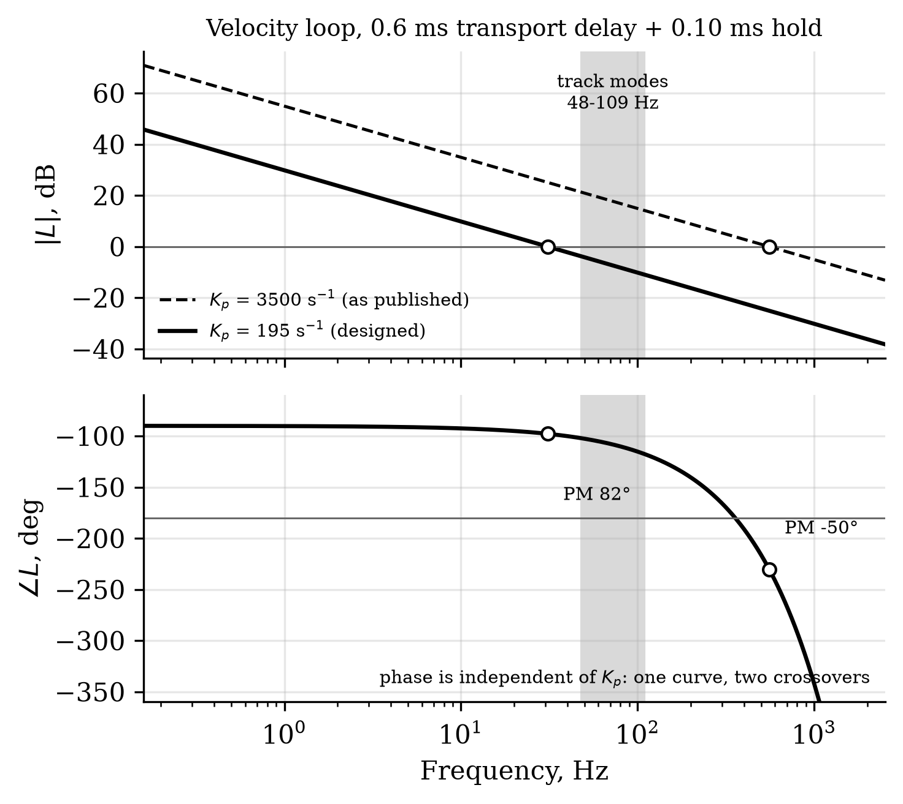<br><sub>The velocity loop, A28. The gain published until 2026-08-13 put the crossover at 557 Hz, above both track modes, with -50.4 deg of phase margin. The designed gain is 195 s<sup>-1</sup>, giving +82.2 deg and +21.2 dB, and the dispersion does not move (<code>control_design.py</code>).</sub></td>
<td width="50%">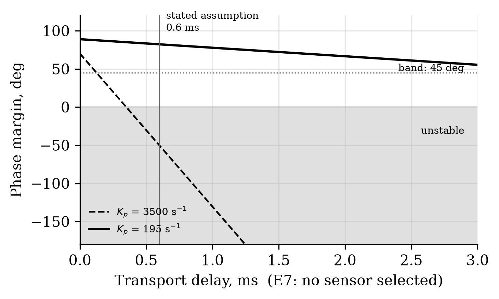<br><sub>The stability floor. The old gain crosses into instability at 0.35 ms of sensor delay. Its dispersion figure came from a simulation that fed back an undelayed state (P47).</sub></td>
</tr>
<tr>
<td colspan="2">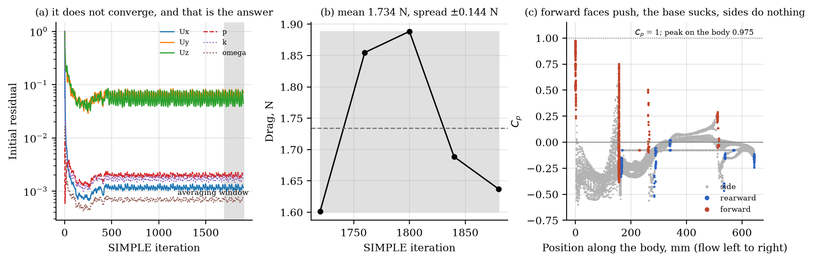<br><sub>CFD, A29: the full report rather than just the answer. (a) the solve does not converge, which is what a steady solver does on a separated wake, so the force is a windowed mean; (b) that mean, 1.734 +/- 0.144 N; (c) surface pressure, where forward faces push, the base sucks and the sides do nothing, with a peak C<sub>p</sub> of 0.975 where stagnation should approach 1. Meshed by <code>snappyHexMesh</code> from the script-built Gen5 CAD rather than an idealised box.</sub></td>
</tr>
<tr>
<td width="50%">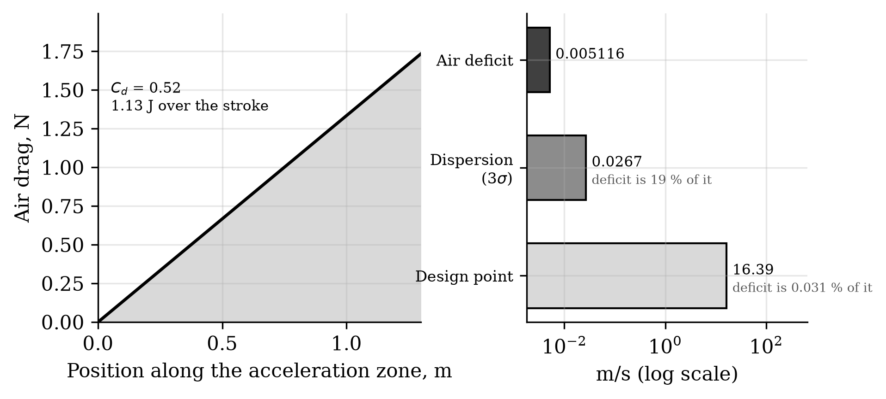<br><sub>What air costs a ground test. The machine flies in vacuum and the full-scale test fires in a room. The deficit is 5.1 mm/s, which is 0.031 % of the design point but 19 % of the dispersion the test exists to resolve. No vacuum chamber is needed; an air correction on every measured velocity is.</sub></td>
<td width="50%">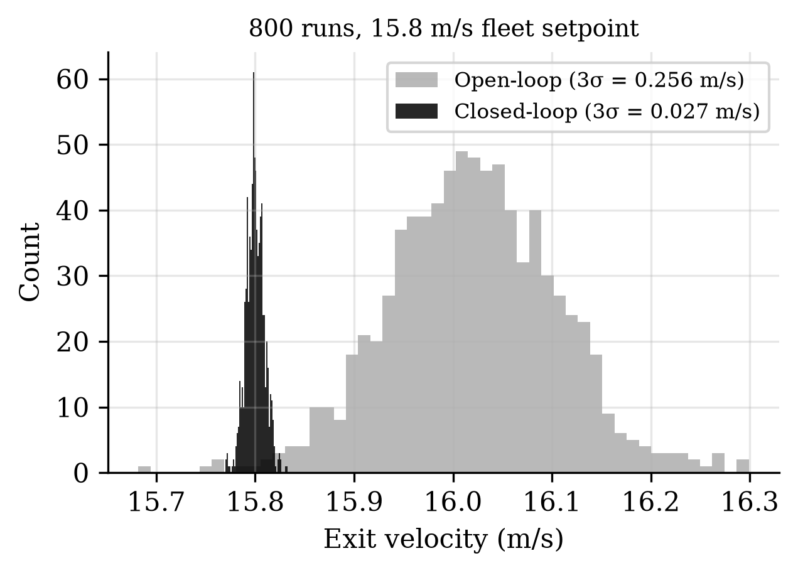<br><sub>Dispersion. 800 Monte Carlo runs, 0.0274 m/s (3-sigma) about a 15.8 m/s setpoint. The gain behind it is now designed against margins rather than asserted (ADR-027).</sub></td>
</tr>
</table>

[Every figure](figures/), and [what stands behind each one](docs/FIGURE_INDEX.md).

### Charts

Full set in [`docs/RESULTS.md`](docs/RESULTS.md), all drawn by GitHub from text with no image
files. Two of them carry the argument:

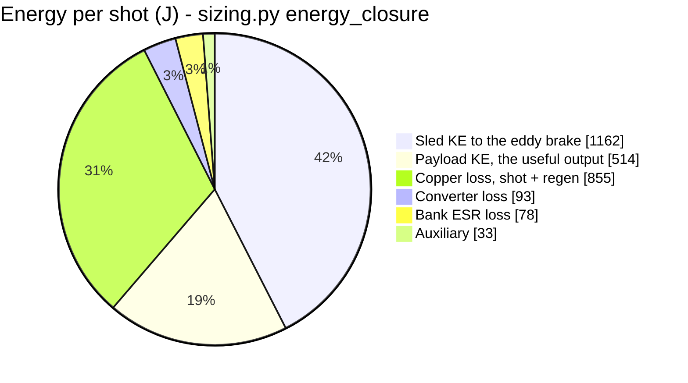
```mermaid
pie showData
    title Energy per shot (J) - sizing.py energy_closure
    "Sled KE to the eddy brake" : 1162
    "Payload KE, the useful output" : 514
    "Copper loss, shot + regen" : 855
    "Converter loss" : 93
    "Bank ESR loss" : 78
    "Auxiliary" : 33
```

514 J reaches the payload out of a net 2735 J: 2782 J leaves the bank and 47 J returns. That is
the 18.8 %. Efficiency fell with the heavier sled twice over, because more of the same
mechanical work goes into a mass that is then braked away and the longer 162 ms pulse accrues
more copper loss at unchanged current density. Regeneration is the first thing that has moved
it the other way.

This page said "no regeneration credit" until 2026-07-31, on the strength of a 2025 decision that
argued the motor cannot arrest the sled. It cannot, and the brake stays. It was
never shown that no energy could be recovered, and
[`validation/A11_regen_braking.md`](validation/A11_regen_braking.md) found 23.0 % of the sled's
energy available inside the existing envelope at the existing current rating.

The 86 J ESR slice was not here until 2026-07-30. No script modelled the bank's series
resistance, so the loss existed in the hardware and nowhere in the accounting. A circuit
simulation found it (P24).

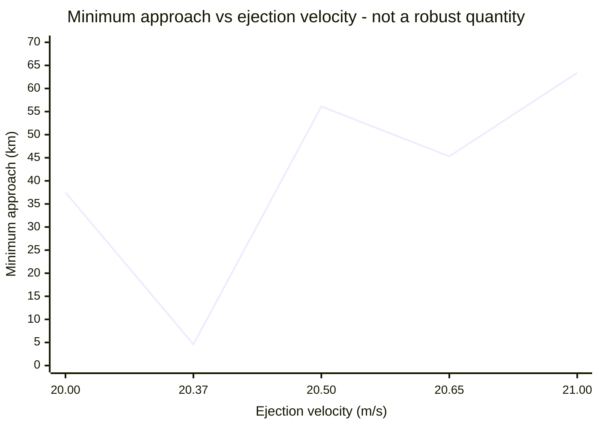
```mermaid
xychart-beta
    title "Minimum approach vs ejection velocity - not a robust quantity"
    x-axis "Ejection velocity (m/s)" [20.00, 20.37, 20.50, 20.65, 21.00]
    y-axis "Minimum approach (km)" 0 --> 70
    line [37.5, 4.6, 56.1, 45.3, 63.4]
```

A ±2.5 % velocity change moves the conjunction minimum from 4.6 km to 63.4 km. That is why
the paper's safety claim rests on the realignment period, now 10.3 days at the current
operating point, instead of a single distance (P1). The sweep above was computed at the
superseded 20.37 m/s point and is kept as the evidence for P1; the fragility it demonstrates
is a property of the beat geometry, not of any one velocity.


## What is wrong with it

This section is the reason the repository exists. Everything above is computation; what follows is
what that computation does not cover, what it got wrong, and what has been corrected since.

| | |
|---|---|
| Maturity | TRL 2 to 3 |
| Built, fired or measured | Nothing, at any scale. E4 is open and no analysis on this page changes it |
| Defect register | 147 numbered entries, 56 live, in [`OPEN_PROBLEMS.md`](OPEN_PROBLEMS.md) |
| Validation | 70 run sheets, 67 analyses across A1 to A71 (A3, A26, A60 and A66 were numbered and never written), each against a band declared before the run. Three failed outright |
| Kill criteria | Seven, three crossed, in [`docs/KILL_CRITERIA.md`](docs/KILL_CRITERIA.md) |

### The three defects that matter more than the rest

| | |
|---|---|
| P67 | The seal friction has never been measured, and it now chooses between two architectures. It owns 98.7 % of Gen6's dispersion, and every published dispersion figure descends from A41's allowance, which is 4.68x looser than the specification [A61](validation/A61_seal_class.md) derived. At 17.8 N or below the trim stage is deleted; above 22.3 N it is needed ([ADR-036](docs/adr/036-seal-specification-and-the-trim-stage.md)). One bench test can delete a subsystem here rather than add one |
| P68 | [ADR-032](docs/adr/032-gen6-stage-integrated-gas-store.md)'s first falsifier has fired. The stage credit breaks even at 11.0 % at A56's sized store rather than the 30 % the ADR claimed, and 58.6 % of it is a skin on a vehicle nobody has agreed to lend. [A45-R2](validation/A45R2_stage_credit_resized_store.md) is the only run that has ever moved the allowance, and a 42 % lighter store moved the hostile reading by 5.7 %, so the store is not what is wrong with the mass case |
| P59 | Kill criterion 1 is crossed at 5.3x. A35 closed the architecture route out of it and A36 closed the manifest route. Only a smaller payload class remains, and that decision has been deferred since Phase I |

### The kill criterion this design does not meet

Above roughly 2 kg per satellite, a rational customer buys a propulsion module instead.
[A35](validation/A35_constraint_ledger.md) attributed every kilogram to the requirement causing it
and found that 88.67 kg, or 70.06 %, survives the deletion of every requirement in all 64 corners
([P95](OPEN_PROBLEMS.md): A35's run sheet still says 49.23 kg at the pre-A46 dry mass), so there
is no architecture that reaches 2 kg. Gen5 is 10.547 kg; Gen6 is 1.2145 kg added but 10.547 kg on
dry mass, and both numerators are reported wherever either appears. The threshold has never been
moved, because a threshold revised after a result is known is not a threshold. The honest options
remain what they were: change the payload class, or publish the criterion as crossed.

### Corrections, dated

Every one of these moved a published number, and none of them improved it.

| When | What was found | What it cost |
|---|---|---|
| 2026-07-29 | The sled was modelled at 4.86 kg parametrically; exact solid volumes from the Gen3 CAD give 9.445 kg (P15) | Exit velocity went from 20.37 m/s at 16.3 g to 16.388, efficiency 32 to 20 %, lifetime multiplier 1.80x to 1.60x. [A4](validation/A4_sled_structural.md) fixed the consequence of each outcome before the structural analysis ran: at 5.35 kg or below the parametric model stood, between 5.35 and 6.80 kg neither estimate was right, and at 6.80 kg or above the headline changes. The CAD landed in the third branch, and the scripts moved before the paper did |
| 2026-07-30 | The pulse-power chain does not close on purchasable cells (P26) | The bank is modelled at 12 milliohm; commercial cells of this capacitance give 116 to 185 milliohm and the shot stops completing above 65 milliohm. A source behind resistance R cannot deliver more than V-squared over 4R, and this one is asked for 30 kW. Exit velocity, stroke time and dispersion are unaffected. What is affected is that the rated point assumes a bank nobody can buy, and that is not silently fixed here |
| 2026-08-03 | A winding-thickness quadrature error, A13's internal-momentum physics, A6's covariance claim, A12's stress plane, a 0.344 kg brake-fin double count | K_t fell to 10.54 N per kA/m, and every dependent number with it |
| 2026-08-13 | The last four deferred decisions, taken together in [ADR-030](docs/adr/030-apply-the-depth-resolved-thrust-constant.md) | K_t 11.03 to 10.54, exit velocity 16.388 to 16.029 m/s, efficiency 21.0 to 18.8 %, mass per satellite 6.378 to 10.547 kg. Nothing improved, and that is what the corrections cost |
| 2026-08-16 | The enclosure was an 8.00 kg placeholder; [A46](validation/A46_enclosure_buildup.md) built it up from the geometry | 50.04 kg. The earlier warning had guessed 20 |
| 2026-08-19 | ADR-034 moved the design point in `cad/parameters.json` and eleven documents, and not in the analysis scripts (P84) | A44 and A48 are answering a superseded question. Nothing in this repository compares the parameter file against the scripts, so every gate stayed green |
| 2026-08-20 | The dispersion figure never propagated. A55 measured 3.9798 % at ADR-034's stroke on 19 August, while ADR-033, `GENERATIONS.md`, `BUILD_READINESS.md` and `GEN6.md` all still published A44's 1.113 % | A factor of 3.6 low, in four documents, for a day. The number was never missing, and a stale figure with its replacement sitting one file away is a worse failure than an unknown one, because nothing about it looks unfinished. P84's own closing sentence claimed the current figure was unknown; it was not, and that has been corrected too |
| 2026-08-20 | Two dated scripts had one leg live and one leg frozen (P84, second and third instances) | `gen6_dispersion.py` was computing a shot at 50 bar over 8.0 m, a point never adopted, returning 1.504 % against A44's published 1.113 %. `trim_stage.py` band 3 reported 0.497 % where A48 declared 1.822 %. Both now freeze their own stroke the way `precharged.py` already froze `STROKE_A41`, which is a pattern that existed and had not been applied. Nothing compares a script against the run sheet it produced |
| 2026-08-20 | Three different figures were being published for one quantity. Added mass per satellite appeared as 1.403, 1.296 and 1.324 kg across the front page, the site, `GENERATIONS.md` and `GEN6.md`, from three different stores: A43's 5.38 kg, ADR-034's gas-ratio-scaled 4.10, and the same 4.10 plus the trim stage | None was wrong for its own scope and no page said which scope it was using. The tell was that the front page's hostile figure of 3.164 was the 4.10 kg row while P68's 3.108 was A45's at 5.38: two different stores, two different runs, both published as Gen6. [A45-R2](validation/A45R2_stage_credit_resized_store.md) band 8 reconciled all five readings and named 1.2145 kg per satellite canonical, at A56's sized store and without the trim stage, because [ADR-036](docs/adr/036-seal-specification-and-the-trim-stage.md) suspended it. Any page quoting 1.3173 must say it includes a section that may not be built |
| 2026-08-20 | `cad/DIMENSIONS.md` labelled every physical quantity "mm" | 200 bar rendered as "200.0 mm", a 473 K ceiling as "473.0 mm", the 3.1216 kg store as "3.1216 mm". `unit_for()` fell through to millimetres for anything it did not recognise, and every quantity the gas architecture added was unrecognised. This is the document whose stated purpose is to be read instead of the JSON by whoever is cutting metal |

Ways to recover the lost velocity, which are pocketing, sheet current, stroke length, a two-layer
stator, and a momentum-transfer release that buys it all back for 1.6 % of the shot energy, are
costed in [`docs/DESIGN_OPTIONS_exit_velocity.md`](docs/DESIGN_OPTIONS_exit_velocity.md).


### Defects that sit in the paper rather than in the design

The published paper previously contained four numbers its own scripts did not reproduce
(conjunction minimum, peak current, far-field stray values, brake fin temperature rise), all found
by reconstructing the analysis from scratch. All four were corrected in `paper/paper.tex` on
2026-07-23 to match the scripts, and the conjunction claim was additionally reframed because that
minimum is not a robust quantity. Note that `paper/archive/EMOCD_submission_uncorrected.pdf` still
carries the uncorrected values, and whether that build is the one that was submitted is open
(`OPEN_PROBLEMS.md` P11). The full record with cause, before and after, and references is in
`CHANGELOG.md`; the original defects remain documented in `OPEN_PROBLEMS.md` P1 and P4 for the
audit trail.

Two issues are live rather than historical, and both sit in the paper:

- P16, the invariance claim in the abstract, is falsified. GMAT reproduces the 1.80x lifetime
  multiplier at mean and high solar activity but gives 2.074x at low, an 18.5 % spread against a
  band of 5 % or less. The reason is that `astro.py` varies solar activity by scaling density
  uniformly, which preserves a ratio by construction, and the ballistic-coefficient half of the
  same sentence is the identical construction, since `scale` and `1/BC` occupy the same slot in
  the drag term. Neither half of that claim was ever tested by a method capable of falsifying it.
  Corrected 2026-08-20: the paper has withdrawn it. `paper.tex` says "not claimed invariant" in
  the abstract and "no invariance is claimed" in section V-B, the sensitivity and limitations
  sections both record why the original claim was wrong, and the built PDF carries the
  withdrawal. This bullet said the opposite until today, because the source was fixed and this
  summary was not, which is the failure mode the project keeps finding in itself. What remains
  open is the replacement claim, which needs A9. That is blocked: `celestrak.org` still could not
  be retrieved on the machine this analysis was run on, re-tested 2026-08-20.
- P11, which build was actually submitted, is unresolved. Until that is answered, it is not known
  whether the version of record carries P1, P4 and the falsified abstract claim.

Newest entries: P26 (the supercapacitor bank cannot source the shot on purchasable cells), P28
(the regeneration stator and the eddy fin do not both fit the arrest section) and P29 (the paper
says the winding is segmented while the model charges copper for all 1.3 m). Most recently closed
is P17, the inter-array attraction feeding the A4 FEA, 37 % high, resolved by A12, which also
found that P17's explanation of its own finding was backwards.


> The gap between fifty-three analyses and nothing measured is the project's real position.
> [`docs/B1_ORDER.md`](docs/B1_ORDER.md) is the one action that changes the category of the
> evidence rather than its degree.

## How it got here

### The decisions that actually moved it

**The three architectures are not three ways to build one machine. They are three different
readings of what the problem is** — and one decision, in 2023, that is neither.

| When | The decision | How the machine works | What it gave up |
|---|---|---|---|
| **2021** | **Coilgun** — *how hard can we throw it?* Presented at ARDE / INSARM | a capacitor bank discharges into coils; the payload is pulled by a field gradient | **velocity you can command.** A coilgun's exit speed is set by the discharge, not by a loop |
| **2023** | **[ADR-002](docs/adr/002-host-is-a-spent-upper-stage.md) — the host is a spent upper stage.** *This set the direction*, and it is not an architecture change | a free-flyer must carry attitude control, power and recoil management, *"which is most of a spacecraft"*; a spent stage already has all three | nothing yet. **It turned VOLLEY from a mission into a payload**, and everything after it moved the same way |
| **mid-2025** | **Linear synchronous motor** — *how precisely can we throw it?* Not for accuracy, whatever the record used to say: *"the acceleration is enormous and the EMI environment is awful. **That defeats the whole point of supporting unmodified CubeSats**"* | current commanded against measured position; magnets ride a **reusable sled**, an eddy brake recovers it | **simplicity.** Every subsystem that follows — bank, power electronics, brake, return stroke — exists to serve the sled. A35 prices that at **11.54 kg**, against **26.35 kg** for insisting the energy arrive *during* the shot |
| **2026-08-20** | **[ADR-035](docs/adr/035-drive-tube-material.md) — the tube is hard-anodised aluminium**, then **[ADR-036](docs/adr/036-seal-specification-and-the-trim-stage.md) — the seal is specified and the trim stage suspended** | A59 found strength, stiffness and buckling **indifferent between the metals**, so mass alone decided — and that **forecloses steam** (A63: zero of 108 points reach 473 K). Then A61 specified the seal at **17.8 N** and ADR-036 stopped work on the stator rather than building or deleting it | **P67.** Both decisions rest on a friction nobody has measured, and ADR-036 is written to be falsified by the bench test |
| **2026-08-14** | **[ADR-032](docs/adr/032-gen6-stage-integrated-gas-store.md) — cold gas on a stage rail.** *What does the machine need to exist at all?* Then **[ADR-033](docs/adr/033-gen6-trim-stage.md)**, a motor that steers, and **[ADR-034](docs/adr/034-gen6-long-stroke-design-point.md)**, the stroke becomes the stage | a **2 L chamber at 22.73 bar** fires the payload along **8.0 m** of rail the spent stage already is; **nothing is recovered**; a **39.7 mm stator** corrects the result. **29.75 kg deleted, 43.33 kg reassigned** | **the pulse, partly.** The trim stage is 37.7 J at 28 kW — C3 returning at a fiftieth of the energy, **on hardware nobody has weighed** |

**The arc is `how hard` → `how precisely` → `what can be deleted`.** Each step kept the problem and
threw away the previous answer's central assumption.

**Read them together and one line runs through all of them: every architecture change moved the
design closer to *being* the stage rather than riding one.** *It is not a claim that anyone
planned it that way — each step was taken for a reason recorded at the time, and `LINEAGE.md`
says so in those words.*

### The timeline

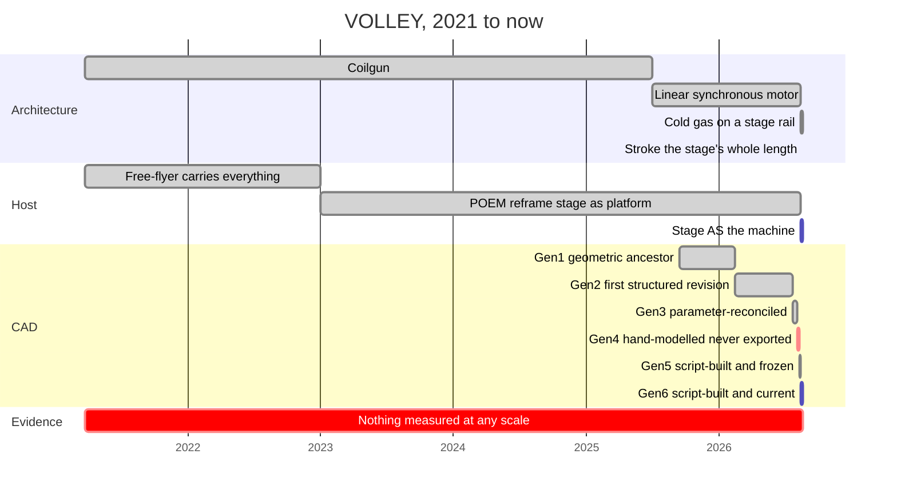
```mermaid
gantt
    title VOLLEY, 2021 to now
    dateFormat YYYY-MM-DD
    axisFormat %Y
    todayMarker off

    section Architecture
    Coilgun                          :done, a1, 2021-03-22, 2025-07-01
    Linear synchronous motor         :done, a2, 2025-07-01, 2026-08-14
    Cold gas on a stage rail         :done, a3, 2026-08-14, 2026-08-19
    Stroke  the stage's whole length :active, a4, 2026-08-19, 2026-08-20

    section Host
    Free-flyer  carries everything   :done, h1, 2021-03-22, 2023-01-01
    POEM reframe  stage as platform  :done, h2, 2023-01-01, 2026-08-14
    Stage AS the machine             :active, h3, 2026-08-14, 2026-08-20

    section CAD
    Gen1  geometric ancestor         :done, c1, 2025-09-15, 2026-02-15
    Gen2  first structured revision  :done, c2, 2026-02-15, 2026-07-23
    Gen3  parameter-reconciled       :done, c3, 2026-07-23, 2026-08-03
    Gen4  hand-modelled never exported :crit, c4, 2026-08-03, 2026-08-10
    Gen5  script-built and frozen    :done, c5, 2026-08-10, 2026-08-14
    Gen6  script-built and current   :active, c6, 2026-08-14, 2026-08-20

    section Evidence
    Nothing measured at any scale    :crit, e1, 2021-03-22, 2026-08-20
```

<sub><b>Dates carry the precision <a href="docs/HISTORY.md">docs/HISTORY.md</a> records, and not
more.</b> <b>Documented:</b> the 2021-03-22 concept, the 2026-07-23 Gen3 build, and everything from
2026-07-29 on, which is in git. <b>Approximate:</b> the mid-2025 motor decision, Gen1 and Gen2,
whose build history was never reconstructed — <code>cad/CHANGELOG_CAD.md</code> gives Gen1 a range
of 2021–2025 and is the authority if this disagrees. <b>Inferred:</b> the 2023 host reframe has a
year and no month in the record; it is drawn at the start of that year and the bar's left edge
should not be read as a date. Bar <i>lengths</i> are spans between milestones, not durations of
work.</sub>

**The Host lane is the one with a direction.** **[ADR-002](docs/adr/002-host-is-a-spent-upper-stage.md),
2023** — *"Learning of ISRO's POEM, a spent PSLV fourth stage operated as a stabilised platform,
reframed the problem"* — set it, and every architecture decision since has moved the design from
*riding* a stage to *being* one. **[`docs/LINEAGE.md`](docs/LINEAGE.md)** is that through-line,
with what each CAD generation assumed about the vehicle underneath it.

**The bottom bar is the one that matters.** Five years, three architectures, six CAD
generations, fifty-three analyses — and **not one measurement**. That is `OPEN_PROBLEMS.md` **E4**,
it is open, and nothing above it changes that.

### Which generation is which

**Gen4 was the last one drawn by hand and it has no committed export. Gen5 is the frozen baseline
every headline number is computed against. Gen6 is the design target.** The renders below get
plainer in that order, and the reason is not the renderer.

**The full comparison — drive, store, arrest, structure, and what each generation fixed —
is [`docs/GENERATIONS.md`](docs/GENERATIONS.md).** What the three look like:

<table>
<tr>
<td width="33%"><a href="cad/renders/hero_open.png">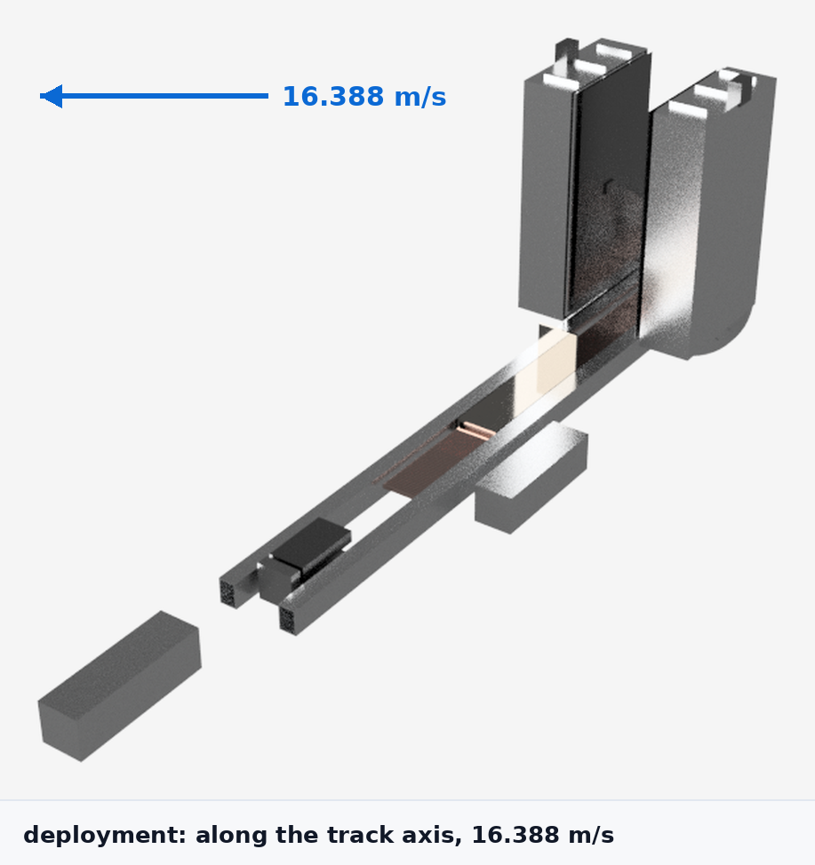</a><br><sub><b>Gen4.</b> Hand-modelled, more detail than any generation since, and no committed export.</sub></td>
<td width="33%"><a href="cad/renders/gen5/hero_open.png">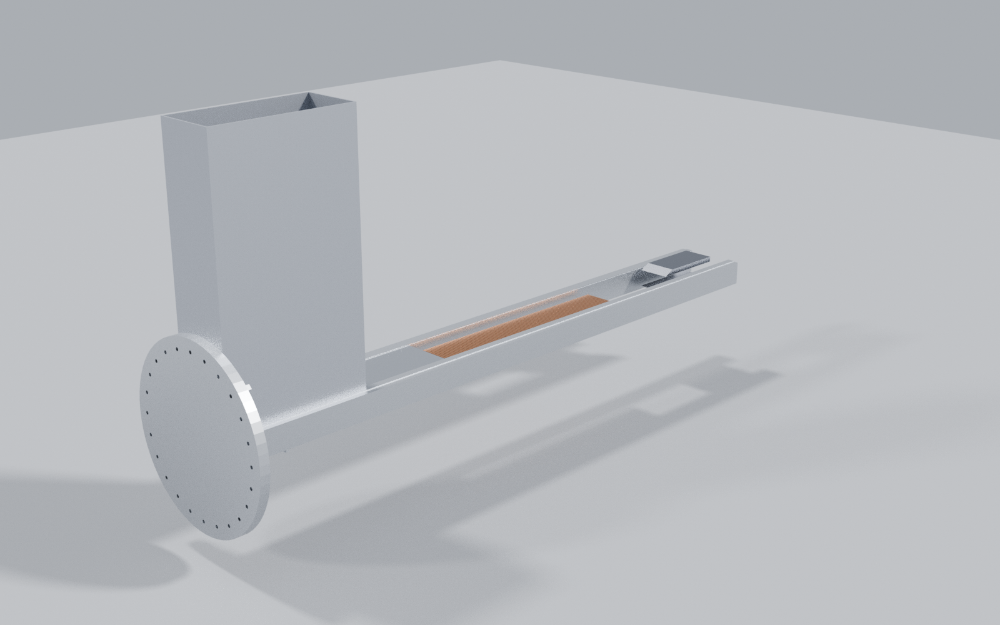</a><br><sub><b>Gen5.</b> Eight parts from the parameter file. Plainer because every feature must trace to a parameter.</sub></td>
<td width="33%"><a href="cad/renders/gen6/hero_open.png">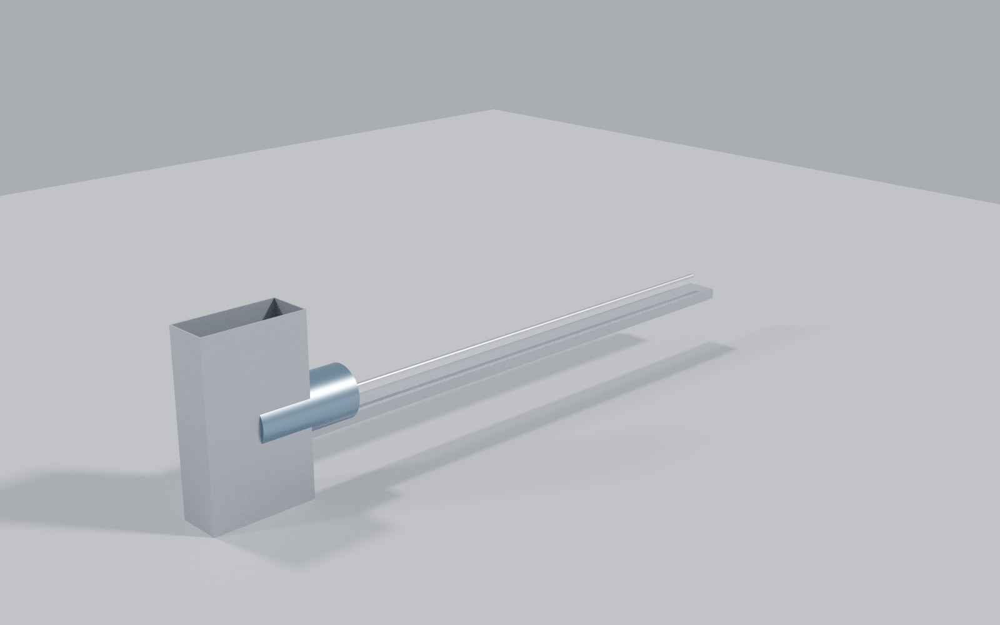</a><br><sub><b>Gen6.</b> What is left after deletion: a rail, a tube, a chamber — now <b>8.2 m of it</b>, the host stage's whole length (ADR-034). <b>The difference is the architecture, not the renderer.</b></sub></td>
</tr>
</table>

**[The full comparison, with what each generation fixed and what it cost →](docs/GENERATIONS.md)** · **[the per-generation archive, one file each →](docs/generations/README.md)**

> **Getting Gen6 to frozen.** Gen5 earned that label on five properties; **Gen6 has two** — it is
> script-built and it rebuilds byte-identically. It does not carry the headline numbers, has no
> second implementation checking it, and has A35–A53 behind it against Gen5's structural FEA,
> circuit simulation, CFD and designed control loop. **[`docs/GEN6_CLOSURE.md`](docs/GEN6_CLOSURE.md)
> is what closing that costs** — seven analyses that are computation, four decisions that are the
> owner's, and one measurement (**P67**) that can *delete* work rather than add it. *Phase I froze
> Gen5 **with three kill criteria crossed and stated as such**, and that is the honest target here
> too.*

### The same arc, as a diagram

**Solid arrows are the line the design actually took. Broken arrows go to the vault** —
[VOLLEY-lab](https://github.com/aaaaaaaaaaaavm/VOLLEY-lab), where every branch that stopped
records why, and **not one of them was refuted.**

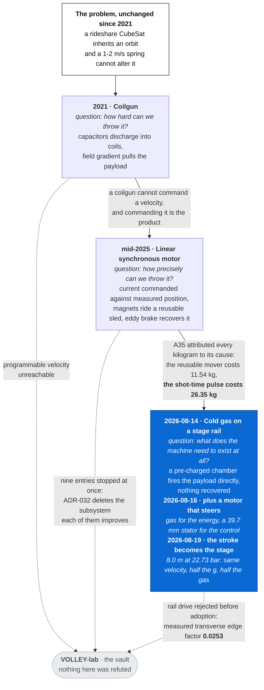
```mermaid
flowchart TD
    P["<b>The problem, unchanged since 2021</b><br/>a rideshare CubeSat inherits an orbit<br/>and a 1-2 m/s spring cannot alter it"]

    A1["<b>2021 · Coilgun</b><br/><i>question: how hard can we throw it?</i><br/>capacitors discharge into coils,<br/>field gradient pulls the payload"]
    A2["<b>mid-2025 · Linear synchronous motor</b><br/><i>question: how precisely can we throw it?</i><br/>current commanded against measured position,<br/>magnets ride a reusable sled, eddy brake recovers it"]
    A3["<b>2026-08-14 · Cold gas on a stage rail</b><br/><i>question: what does the machine need to exist at all?</i><br/>a pre-charged chamber fires the payload directly,<br/>nothing recovered<br/><b>2026-08-16 · plus a motor that steers</b><br/><i>gas for the energy, a 39.7 mm stator for the control</i><br/><b>2026-08-19 · the stroke becomes the stage</b><br/><i>8.0 m at 22.73 bar: same velocity, half the g, half the gas</i>"]

    P --> A1
    A1 -->|"a coilgun cannot command a velocity,<br/>and commanding it is the product"| A2
    A2 -->|"A35 attributed every kilogram to its cause:<br/>the reusable mover costs 11.54 kg,<br/><b>the shot-time pulse costs 26.35 kg</b>"| A3

    V(["<b>VOLLEY-lab</b> · the vault<br/>nothing here was refuted"])

    A1 -.->|"programmable velocity<br/>unreachable"| V
    A2 -.->|"nine entries stopped at once:<br/>ADR-032 deletes the subsystem<br/>each of them improves"| V
    A3 -.->|"rail drive rejected before adoption:<br/>measured transverse edge factor <b>0.0253</b>"| V

    classDef live fill:#0b69d4,stroke:#083f80,color:#fff
    classDef dead fill:#e9ecef,stroke:#adb5bd,color:#495057
    classDef prob fill:#fff,stroke:#111,color:#111
    class A3 live
    class V dead
    class P prob
```


<sub><b>Those are kilograms, not percentages, and deliberately.</b> A35's shares were published as
percentages of a 84.53 kg rollup; <a href="validation/A46_enclosure_buildup.md">A46</a> moved the
rollup to 126.6 kg on 2026-08-16, so every percentage of dry mass fell without a single kilogram
moving. <b>The attributed masses are what the run actually measured</b> and they do not move with
the denominator. The ordering is unchanged and the margin widened: the pulse costs
<b>2.28×</b> the mover, where at the old rollup it was 2.07×. <b>P73.</b></sub>

### The branches that stopped — and why they are kept

**[VOLLEY-lab](https://github.com/aaaaaaaaaaaavm/VOLLEY-lab) is the vault**, and its one rule is
that every entry states why it stopped. **Not one of these was refuted.** Each is a correct
analysis of a part that no longer exists, and a vault whose entries vanish when the design moves
is a graveyard.

| Branch | What it was | Why it stopped |
|---|---|---|
| **[PII-19](https://github.com/aaaaaaaaaaaavm/VOLLEY-lab/blob/main/PII-19_induction_drive_gen6.md)** · induction drive | the Gen6 that *was* adopted, 2026-08-13 | Superseded in a day. **The mover it spent its whole effort making lighter costs 11.54 kg, against 26.35 kg for the pulse it kept** |
| **[PII-16](docs/GEN6_RAIL_DRIVE.md)** · satellite's own CDS rails as the motor secondary | 116 cm² of conductive rail every customer already owns | **Rejected before adoption.** A30 measured a transverse edge factor of **0.0253** |
| **PII-1** · momentum-transfer release | the project's self-declared strongest idea | **Deleted by arithmetic it wrote itself.** Δv scales with the mover mass *M*; with no mover, M = 0 |
| **PII-7** · a bank that can source the shot | four parallel strings, the fix for **P26** | **No bank.** The largest live defect the project carried, answered by an architecture whose electrical demand A51 measures at **0.26 W average** |
| **[PII-11](https://github.com/aaaaaaaaaaaavm/VOLLEY-lab/blob/main/PII-11_deployable_track.md)** · deployable track | fold the 1.8 m track for launch | The stage is already deployed, already long and already straight |
| **[PII-14](https://github.com/aaaaaaaaaaaavm/VOLLEY-lab/blob/main/PII-14_cable_driven_gondola.md)** · cable-driven gondola | +49.7 % exit velocity in the same track | **The headline assumed zero rotating inertia.** Realistically +15 to +30 %, possibly zero |
| **PII-2, -3, -4, -12, -17, -18** | ribbed chassis, two-layer stator, repackaged envelope, block commutation, departing mover, 0.25 kg shuttle | No sled, no stator, no envelope, no mover — **nine entries stopped on one day, for a reason none of them anticipated** |

**Two got closer rather than stopped.**
**[PII-8](https://github.com/aaaaaaaaaaaavm/VOLLEY-lab/blob/main/PII-8_free_flyer.md)**, the
free-flyer, had airgap straightness over a deployed structure as its hardest problem — **Gen6 has
no airgap.** And
**[PII-9](https://github.com/aaaaaaaaaaaavm/VOLLEY-lab/blob/main/PII-9_lunar.md)**, the lunar case,
never depended on this architecture at all.

**[The full vault, with the close condition each entry must meet to come back →](docs/VAULT.md)**


**Spin it in the browser:** [`cad/stl/EMOCD_Assembly_Gen3.stl`](cad/stl/EMOCD_Assembly_Gen3.stl)
and [`cad/stl/EMOCD_Sled_Gen3.stl`](cad/stl/EMOCD_Sled_Gen3.stl), GitHub renders STL
natively, so click either and drag. They are derived meshes; `cad/step/gen3/` is the master
geometry ([why](cad/stl/README.md)).

### What the machine looked like at Gen4

<table>
<tr>
<td width="50%"><a href="cad/renders/hero_open.png"></a><br><sub><b>Interior.</b> Track, stator belts, sled and cassette, enclosure open. The payload leaves along the track axis at 16.029 m/s.</sub></td>
<td width="50%"><a href="cad/renders/espa_interface.png">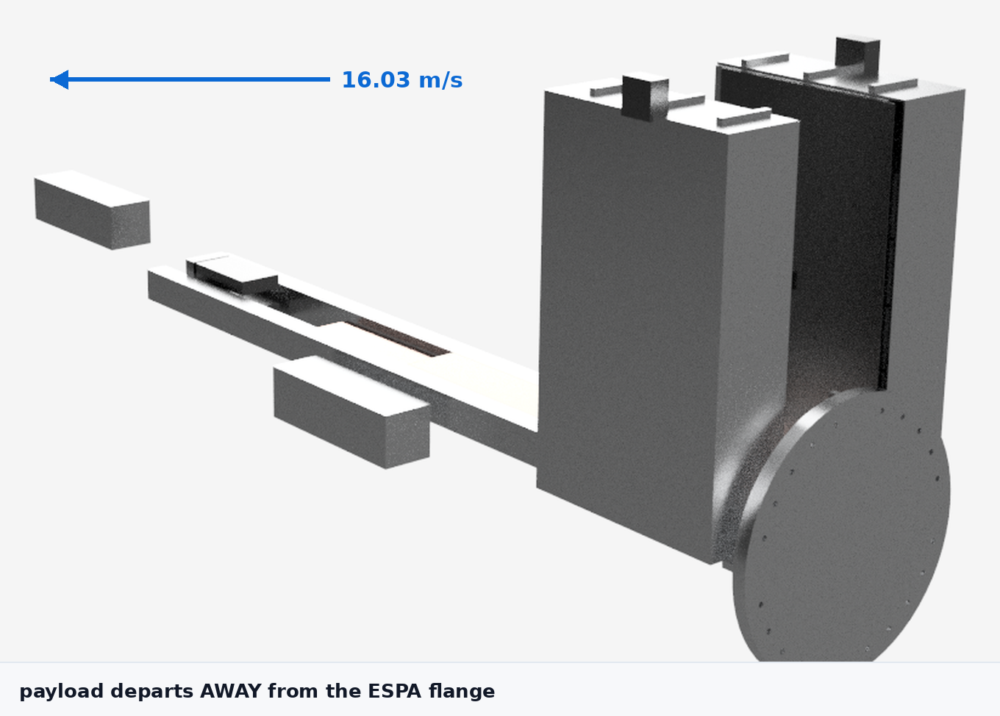</a><br><sub><b>Aft mounting.</b> Ø460 mm ring flange, Ø400 mm bolt circle, 24 holes. The payload departs <b>away from</b> the flange, out the muzzle.</sub></td>
</tr>
<tr>
<td width="50%"><a href="cad/renders/track_stator.png">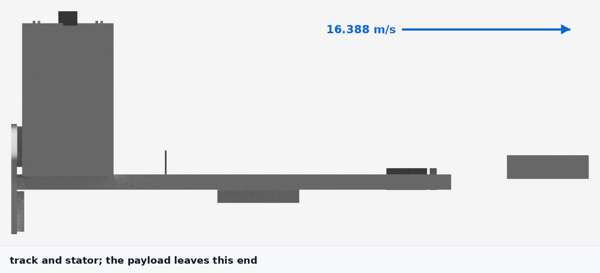</a><br><sub><b>Track and stator.</b> Side elevation. Gen4 stows the sled at s = 300 mm and releases at s = 1200 mm.</sub></td>
<td width="50%"><a href="cad/renders/brake.png">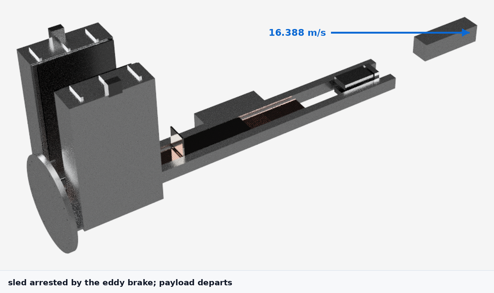</a><br><sub><b>Brake.</b> The sled is arrested by the eddy brake after the payload has gone. Gen4 brake-fin entry at s = 1222 mm.</sub></td>
</tr>
<tr>
<td width="50%"><a href="cad/renders/sled_detail.png">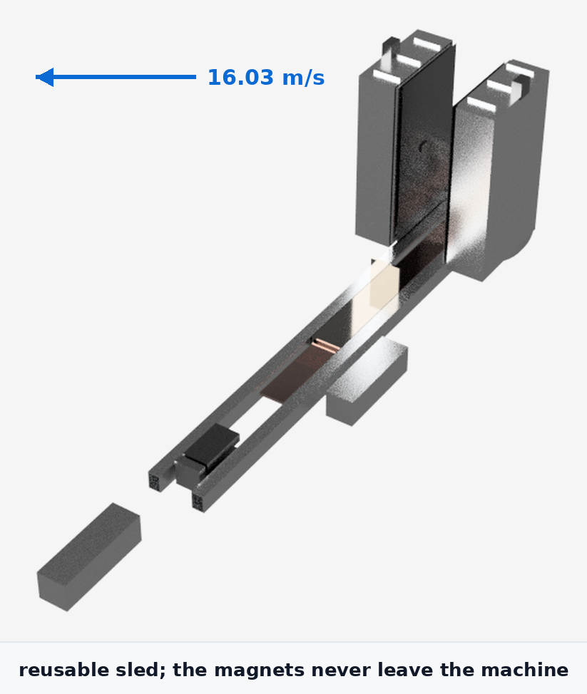</a><br><sub><b>Sled.</b> Reusable, 488 mm. The magnets ride the sled and never leave the machine.</sub></td>
<td width="50%"><a href="cad/renders/magazine_feed.png">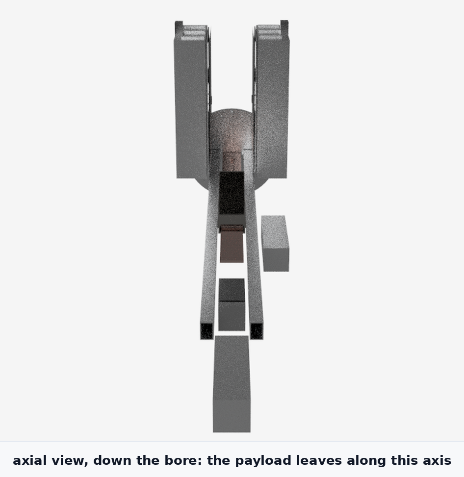</a><br><sub><b>Down the bore.</b> Axial view along the departure axis, cassette feeding transversely into the breech.</sub></td>
</tr>
</table>

<sub><b>These are the Gen4 Fusion model, and Gen4 has no committed STEP export.</b> No performance number on this page is taken from them: Gen4's stations differ from the analysis model's, and its release point is 1200 mm where <code>analysis/</code> assumes 1500. The payload is a plain rectangular 3U proxy. The velocity annotated on each image is read from <code>analysis/results/motor_results.json</code> at render time — it was hard-coded until 2026-08-16 and said <b>16.388 m/s</b>, a figure withdrawn twice (<b>P72</b>). Full account: <a href="docs/GEN4_STATUS.md">docs/GEN4_STATUS.md</a>, ADR-019 and <b>P43</b>. <b>Gen5 and Gen6 are rendered in <a href="docs/GENERATIONS.md">docs/GENERATIONS.md</a>.</b></sub>

## Host integration, worked against real vehicles

The interface asks four things of any host: mass and control authority, a 150-300 W recharge
feed, a serial command link, and an authorized firing window. Two Indian candidates are
worked as examples in the paper because both exist today.

**ISRO's POEM** is the flown precedent, a spent PS4 stage operated as a three-axis-stabilized
hosted platform with solar power, NavIC navigation and helium attitude thrusters, retired by
controlled reentry. It supplies everything the attached variant borrows, and its zero-debris
closeout is the regulatory template.

**Skyroot Aerospace's Vikram-1** carries a restartable liquid Orbit Adjustment Module, one
Raman-2 engine, four Raman Mini thrusters, eight cold-gas thrusters, stage-tested through more
than a thousand pulses, whose stated multi-orbit deployment role is functionally the PS4's.
Against the vehicle's published 350 kg LEO capacity, a loaded VOLLEY is **34 %**, falling to
**22 %** and **13 %** on the announced 550 kg and 900 kg family members. Early flights are
therefore dedicated demonstrations and later ones ordinary manifest items.

One integration quantity cannot be closed from public data: the OAM's mass and control
authority are undisclosed, which is why the recoil budget is parametric. Obtaining stage mass,
thruster impulse budget and coast duration is the single data exchange that converts this
analysis from parametric to specific, for any candidate vehicle, Indian or otherwise.

Recoil is the satellite's momentum only, **64.1 N·s** per shot, nulled by a few grams of cold
gas. Comparison against fielded deployers and transfer vehicles, including Dhruva Space's
flown DSOD, is in [`docs/LANDSCAPE.md`](docs/LANDSCAPE.md).


## Repository layout

- `analysis/`, current scripts; these reproduce the numbers above
- `analysis/femm/`, FEMM magnetostatics package: `emocd_cross_section.dxf` + `FEMM_RUN_SHEET.md` (analysis A1, not yet run)
- `cad/`, the CAD: `parameters.json` is the geometry source of truth, and
  **`build_gen5.py` and `build_gen6.py` generate every current part from it** — `step/gen5/` and
  `step/gen6/` rebuild byte-identically from a clean clone. `step/gen1|gen2|gen3/` are the earlier
  Fusion exports, kept for history. Also `scad/` (**a second, independent OpenSCAD implementation
  of Gen5 — it found P71 on its first run**), `stl/` (browser-viewable meshes),
  `renders/` with `gen5/` and `gen6/` subdirectories, `tools/`, and `CHANGELOG_CAD.md`
- `legacy/`, superseded scripts, kept for history, **do not cite**
- `figures/`, every result figure, regenerated from `analysis/` by `tools/make_figures.py`
- **No LaTeX lives here.** The IEEE manuscript, its `.cls`, the built PDF and the CV are
  authored in **[VOLLEY-paper](https://github.com/aaaaaaaaaaaavm/VOLLEY-paper)** (ADR-028)
- `validation/`, independent cross-check plan (FEMM, CalculiX, Orekit, CARA, Chrono),
  each with an acceptance band declared before the run; nothing run yet
- `docs/`, computation notes, FEMM run sheet, related work and comparator sources
- `docs/PROJECT_NOTES.md`, working context: ground rules, layout, locked decisions
- `docs/LANDSCAPE.md`, how this compares with deployers that actually fly
- `docs/DESIGN_OPTIONS_exit_velocity.md`, options for the P15 velocity shortfall, costed
- `docs/INVENTORY.md`, complete indexed catalogue of every calculation, decision and artifact
- `docs/DECISION_LOG.md`, why each design change happened, including two self-corrections
- `docs/PROVENANCE.md`, what came from where, and what was never verified
- `OPEN_PROBLEMS.md`, known errors in the paper, and unsolved engineering
- `docs/PROGRAMME.md`, the four repositories and how they relate
- `docs/BASELINE.md`, the frozen Phase I baseline (generated) and its change-control rule
- `docs/GEN4_STATUS.md`, provisional open-assembly geometry and the export/performance gate
- `docs/HISTORY.md`, project timeline since 2021, and how the git history was reconstructed
- `docs/programme/`, the governing dossier, adopted verbatim, plus its amendment record
- `docs/adr/`, thirty-three architecture decision records
- `docs/VAULT.md`, deferred work and the gate it must clear to return
- `docs/MANUFACTURING.md`, tolerance stack, assembly hazard, make-vs-buy
- `docs/CROSS_INDUSTRY.md`, which open items are actually solved elsewhere
- `docs/QUALIFICATION_PLAN.md`, environmental and qualification campaign, specified not run
- `docs/BENCHTOP_TESTS.md`, four cheap sub-scale experiments, bands declared in advance
- `analysis/cost.py`, parametric BOM; every price assumed, structure is the deliverable


## Licence

**The whole of this repository is CC BY 4.0** — a single licence at the root, no directory
split. Full text in [`LICENSE`](LICENSE), attribution form in [`NOTICE`](NOTICE), scope and
reasoning in [`LICENSING.md`](LICENSING.md).

**This is not retroactive.** Snapshots taken before this change — clones, forks, archives, and
every commit reachable before it — **remain available under the MIT licence** they carried at
the time; that text is kept at [`LICENSE-MIT-superseded`](LICENSE-MIT-superseded).

The IEEE manuscript, which now lives in [VOLLEY-paper](https://github.com/aaaaaaaaaaaavm/VOLLEY-paper), is a separate case: **an IEEE copyright transfer on acceptance
would supersede this licence for the accepted version.** See [`LICENSING.md`](LICENSING.md).

### Across the programme

| Repository | Licence | Why |
|---|---|---|
| **[VOLLEY](https://github.com/aaaaaaaaaaaavm/VOLLEY)** | **CC BY 4.0** | The engineering record. One licence, no directory split — `analysis/` is the design expressed executably, not tooling around it |
| [VOLLEY-thesis](https://github.com/aaaaaaaaaaaavm/VOLLEY-thesis) | CC BY 4.0 | Generated companion; documents |
| [VOLLEY-lab](https://github.com/aaaaaaaaaaaavm/VOLLEY-lab) | CC BY 4.0 | Phase II research track; documents |
| [pulsed-linear-motor-design-lab](https://github.com/aaaaaaaaaaaavm/pulsed-linear-motor-design-lab) | CC BY 4.0 | Carries `reference/volley/motor_model.py` — **the invention.** A patent-granting licence was considered and rejected |
| [orbital-deployment-trade-study](https://github.com/aaaaaaaaaaaavm/orbital-deployment-trade-study) | CC BY 4.0 | Same: carries `motor_model.py` and `astro.py` |
| [engineering-evidence-toolkit](https://github.com/aaaaaaaaaaaavm/engineering-evidence-toolkit) | **Apache-2.0** | The only repository containing no part of the deployer design. Its code is `src/engtrace/`; its `reference/volley/` copies are repository tooling. **Apache §3 grants patent rights**, so it is used only where nothing is disclosed |
| **[VOLLEY-paper](https://github.com/aaaaaaaaaaaavm/VOLLEY-paper)** | **MIT — held** | Relicensing it would set terms for a manuscript whose rights may transfer to IEEE on acceptance. **The hold is enforced by the export manifest**, not by discipline: that companion's `LICENSE` is sourced from `LICENSE-MIT-superseded`, so a routine regeneration cannot relicense it by accident |

**CC BY 4.0 does not license patent rights** (§2(b)(2)), and that is deliberate across six of the
seven. Apache-2.0 does, which is why it appears exactly once.

## Using this work

This work is intended to be built, not only read. I am available to work on it with anyone who
is building it. Contact: **Adityavardhanmishra@icloud.com**.
Attribution is required under CC BY 4.0, including an indication of what was changed.

## Author

**Adityavardhan Mishra**: Department of Mechanical Engineering, Symbiosis Institute of
Technology, Symbiosis International (Deemed University), Pune. Project begun April 2021.

 [adityavardhanmishr@gmail.com](mailto:adityavardhanmishr@gmail.com)

Questions, corrections and reproduction attempts are all welcome, particularly reproduction
attempts. If a number in this repository does not reproduce for you, that is a defect and I
want to know. See [`docs/CONTRIBUTING.md`](docs/CONTRIBUTING.md).
