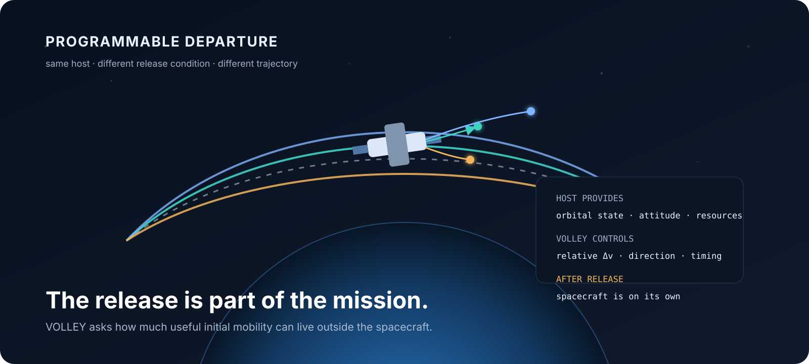
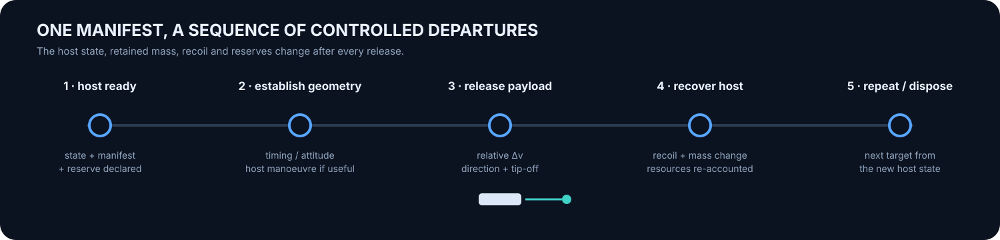
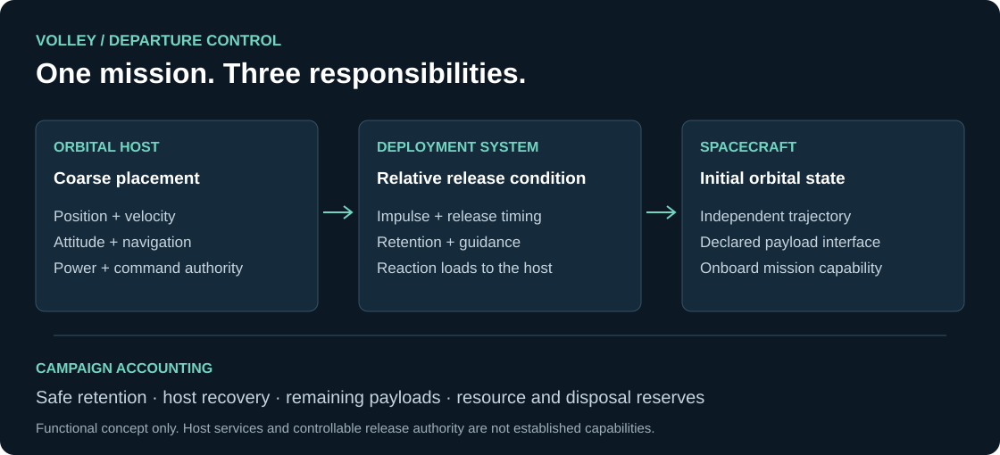
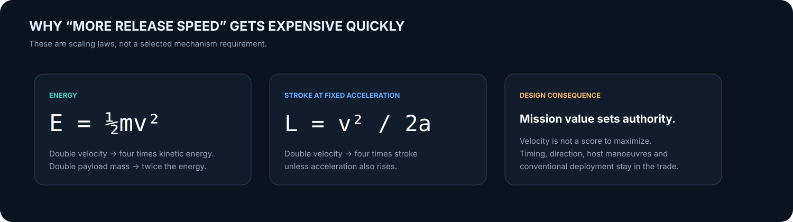
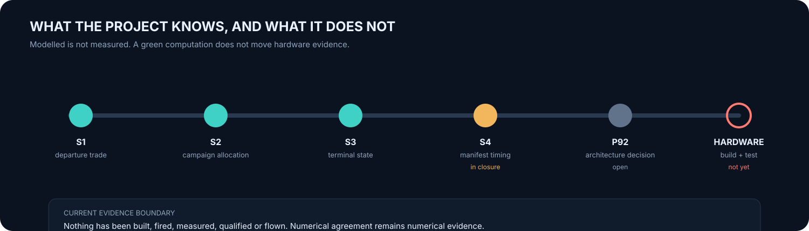
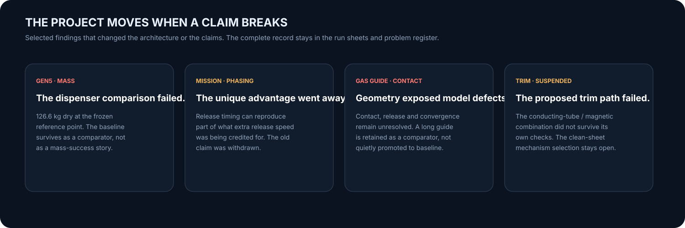
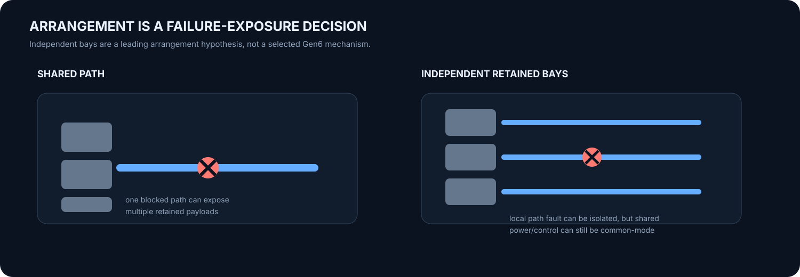

# VOLLEY

### Programmable spacecraft departure from a controlled orbital host.

I started VOLLEY with a question: **how much of a satellite's initial orbital distribution can be handled by the system that releases it, before the satellite has to carry propulsion of its own?**

The project investigates provider-hosted control of individual payload departure conditions: relative release velocity, direction and timing across one spacecraft or a manifest. Keeping the spacecraft mechanically and electrically unmodified is the design objective; the interfaces still have to earn that claim.

> **Computational engineering programme. Nothing has been built, fired, measured, qualified or flown.**

[Interactive project site](https://aaaaaaaaaaaavm.github.io/VOLLEY/) · [Documentation portal](https://aaaaaaaaaaaavm.github.io/VOLLEY/docs.html) · [Current work](docs/PROGRAMME_EXECUTION.md) · [Evidence](https://aaaaaaaaaaaavm.github.io/VOLLEY/evidence.html) · [CAD](cad/README.md) · [Open problems](OPEN_PROBLEMS.md)

<table><tr><td width="48%"></td><td width="52%"></td></tr><tr><td><b>A machine that actually existed in the engineering record.</b> Gen5 is the frozen electromagnetic comparator, not the next design.</td><td><b>The idea that survives the machines.</b> Same host, individually controlled departure conditions, then the spacecraft is on its own.</td></tr></table>

---

## The mission in one picture

A secondary spacecraft begins with the position and velocity its launch service gives it. Its separation mechanism adds another initial condition. VOLLEY asks when controlling that condition more deliberately is worth the hardware, energy and operational burden.



The host supplies navigation, attitude authority and any permitted orbital manoeuvres. The deployment system supplies the relative release condition and mechanical interface. After separation, the spacecraft follows the resulting trajectory and whatever capabilities it carries itself.

**VOLLEY cannot provide continuing stationkeeping, collision avoidance or formation maintenance after contact ends.** Release changes velocity at the release position; it cannot place a propulsion-less spacecraft into an arbitrary different circular orbit by itself.

The comparison therefore includes ordinary springs, release timing, host manoeuvres, cooperative spacecraft interfaces and payload propulsion wherever they can do the same mission. Programmability has to beat a competent baseline, not a deliberately weak one.



---

## Five years of changing the machine

The project began in **2021** around a coilgun and a dedicated free-flyer. In **2023**, learning from the spent-upper-stage platform idea represented by POEM reframed the host as an active post-primary delivery platform. By mid-2025 the coilgun had become a linear synchronous motor because commanding release velocity mattered more than simply ejecting a payload. In 2026 the stage itself became part of the machine.

<table><tr><td width="33%"></td><td width="33%"></td><td width="33%"></td></tr><tr><td><b>Gen4.</b> Last hand-modelled generation. Detailed, but no committed STEP export and known geometry/analysis disagreement.</td><td><b>Gen5.</b> Frozen electromagnetic baseline. Reproducible generated CAD and the manuscript comparator. The mass comparison failed.</td><td><b>Existing Gen6.</b> Stage-integrated gas-guide investigation. Contact/release physics and accommodation remain unresolved; trim is suspended.</td></tr></table>

### The current redesign is intentionally not pictured.

No clean-sheet mechanism has won. The next design will not get a hero render before the mission comparison and architecture decision earn one. The existing gas guide remains a comparator with its results and failures intact.

[Full generation record](docs/GENERATIONS.md) · [Decision lineage](docs/LINEAGE.md) · [Visual machine evolution](https://aaaaaaaaaaaavm.github.io/VOLLEY/evolution.html)

---

## Velocity is not the product score

At the frozen Gen5 model point the calculated release velocity is **16.029 m/s**, peak acceleration is **10.07 g**, dry mass is **126.6 kg**, and net electrical-to-payload efficiency is **18.8%**. Those are outputs of one frozen configuration, not product requirements.



The mission studies are already showing why this matters. In one common-energy campaign the **11.8, 16.029 and 29.009 m/s** release-authority screens all avoid host corrections. That case gives no reason to choose the highest speed. Timing, direction, terminal-state error, host manoeuvres, installed burden and controllability matter alongside raw velocity.

---

## What the evidence actually says



| Study | Cases | What it adds | What remains outside the result |
|---|---:|---|---|
| [S1 · Departure-state trade](docs/DEPARTURE_TRADE.md) | 210 | Finite host recoil and assumed release authority | Complete campaign and installed-system benefit |
| [S2 · Sequential campaign](docs/CAMPAIGN_ALLOCATION.md) | 180 | Host propagation, remaining manifest mass and propellant allocation | Full position/velocity targets and useful constellation performance |
| [S3 · Terminal-state timing](docs/TERMINAL_TIMING.md) | 300 | Identical terminal position/velocity target and release-time search for one payload | Coupled multi-payload optimization |
| **S4 · Manifest timing** | **in closure** | Coupled two-payload terminal-state campaign | Not promoted to completed evidence until generated artifacts, freshness checks and companion snapshots are coherent |

The browser [mission sandbox](https://aaaaaaaaaaaavm.github.io/VOLLEY/#sim) is deliberately **not** part of this evidence chain. It is a simple two-body visualisation for intuition. The validated studies above remain authoritative.

[Provenance](docs/PROVENANCE.md) · [Run sheets](validation/README.md) · [Figure index](docs/FIGURE_INDEX.md) · [Visual evidence portal](https://aaaaaaaaaaaavm.github.io/VOLLEY/evidence.html)

---

## Things that broke

The failures are not a footnote because several of them changed what VOLLEY is allowed to claim.



Gen5 loses its 3U dispenser mass comparison. The original unique constellation-phasing advantage was withdrawn after release timing proved to be a real competitor. The long gas guide exposed contact/release and model-form defects. The proposed electromagnetic trim path did not survive its own checks and is suspended.

The point is not to collect red boxes. The point is that a failed calculation must be able to change the machine.

[Open problem register](OPEN_PROBLEMS.md) · [Kill criteria](docs/KILL_CRITERIA.md) · [Computational closure](docs/COMPUTATIONAL_CLOSURE.md)

---

## The architecture question now

Before choosing a mechanism, the redesign separates two decisions that earlier generations tended to collapse:

**Payload arrangement:** independent retained bays, banks, or a shared magazine.

**How the release is produced:** controlled stored-energy pusher, short-stroke electromechanical pusher, gas-driven mechanism, or another architecture that survives the requirements.



Independent paths can reduce how many payloads one blocked path strands, but shared power and control can still be common-mode failures. A shared magazine may win mass and packaging. Neither gets the answer for free.

The comparison charges installed mass, envelope, energy, consumables, thermal recovery, clearing time, host reaction, controllability, retention, arrest, tolerances and fault exposure to the candidate that needs them.

---

## Scaling is an architecture family, not enlarged CAD

The existing reference is **4 kg / 3U**. From there the work moves to adjacent payload sizes and **2-, 4- and 12-payload** arrangements. Very small spacecraft are sensitive to adapter overhead. Larger spacecraft bring stronger interfaces, distributed force application and larger host reaction demands.

A programmable ground separation-test system is an adjacent application worth keeping: controlled push profile, instrumented surrogate, measured release velocity, tip-off and repeatability. It could answer release-physics questions before a flight product exists, provided gravity and test-support effects are accounted for.

---

## What happens next

**1. Finish the coupled manifest mission comparison.** Close S4 as reproducible evidence rather than a passing script on a branch.

**2. Select the architecture.** Compare arrangement and mechanism under the same mission requirements and record why the losing architectures lost.

**3. Engineer one release cell.** Retention, actuator, arrest, structure, tolerances, sensors, controls, thermal behaviour, faults and interfaces.

**4. Scale and make it buildable.** Drawings, BOM, budgets, assembly/inspection, instrumentation, calibration, uncertainty and frozen acceptance criteria before the test.

[Programme execution](docs/PROGRAMME_EXECUTION.md) · [Mission and redesign](docs/workstreams/MISSION_AND_REDESIGN.md) · [Engineering closure](docs/workstreams/ENGINEERING_CLOSURE.md) · [Visual current-work portal](https://aaaaaaaaaaaavm.github.io/VOLLEY/work.html)

---

## Explore the project visually

| | | | | |
|---|---|---|---|---|
| [**Concept**](https://aaaaaaaaaaaavm.github.io/VOLLEY/concept.html) | [**Evolution**](https://aaaaaaaaaaaavm.github.io/VOLLEY/evolution.html) | [**Mission sandbox**](https://aaaaaaaaaaaavm.github.io/VOLLEY/#sim) | [**Evidence**](https://aaaaaaaaaaaavm.github.io/VOLLEY/evidence.html) | [**Documentation**](https://aaaaaaaaaaaavm.github.io/VOLLEY/docs.html) |
| Mission boundary and real host context | Five years of machine changes and failures | Interactive release velocity, timing and propagation | Studies, run sheets, provenance and visual outputs | Mission, CAD, validation, build readiness and programme map |

The [interactive project site](https://aaaaaaaaaaaavm.github.io/VOLLEY/) is the visual front door. The repository remains the engineering record.

---

## Reproduce

Use Python 3.12 or newer and a full-history clone. The companion provenance check needs the recorded export commit in local history.

```bash
python3 -m venv .venv
. .venv/bin/activate
python -m pip install -r requirements.txt -r requirements-dev.txt
bash tools/verify_all.sh
```

Run from a clean committed checkout. The command checks repository consistency and the numerical checks it lists; it does not rerun every external solver or certify the design. Missing checks remain visible.

## Programme repositories

| Repository | Role |
|---|---|
| **VOLLEY** | Flagship engineering record and unmodified-payload design objective |
| [BOLLEY](https://github.com/aaaaaaaaaaaavm/BOLLEY) | Sister project: passive spacecraft interfaces in exchange for different launcher machinery |
| [VOLLEY-paper](https://github.com/aaaaaaaaaaaavm/VOLLEY-paper) | Gen5 manuscript and exported reproducibility evidence |
| [VOLLEY-thesis](https://github.com/aaaaaaaaaaaavm/VOLLEY-thesis) | Gen5 submission material and exported evidence |
| [VOLLEY-lab](https://github.com/aaaaaaaaaaaavm/VOLLEY-lab) | Stopped alternatives and conditions for reopening them |

## Author and use

**Adityavardhan Mishra** · Mechanical Engineering, Symbiosis Institute of Technology, Pune  
Project begun April 2021 · adityavardhanmishr@gmail.com

I welcome independent reproduction, design review and prototype collaboration. Please identify the configuration and run when reporting a discrepancy.

[CC BY 4.0](LICENSE). See [NOTICE](NOTICE), [LICENSING.md](LICENSING.md) and [CITATION.cff](CITATION.cff) for attribution and scope. Historical snapshots retain the terms under which they were released.