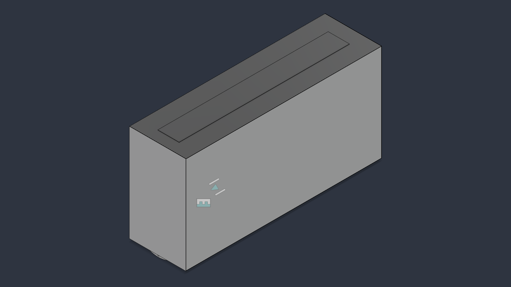
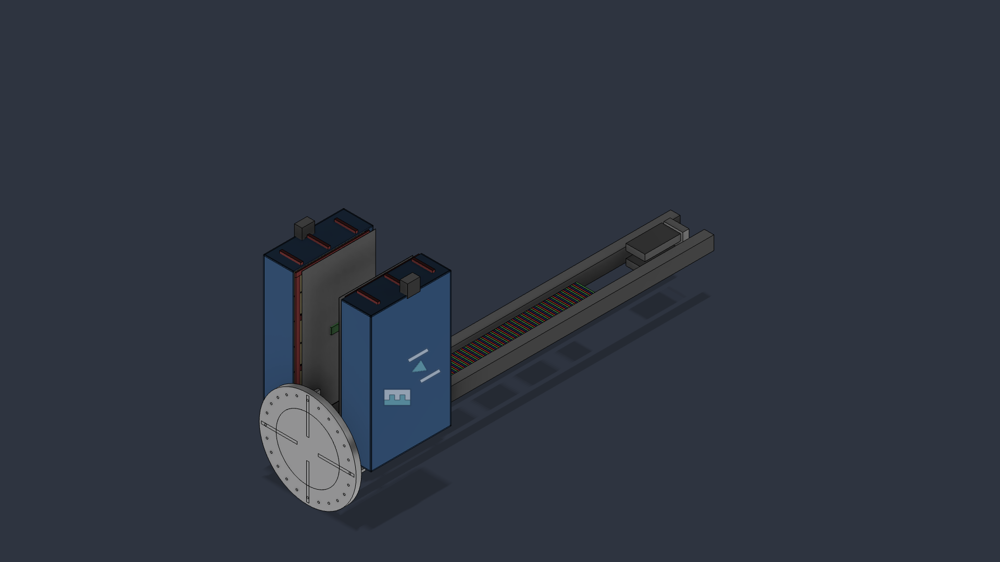
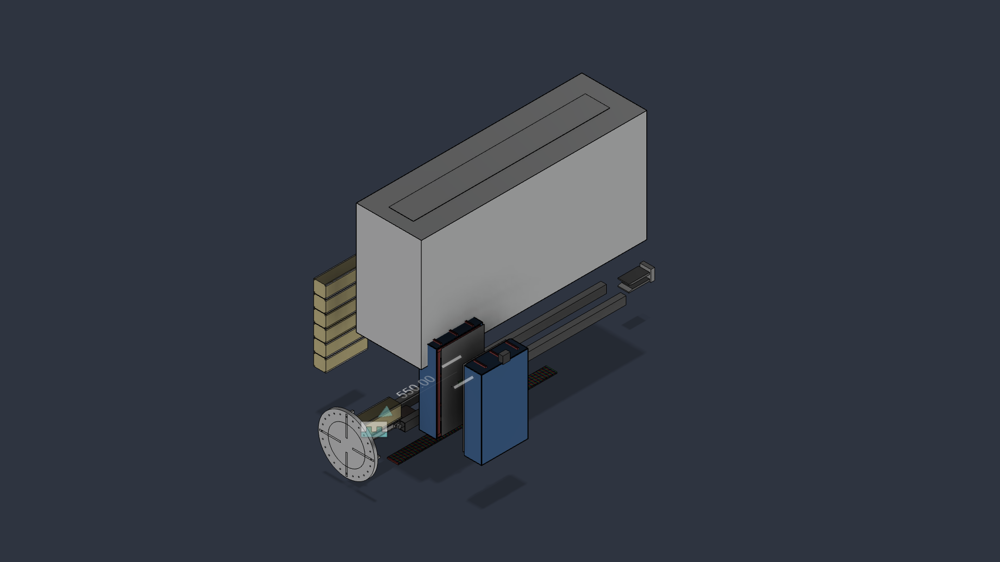
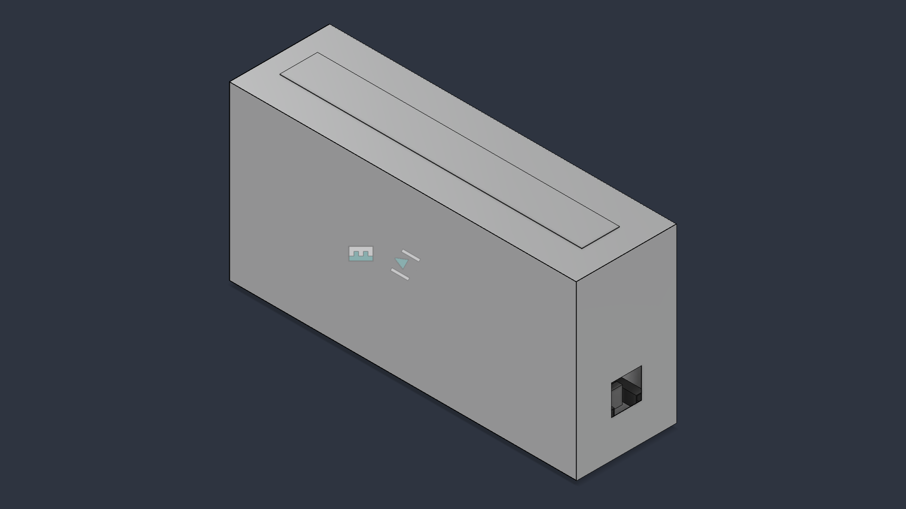
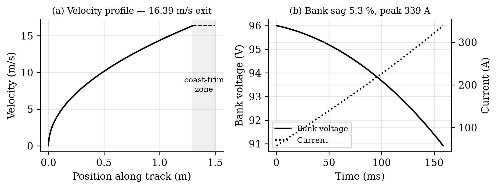
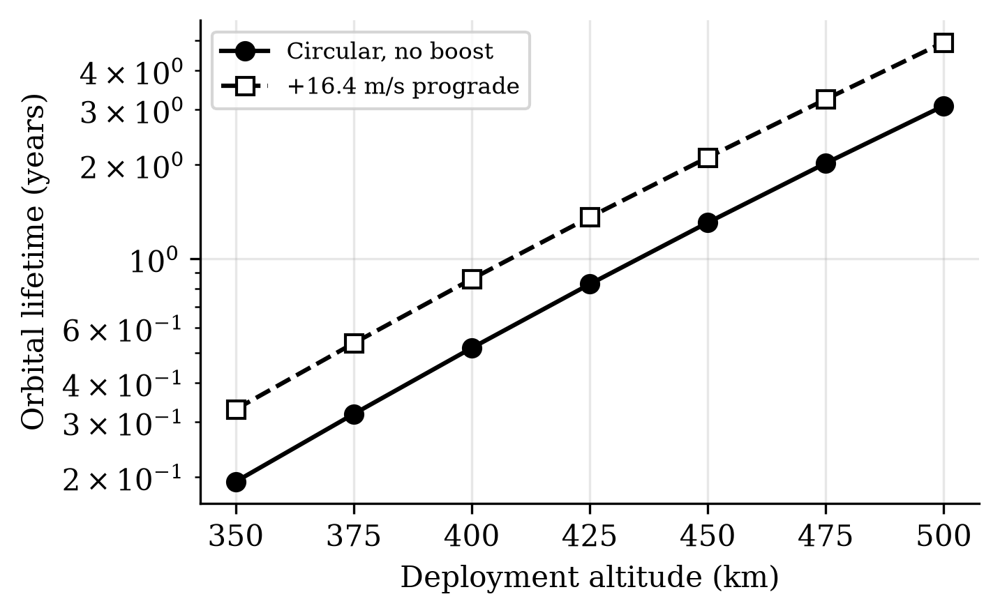
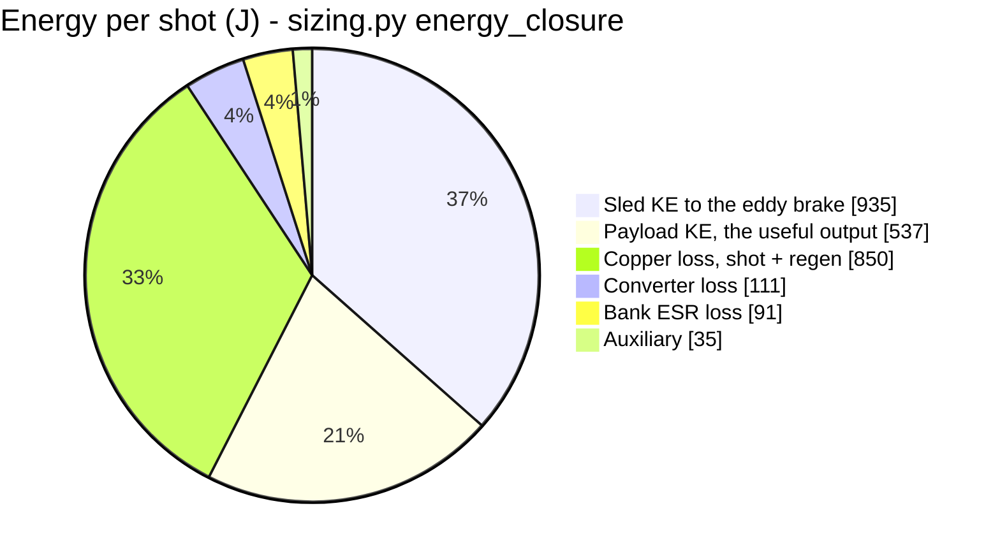
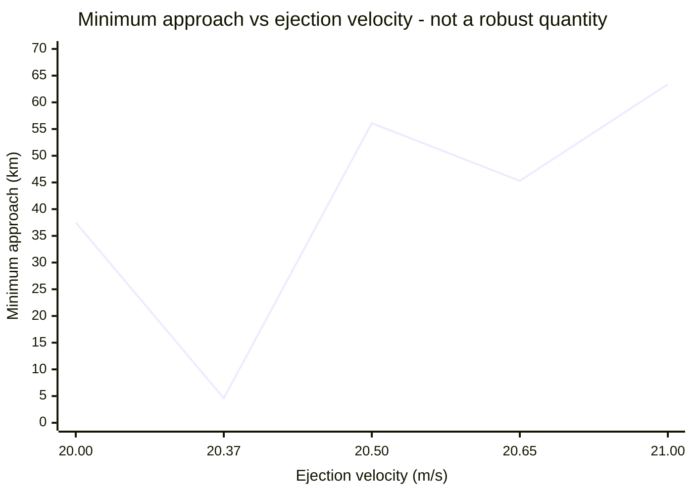

# VOLLEY: an electromagnetic orbital CubeSat deployer

> **Numerical audit correction, 2026-08-03.** I corrected the winding-thickness quadrature
> and propagated the rated point to **11.03 N per kA/m, 16.388 m/s, 10.53 g, 20.99% net
> efficiency, and 65.552 N s per shot**. I also corrected A13's internal-momentum physics,
> replaced A6's fixed-shape covariance claim with a valid current-geometry slab bound,
> extended A12's stress plane, removed a 0.344 kg brake-fin double count, and corrected the
> fin thermal mass. Superseded values remain visible in their validation records and
> change log.

<p align="center">
  
</p>

[](LICENSE)
[](requirements.txt)
[](OPEN_PROBLEMS.md)
[](docs/PROVENANCE.md)

A magazine-fed electromagnetic deployer that ejects unmodified CubeSats from a host
stage at programmable velocity, aimed at the unserved regime between spring deployers
(~2 m/s) and propulsive orbital transfer vehicles (hundreds of m/s).

**Status: design study, TRL 2-3.** CAD complete across 9 Fusion 360 documents in three
generations, STEP exports committed (`cad/`, Gen3 current). **Nine of eleven planned validations
have run** — **two of them failed**, one found a published number 37 % high, and one returned
three rows that could not be evaluated at all. **Nothing has been built and nothing has been measured
at any scale.**
**Read `docs/PROVENANCE.md` before citing anything here.**

**[📄 One-page summary](SUMMARY.md)** · **[🧊 Frozen baseline](docs/BASELINE.md)** · **[🗺 Roadmap](docs/ROADMAP.md)** · **[⚠ Open problems](OPEN_PROBLEMS.md)** · **[✓ Validation](docs/VALIDATION_REPORT.md)** · **[🏗 Manufacturing](docs/MANUFACTURING.md)** · **[📐 ADRs](docs/adr/)** · **[📚 Literature](docs/LITERATURE.md)** · **[🎯 Research position](docs/RESEARCH_POSITION.md)** · **[⛔ Velocity ceiling](docs/VELOCITY_CEILING.md)** · **[☠ Kill criteria](docs/KILL_CRITERIA.md)** · **[📦 Payload classes](docs/PAYLOAD_CLASSES.md)** · **[📈 Market](docs/MARKET.md)**

<!-- PROGRAMME-HEADER-START -->
| Repository | Role | You are here |
|---|---|---|
| **[VOLLEY](https://github.com/aaaaaaaaaaaavm/VOLLEY)** | Flagship, authoritative engineering record, portfolio | |
| [VOLLEY-paper](https://github.com/aaaaaaaaaaaavm/VOLLEY-paper) | IEEE companion, manuscript and reproducibility package *(generated)* | |
| [VOLLEY-thesis](https://github.com/aaaaaaaaaaaavm/VOLLEY-thesis) | Thesis companion, university submission *(generated)* | |
| [VOLLEY-lab](https://github.com/aaaaaaaaaaaavm/VOLLEY-lab) | Phase II, research, redesign, deliberately unstable | |
<!-- PROGRAMME-HEADER-END -->

Four repositories, one programme, see **[`docs/PROGRAMME.md`](docs/PROGRAMME.md)**.

## The idea

CubeSats flown as rideshare secondaries inherit the primary customer's orbit. The
spring that ejects them adds 1-2 m/s, enough to drift clear, not enough to change an
orbit. A satellite with no propulsion of its own is stuck there for life.

VOLLEY replaces the spring with an ironless double-sided Halbach linear synchronous
motor driving a reusable magnetic sled along a 1.5 m track. Twelve 3U CubeSats feed
from two transverse cassettes and are fired one at a time. The satellite is never
modified, the magnets ride the sled, not the payload.

<table>
<tr>
<td width="50%"><a href="cad/renders/interior_open.png"></a><br><sub><b>Interior.</b> Track, stator belts, sled, and both cassettes with the enclosure open.</sub></td>
<td width="50%"><a href="cad/renders/exploded_view.png"></a><br><sub><b>Exploded.</b> The nine documents: track, stator, sled, cassettes, brake, ESPA interface, enclosure, payload.</sub></td>
</tr>
<tr>
<td width="50%"><a href="cad/renders/exterior_aft_mounting.png"></a><br><sub><b>Aft mounting.</b> Ø460 mm ring flange, Ø400 mm bolt circle, 24 holes, four gussets.</sub></td>
<td width="50%"><a href="cad/renders/seq2_midstroke.png"></a><br><sub><b>Mid-stroke.</b> Sled under thrust, payload still cradled, 158.6 ms from breech to release.</sub></td>
</tr>
</table>

**Spin it in the browser:** [`cad/stl/EMOCD_Assembly_Gen3.stl`](cad/stl/EMOCD_Assembly_Gen3.stl)
and [`cad/stl/EMOCD_Sled_Gen3.stl`](cad/stl/EMOCD_Sled_Gen3.stl), GitHub renders STL
natively, so click either and drag. They are derived meshes; `cad/step/gen3/` is the master
geometry ([why](cad/stl/README.md)).

## How a shot works


The satellite is never modified: the magnets ride the sled, not the payload. The sled leaves
release carrying 1268 J; 240 mm of stator past that point takes **291 J of it back into the
bank**, and the eddy brake absorbs the remaining 935 J. Efficiency is quoted
electrical-to-payload, net of that credit.

## Headline results (all model outputs, not measurements)

> ### The pulse-power chain does not close on purchasable cells
>
> **Found 2026-07-30, and stated here rather than left in the defect log.** The supercapacitor
> bank is modelled at 12 mΩ. Commercial cells of this capacitance give **116 to 185 mΩ**, and
> the shot stops completing above **65 mΩ**: a source behind resistance R cannot deliver more
> than V²/4R, and this one is asked for 30 kW.
>
> **Exit velocity, stroke time and dispersion are unaffected** and the mechanical design is not
> implicated. What is affected is that the rated point assumes a bank nobody can buy. Fixing it
> is a sizing decision, costed at four parallel strings in `docs/PHASE_II.md` PII-7, and it is
> **not** silently applied here. See **P26**.


| Quantity | Value | Source |
|---|---|---|
| Thrust constant | 11.03 N per kA/m, ±0.99 % ripple, **independently computed by FEM to 0.03 %** | `analysis/motor_model.py`, A1 |
| Exit velocity, 3U | **16.39 m/s at 10.5 g** | `analysis/motor_model.py` |
| Electrical to payload efficiency | 21.0 % (2.56 kJ net of regeneration, 537 J delivered) | `analysis/motor_model.py` |
| Closed-loop dispersion | 0.027 m/s (3σ) at a 16.2 m/s setpoint to ±0.10 km apogee | `analysis/motor_model.py` |
| Orbital lifetime multiplier | x1.62 at mean activity, **not invariant, see P16** | `analysis/astro.py` |
| Constellation seeding | 30° in 1.4-6.9 days vs 25 days by differential drag | `analysis/astro.py` |
| Dry / loaded mass | 76.5 kg / 124.5 kg | `analysis/mass_properties.py` |
| Recoil per shot | 65.6 N·s | `analysis/astro.py` |
| Track first mode | 109 Hz fixed-fixed (target >70) | `analysis/sizing.py` |
| Energy closure | 100.0 % accounted | `analysis/sizing.py` |

> ### These numbers moved on 2026-07-29, downward
>
> The headline used to read **20.37 m/s at 16.3 g**, computed against a 4.86 kg parametric
> sled. Exact solid volumes from the Gen3 CAD give **9.445 kg**: the plates are drawn
> solid, with no pocketing (P15).
>
> That was not resolved by picking a number.
> [`validation/A4_sled_structural.md`](validation/A4_sled_structural.md) fixed the
> consequence of each outcome **before** the structural analysis ran:
>
> | Measured mass | Declared consequence |
> |---|---|
> | ≤ 5.35 kg | parametric model stands, 20.37 m/s holds |
> | 5.35-6.80 kg | neither estimate right |
> | **≥ 6.80 kg** | **the headline changes and the paper changes materially** |
>
> A4 has since run, the drawn plate passes all three structural bands, so nothing forces a
> lighter chassis, and the CAD result landed in the third branch. The scripts moved
> first, then the paper. Writing the rule down in advance is what made that a procedure
> rather than a preference.
>
> **What this costs and does not cost.** Exit velocity is down 19 % and efficiency from
> 32 % to 20 %, and to 19 % after the ESR correction of 2026-07-30 (P24); regeneration has
> then took it to 21.2 % (A11); the corrected quadrature now gives 21.0 %. The lifetime multiplier is down only 10 %, x1.80 to x1.62, because lifetime
> is a weak function of Δv, the mission case survives better than the machine spec does.
> 9.445 kg is the **as-drawn, unpocketed** geometry, and A4 reports a 17x stress margin, so
> a rib-stiffened chassis would recover mass. Nobody has designed one
> ([`docs/ROADMAP.md`](docs/ROADMAP.md)).
>
> Ways to recover the velocity, pocketing, sheet current, stroke length, a two-layer
> stator, and a momentum-transfer release that buys it all back for 1.6 % of the shot
> energy, are costed in
> [`docs/DESIGN_OPTIONS_exit_velocity.md`](docs/DESIGN_OPTIONS_exit_velocity.md).

Three results have independent cross-checks: the Halbach field model (analytic vs
magpylib, agreeing to three digits, and again vs a meshed magnetostatic FEM, a PDE
solve rather than another superposition, agreeing on the corrected thrust constant to 0.03 %),
and orbital decay (orbit-averaged vs Cowell RK4, 99.4 %). Everything else is
single-sourced.

## Reproducing

```bash
pip install -r requirements.txt
cd analysis
python3 verify_field.py && python3 mass_properties.py && python3 motor_model.py && python3 sizing.py && python3 astro.py
```

Results land in `analysis/results/*.json`.

The analysis layer needs nothing but `requirements.txt`. The **validation** layer needs
external solvers, gmsh and scikit-fem for the magnetostatic FEM, GetDP, CalculiX,
ngspice, and a LaTeX install for the manuscript. `tools/env-setup.sh` installs all of
them on a Debian/Ubuntu machine and verifies each one before exiting.

<table>
<tr>
<td width="50%"><br><sub><b>The shot.</b> Force, velocity and current through the 158.6 ms stroke (<code>motor_model.py</code>).</sub></td>
<td width="50%"><br><sub><b>Lifetime.</b> Boosted vs unboosted decay, the x1.62 multiplier at mean activity is the current model result, not the absolute years (<code>astro.py</code>).</sub></td>
</tr>
</table>

## Validation

**[`docs/VALIDATION_REPORT.md`](docs/VALIDATION_REPORT.md)**: every claim, independently checked
where possible. Four analyses were actually run; three could not be.

- **Reproducibility holds exactly**: 173 values re-computed from clean, 173 identical.
- **GMAT falsified the invariance claim.** It reproduced the old x1.80 multiplier at mean
  and high solar activity but gave 2.074 at low, an 18.5 % spread against a ≤5 % band.
  `astro.py` varies solar activity by scaling density uniformly, and ballistic coefficient
  enters the same multiplicative slot, so *both* halves of that claim were tested by a sweep
  that could not have detected a problem (**P16**).
- **CalculiX** cleared the chassis on all three structural bands, which is what settled the
  sled mass at the CAD-derived **9.445 kg** and moved the headline to 16.54 m/s (**P15**), before the quadrature correction moved it to 16.39 m/s.
- **ngspice** reproduced the then-current shot model to 0.03 % and then, re-run at the then-current operating
  point, found a loss the analytic model had no term for at all: the bank's own series
  resistance, 86 J a shot (**P24**). Corrected, the two methods agree on peak current to
  0.01 %. It also found the quoted bank sag is state-of-charge, not the terminal voltage the
  drive sees.
- **A1 and A10--A13 have been propagated to the corrected point. A5 and the ngspice A8 run predate it** (**P19**) and needs
  re-running. A4 survives, its load being magnetostatic and velocity-independent.
- **A1 has run (2026-07-29).** A meshed 2-D magnetostatic FEM gives K<sub>t</sub> = 11.026 N
  per kA/m against the model's 11.03, **ratio 0.9997**, ripple 0.97 % against 0.99 %. The
  number every headline descends from is no longer checked only analytic-against-analytic.
  Two of seven bands missed, both with identified causes and neither a model error (P20, P21).
- **Not run:** A6, A7, A9.

## Charts

Full set in **[`docs/RESULTS.md`](docs/RESULTS.md)**: all drawn by GitHub from text, no image files.
Two that carry the argument:



537 J reaches the payload out of a **net 2560 J**: 2851 J leaves the bank and 291 J returns.
That is the 21.0 %. Efficiency fell with the heavier sled twice over, because more of the same
mechanical work goes into a mass that is then braked away and the longer 159 ms pulse accrues
more copper loss at unchanged current density. Regeneration is the first thing that has moved
it the other way.

**This page said "no regeneration credit" until 2026-07-31**, on the strength of a 2025
decision that argued the motor cannot *arrest* the sled. It cannot, and the brake stays. It was
never shown that no energy could be recovered, and
[`validation/A11_regen_braking.md`](validation/A11_regen_braking.md) found 23.0 % of the sled's
energy available inside the existing envelope at the existing current rating.

The 86 J ESR slice was not here until 2026-07-30. No script modelled the bank's series
resistance, so the loss existed in the hardware and nowhere in the accounting. A circuit
simulation found it (P24).



A ±2.5 % velocity change moves the conjunction minimum from 4.6 km to 63.4 km. That is why
the paper's safety claim rests on the realignment period, now 9.9 days at the current
operating point, instead of a single distance (P1). The sweep above was computed at the
superseded 20.37 m/s point and is kept as the evidence for P1; the fragility it demonstrates
is a property of the beat geometry, not of any one velocity.

## Validation status

Each analysis has its acceptance band declared **before** the run, in
[`validation/`](validation/). A5 has now been run under GMAT; the rest have not, a cross-check whose target is chosen after seeing the
answer proves nothing.

| Analysis | Tool | Closes | Status |
|---|---|---|---|
| A1 airgap field | FEMM | E1 (2-D half), E2 | specified |
| **A4 sled chassis** | CalculiX ccx 2.21 | **P5, P8** | **run**: as-drawn plate passes; mass unchanged |
| A5 lifetime & seeding | GMAT R2022a | E6 | **run**: see [`docs/RESULTS.md`](docs/RESULTS.md) |
| A6 conjunction Pc | NASA CARA | P1 | specified |
| A7 separation & tip-off | Project Chrono | E7 | specified |
| A8 pulse-power chain | ngspice 42 | E17 | **run**: bands met, 2 findings |

## Host integration, worked against real vehicles

The interface asks four things of any host: mass and control authority, a 150-300 W recharge
feed, a serial command link, and an authorized firing window. Two Indian candidates are
worked as examples in the paper because both exist today.

**ISRO's POEM** is the flown precedent, a spent PS4 stage operated as a three-axis-stabilized
hosted platform with solar power, NavIC navigation and helium attitude thrusters, retired by
controlled reentry. It supplies everything the attached variant borrows, and its zero-debris
closeout is the regulatory template.

**Skyroot Aerospace's Vikram-1** carries a restartable liquid Orbit Adjustment Module, one
Raman-2 engine, four Raman Mini thrusters, eight cold-gas thrusters, stage-tested through more
than a thousand pulses, whose stated multi-orbit deployment role is functionally the PS4's.
Against the vehicle's published 350 kg LEO capacity, a loaded VOLLEY is **34 %**, falling to
**22 %** and **13 %** on the announced 550 kg and 900 kg family members. Early flights are
therefore dedicated demonstrations and later ones ordinary manifest items.

One integration quantity cannot be closed from public data: the OAM's mass and control
authority are undisclosed, which is why the recoil budget is parametric. Obtaining stage mass,
thruster impulse budget and coast duration is the single data exchange that converts this
analysis from parametric to specific, for any candidate vehicle, Indian or otherwise.

Recoil is the satellite's momentum only, **65.6 N·s** per shot, nulled by a few grams of cold
gas. Comparison against fielded deployers and transfer vehicles, including Dhruva Space's
flown DSOD, is in [`docs/LANDSCAPE.md`](docs/LANDSCAPE.md).

## Repository layout

- `analysis/`, current scripts; these reproduce the numbers above
- `analysis/femm/`, FEMM magnetostatics package: `emocd_cross_section.dxf` + `FEMM_RUN_SHEET.md` (analysis A1, not yet run)
- `cad/`, Fusion 360 CAD: `parameters.json` (geometry source of truth, 9 documents),
  `step/gen1|gen2|gen3/` exports (**Gen3 current**), `stl/` (browser-viewable meshes),
  `renders/`, `CHANGELOG_CAD.md` (generation history and per-file defect list)
- `legacy/`, superseded scripts, kept for history, **do not cite**
- `paper/`, IEEE conference paper (LaTeX source, figures, PDF)
- `validation/`, independent cross-check plan (FEMM, CalculiX, Orekit, CARA, Chrono),
  each with an acceptance band declared before the run; nothing run yet
- `docs/`, computation notes, FEMM run sheet, related work and comparator sources
- `docs/PROJECT_NOTES.md`, working context: ground rules, layout, locked decisions
- `docs/LANDSCAPE.md`, how this compares with deployers that actually fly
- `docs/DESIGN_OPTIONS_exit_velocity.md`, options for the P15 velocity shortfall, costed
- `docs/INVENTORY.md`, complete indexed catalogue of every calculation, decision and artifact
- `docs/DECISION_LOG.md`, why each design change happened, including two self-corrections
- `docs/PROVENANCE.md`, what came from where, and what was never verified
- `OPEN_PROBLEMS.md`, known errors in the paper, and unsolved engineering
- `docs/PROGRAMME.md`, the four repositories and how they relate
- `docs/BASELINE.md`, the frozen Phase I baseline (generated) and its change-control rule
- `docs/HISTORY.md`, project timeline since 2021, and how the git history was reconstructed
- `docs/programme/`, the governing dossier, adopted verbatim, plus its amendment record
- `docs/adr/`, eighteen architecture decision records
- `docs/PHASE_II.md`, deferred work and the gate it must clear to return
- `docs/MANUFACTURING.md`, tolerance stack, assembly hazard, make-vs-buy
- `docs/CROSS_INDUSTRY.md`, which open items are actually solved elsewhere
- `docs/QUALIFICATION_PLAN.md`, environmental and qualification campaign, specified not run
- `docs/BENCHTOP_TESTS.md`, four cheap sub-scale experiments, bands declared in advance
- `analysis/cost.py`, parametric BOM; every price assumed, structure is the deliverable

## Known issues

The published paper previously contained four numbers its own scripts did not reproduce
(conjunction minimum, peak current, far-field stray values, brake fin temperature rise),
all found by reconstructing the analysis from scratch. **All four were corrected in
`paper/paper.tex` on 2026-07-23 to match the scripts**, and the conjunction claim was
additionally reframed because that minimum is not a robust quantity. Note that
`paper/archive/EMOCD_submission_uncorrected.pdf` still carries the uncorrected values,
whether that build is the one that was submitted is open (`OPEN_PROBLEMS.md` P11). Full record with
cause, before/after, and references is in `CHANGELOG.md`; the original defects remain
documented in `OPEN_PROBLEMS.md` P1, P4 for the audit trail.

**Two issues are live rather than historical, and both sit in the paper:**

- **P16, the invariance claim in the abstract is falsified.** GMAT reproduces the x1.80
  lifetime multiplier at mean and high solar activity but gives x2.074 at low, an 18.5 %
  spread against a ≤5 % band. The reason is that `astro.py` varies solar activity by scaling
  density uniformly, which preserves a ratio *by construction*, and the ballistic-coefficient
  half of the same sentence is the identical construction, since `scale` and `1/BC` occupy the
  same slot in the drag term. Neither half of that claim was ever tested by a method capable
  of falsifying it. **`paper/paper.tex` still asserts it in five places, including the
  abstract**, because there is no TeX engine here and editing the source without rebuilding
  the PDF would split the two.
- **P11, which build was actually submitted is unresolved.** Until that is answered, it is
  not known whether the version of record carries P1, P4 *and* the falsified abstract claim.

Newest entries: **P26** (the supercapacitor bank cannot source the shot on purchasable
cells), **P28** (the regeneration stator and the eddy fin do not both fit the arrest section)
and **P29** (the paper says the winding is segmented; the model charges copper for all
1.3 m). Most recently closed: **P17**, the inter-array attraction feeding the A4 FEA, 37 %
high — resolved by A12, which also found that P17's *explanation* of its own finding was
backwards.

## Author

**Adityavardhan Mishra**: Department of Mechanical Engineering, Symbiosis Institute of
Technology, Symbiosis International (Deemed University), Pune. Project begun April 2021.

📧 [adityavardhanmishr@gmail.com](mailto:adityavardhanmishr@gmail.com)

Questions, corrections and reproduction attempts are all welcome, particularly reproduction
attempts. If a number in this repository does not reproduce for you, that is a defect and I
want to know. See [`docs/CONTRIBUTING.md`](docs/CONTRIBUTING.md).
