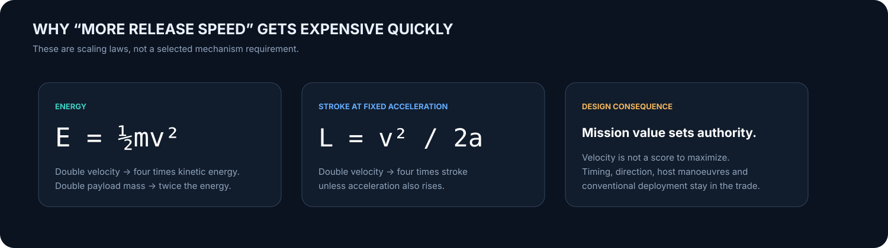
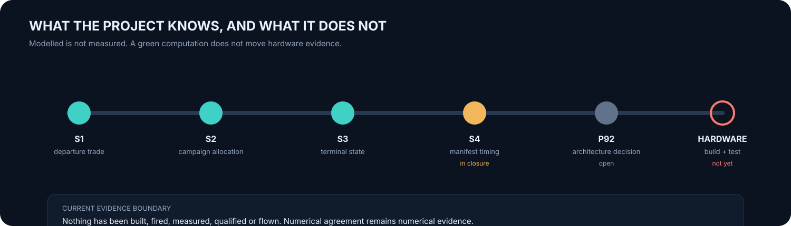

# VOLLEY

**A research programme for sequential CubeSat deployment with a commanded departure condition.** VOLLEY asks whether one host-mounted, reloadable launcher could release ordinary CubeSats one after another, choosing the relative speed for each shot without giving every spacecraft its own propulsion unit.

*Mission illustration, not a flight configuration or demonstrated trajectory.*

> **Current status — September 2026:** Gen6 is in development. No drive mechanism, speed envelope, flight design or payload interface has been selected or validated. Nothing here has been built, fired, measured, qualified or flown. The [engineering record correction](docs/REPAIR_NOTICE_2026-09-28.md) explains the withdrawal of an earlier architecture claim.

| The goal | The record today |
| --- | --- |
| One reusable launch path, sequentially fed from a shared store | A design objective; loading and jam recovery remain unproved |
| A commanded speed for each CubeSat | A design objective; the physical lower and upper limits are open |
| A useful mission benefit without burdening each payload | Under study; full-manifest benefit and complete installed mass are not established |
| An ordinary CubeSat and a compatible host | Intended interfaces; payload loads, provider acceptance and host integration require evidence |

## The system we are trying to make

A host would present a CubeSat to one launch path, command its release condition, arrest and reset the mechanism, then feed the next spacecraft. The shared path is the point of the architecture. A bank of separate single-use launch cells does not satisfy it merely by being mounted together.

*Conceptual operating sequence. Retention, feeder reliability, recoil recovery and multi-shot speed control still need design and test.*

The requested examples of roughly 1–2, 30–40 and 100 m/s are **investigation points, not demonstrated settings**. For a 4 kg payload, ideal kinetic energy rises from 2 J at 1 m/s to 1,800 J at 30 m/s, 3,200 J at 40 m/s and 20,000 J at 100 m/s. At a hypothetical constant 10 g, reaching 100 m/s would take about 51 m of acceleration distance. Actual contact loads, efficiency, feeder mass and packaging must be evaluated before setting a credible range. No universal CubeSat acceleration rating authorizes these release conditions.

## Engineering work you can inspect

### Electromagnetic modelling and CAD

*Gen5 CAD rendering: a frozen, modelled electromagnetic configuration with a magazine concept. This is not selected Gen6 hardware or a built article.* [Explore the CAD record](cad/README.md) · [Read the Gen5 closure](docs/GEN5_CLOSURE.md)

Gen5's calculated 16.029 m/s and 126.6 kg belong to that configuration. The mass is not a complete installed-system comparison. Other CAD and reports in this repository document historical studies; their former selection language has been withdrawn.

### Mission analysis

*P113-S4 is a two-payload ideal-model screen. Its best sampled point, near 4.57 m/s, is not VOLLEY's maximum speed or evidence for a selected mechanism.* [Read the assumptions and result](docs/MANIFEST_TIMING.md)

The later [finite-burn twelve-payload study](docs/MANIFEST_FINITE_BURN.md) found no complete delivery among six tested screens; the best delivered 5 of 12. That blocks a completed-manifest claim for those cases without proving that every mission is infeasible.

### Evidence boundary

*Calculations, numerical agreement and CAD provide study evidence. They are not measurements or qualification.* See the [provenance](docs/PROVENANCE.md), [validation register](validation/README.md) and [open problems](OPEN_PROBLEMS.md).

## What comes next

Compare a shared electromagnetic guide and feeder, other shared drives, small banks, the historical gas and spring studies, and conventional dispensers under the **same** payload, host, manifest, failure assumptions and complete installed-system accounting. Select a drive only after its load case, control range, interfaces and mission value survive that comparison. Then demonstrate calibrated, repeated releases before claiming performance or reliability.

The earlier independent mechanical-cell bank is retained as a bounded study in [VOLLEY-lab](https://github.com/aaaaaaaaaaaavm/VOLLEY-lab). [BOLLEY](https://github.com/aaaaaaaaaaaavm/BOLLEY) investigates a separate cooperative electromagnetic interface. Neither is the selected Gen6 mechanism.
