# VOLLEY

### A computational design study for sequential CubeSat deployment

VOLLEY studies a host-mounted electromagnetic machine that would feed ordinary 3U CubeSats through one reusable launch path and command an individual departure speed for each release. **Gen5 is the controlled academic evaluation snapshot, with a negative 3U selection finding.** Its final engineering release and academic freeze are open. Gen6 is the proposed first instrumented prototype programme, with its speed and accuracy to be derived from a named mission and payload. A 1 km/s-class release is a separate long-range research objective; Gen6 has no selected mechanism or validated performance.

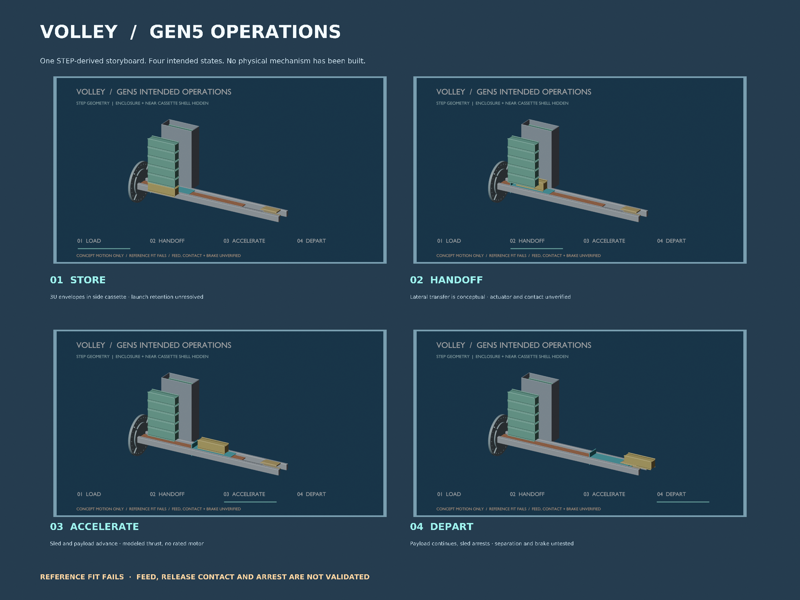

*Intended operations, not validated motion. The enclosure and near cassette shell are hidden for visibility. The evaluated side-fed assembly **fails** its static fit check; feed, contact and brake dynamics remain unverified. [Watch the eight-second conceptual animation](cad/renders/sequence/gen5_intended_sequence.mp4) · [inspect its STEP sources and provenance](cad/renders/sequence/README.md) · [open the interactive website](https://aaaaaaaaaaaavm.github.io/VOLLEY/).*

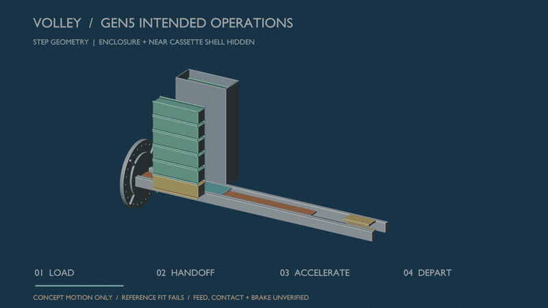

**Read first:** [Computational review report](reports/GEN5_COMPUTATIONAL_REVIEW.pdf) · [FreeCAD/CAD report](cad/GEN5_CAD_REVIEW.pdf) · [Gen5 freeze readiness](docs/GEN5_FREEZE_READINESS.md) · [Remaining CAD and IEEE work](IEEE_AND_CAD_REMAINING_WORK.md) · [IEEE prior-art update](docs/IEEE_PRIOR_ART_UPDATE_2026-10-09.md) · [Market and spacecraft fit](MARKET_AND_CUSTOMER_FIT.md) · [Gen5 technical closure](docs/GEN5_CLOSURE.md) · [Full baseline](docs/BASELINE.md) · [Evidence provenance](docs/PROVENANCE.md) · [Open problems](OPEN_PROBLEMS.md) · [CAD](cad/README.md) · [Validation](validation/README.md)

> **Evidence status, October 2026.** Gen5 is the selected computational design for academic review. Its configuration, model results and failed criteria are documented; [decisive verification items remain open](docs/GEN5_FREEZE_READINESS.md), so the final academic freeze has not been declared. No VOLLEY article has been built, fired, measured, qualified or flown; no complete installed-system or provider-specific interface has been validated. Published work on related systems is prior art and a source of assumptions, not a physical test of Gen5.

> **Decisive new finding:** the CAD finite-array/stator force screen gives **12.448 m/s only under ideal phase and omitted circuit losses**, versus **16.029 m/s** in the historical periodic-force shot model. The historical value below is retained for traceability, not an established Gen5 performance claim. [Force map and numerical limits](validation/P118_gen5_finite_force_map.md) · [Affected claims and rerun decisions](docs/GEN5_2026_10_09_FINDING_DISPOSITION.md).

An [independent 2-D finite-element screen](validation/P119_gen5_finite_force_fem2d.md) now checks the finite-array force decline using a magnetostatic PDE instead of the cuboid field law. It gives **1,081.6 J ideal in-plane work** on a 1 mm mesh, compared with **1,041.7 J** in the 3-D analytic screen. Depth effects and coupled electrical behavior remain open, so neither result is a motor rating.

A [depth-resolved 3-D surface-charge cross-check](validation/P121_gen5_finite_force_surface3d.md) independently evaluates the finite cuboids and all 162 stator belts. It recovers **1,041.7 J** ideal work, with 16-to-24 point face quadrature changing work by **0.00002%** and 25-to-12.5 mm station spacing changing it by **0.096%**. The separate [gap and depth scenarios](validation/P122_gen5_finite_force_sensitivity.md) show **906.7 J at a 14 mm gap** versus 1,041.7 J at 12 mm. These are ideal-phase model checks with shared magnetic material assumptions, not motor ratings or hardware tolerances.

> **Installed-system decision, 10 October 2026:** the [P123 one-event mass screen](validation/P123_gen5_one_event_mass_screen.md) finds **1.866 kg** less host fuel used by ideal finite-force Gen5 than a spring class when both carry 10 kg, against **54.562 kg** greater modeled device dry mass. With fuel re-solved for that one event plus equal reserve, Gen5 remains **52.717 kg heavier** on device plus fuel. Ideal-speed parity would require about **52.630 kg** less Gen5 device mass; that is a quantified redesign screen, not a full mission or motor rating. [Recompute from source](analysis/gen5_one_event_mass_screen.py) · [captured result](analysis/results/gen5_one_event_mass_screen.json) · [six-gate evidence programme](docs/GEN5_EVIDENCE_BUILD_PROGRAMME.md).

> **Necessary bound for the next design:** even a perfect release needing no host preburn would require Gen5 device mass **≤74.659 kg** to tie this one-event spring reference; today's model is 126.562 kg. The [reproducible bound](analysis/gen5_architecture_bounds.py) shows that motor speed alone cannot close this specific gap. A [captive passive-armature and integrated-structure hypothesis](docs/GEN5_H1_INTEGRATED_DEPLOYER_HYPOTHESIS.md) is an unselected research direction, not a revised Gen5 result or a verified invention.

> **Precision delivery must be specified by the orbit, not by speed alone.** The [P124 design-space screen](validation/P124_precision_delivery_design_space.md) converts declared 450 km orbit targets into ideal tangential increments and velocity-error budgets. It also shows that 1 km/s over the Gen5 1.3 m stroke implies about **39,220 g** for an ordinary 4 kg 3U payload. The first Gen6 prototype needs a payload and mission-derived speed/load specification; the 1 km/s goal remains separate long-range research.

The [P127 release/arrest bounds](validation/P127_gen5_release_arrest_bounds.md) find 731.8 J of sled kinetic energy at the **ideal** finite-force speed. Over the provisional 210 mm brake corridor, stopping it needs at least 37.6 g mean sled deceleration; the first-order host reaction and net recoil are also bounded. Eddy-current peak force, payload contact, host attitude and repeated-shot thermal behavior remain unsolved.

The [P126 R1 tolerance screen](cad/FEEDER_R1_TOLERANCE_SCREEN.md) uses the R1 CAD-derived 5 mm lateral gap and declared alignment bands. A 0.2° band retains 1.31 mm; a 0.5° band overlaps by 0.47 mm. These are assumed tolerances, not measured fit or accepted mechanism clearances.

> **P125 drive feasibility screen:** A quasi-steady, three-phase voltage/current model uses the finite Gen5 force map and the historical **unselected** winding and 96 V source. The reference surrogate reaches 12.448 m/s; halving the current limit gives 8.802 m/s and halving the initial source voltage gives 10.794 m/s. A single string at the older 116–185 mΩ commercial ESR bound **fails the source-power equation before release**; ideal parallel-string branches complete while multiplying source cells and mass. These are conditional model outputs, **not a rated release speed or selected drive**. [Method and limits](validation/P125_gen5_voltage_limited_screen.md) · [source](analysis/gen5_voltage_limited_screen.py) · [result](analysis/results/gen5_voltage_limited_screen.json).

The [Gen6 prototype-to-flight roadmap](docs/GEN6_PROTOTYPE_TO_FLIGHT_ROADMAP.md) sets explicit mission, architecture, predictive-model, measured-prototype, engineering-model, qualification and flight decision gates. These are proposed development stages, not achieved milestones.

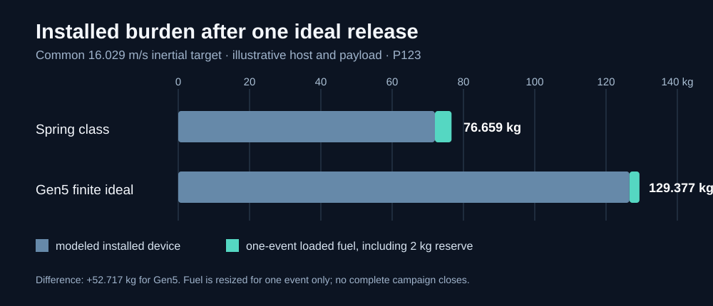

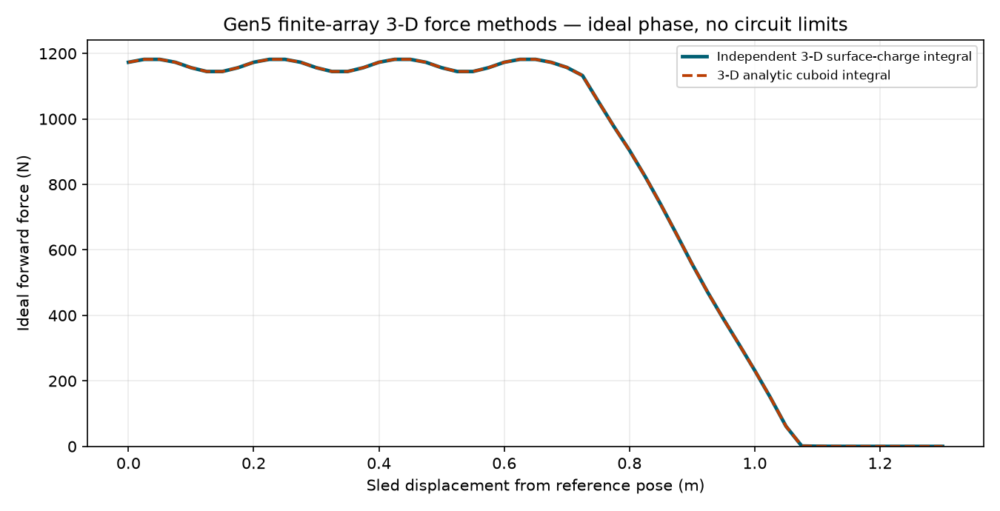 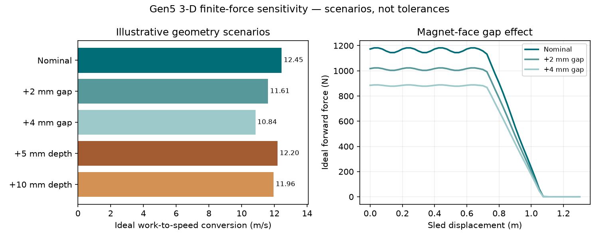

*Reproducible [P121 3-D numerical check](validation/P121_gen5_finite_force_surface3d.md) and [P122 deterministic scenarios](validation/P122_gen5_finite_force_sensitivity.md). The agreement checks the ideal finite-geometry integral; it does not select a winding, switching law or physical release speed.*

A [finite-force shot rerun](validation/P120_gen5_finite_coupled_shot.md) carries the P118 force profile through the historical capacitor/ESR model. With the old full-winding assumption it gives **12.448 m/s and 2.099 kJ gross draw**; a hypothetical segmented-copper branch gives the same ideal speed and **1.394 kJ**. These are conditional calculations using unselected power hardware and ideal phase at every position. The old energy, brake and precision figures cannot be transferred to them.

 

*New model screens: the finite-force result is analytic and shares the original magnetic field law; the matched mission uses assumed host and dispenser data. Neither is a physical result. [Mission assumptions and results](docs/MATCHED_MISSION_REFERENCE.md).*

 

*Actual scikit-fem solver outputs, not CAD renders or physical measurements. The 2-D method omits finite magnet-depth effects; [P119](validation/P119_gen5_finite_force_fem2d.md) records mesh and boundary sensitivity.*

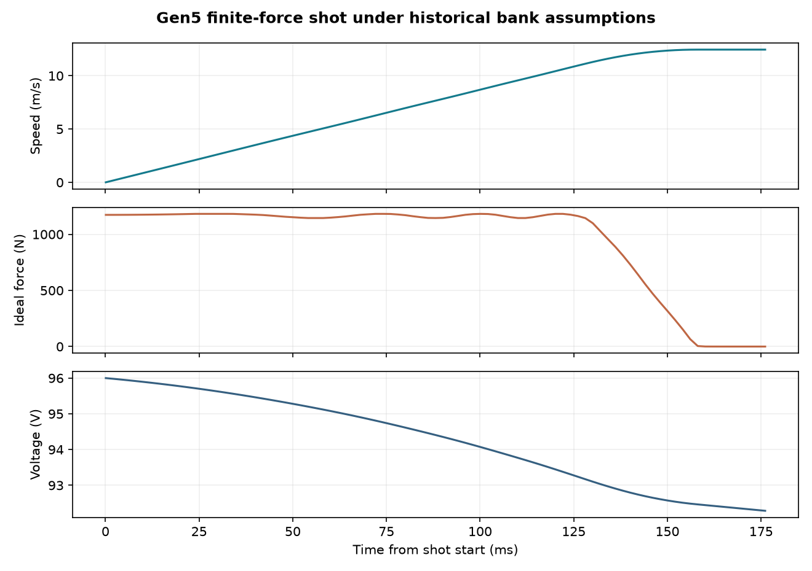

*Position-dependent model rerun, not a measured pulse or inverter validation. [P120 inputs, ledger and timestep check](validation/P120_gen5_finite_coupled_shot.md).*

## One machine, one evaluated configuration

Gen5 places the release station 1.5 m from the breech on 1.8 m structural longerons, with a 1.3 m powered stroke. It models a double-sided ironless Halbach linear synchronous drive, reusable permanent-magnet sled, eddy-current arrest, capacitor pulse store and conceptual twelve-payload magazine. The satellite is intended to remain mechanically and electrically unmodified. The modeled acceleration is **10.07 g**, but that value does not qualify any real payload.

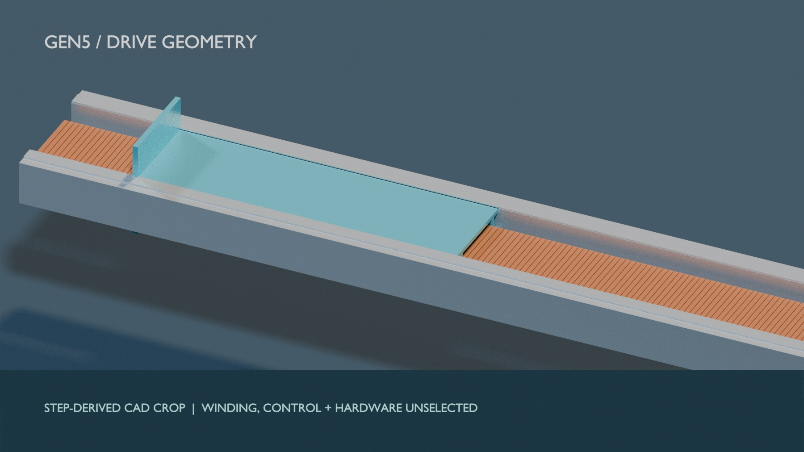 Cropped reference CAD view. Switching, release contact and fabrication details are not defined by these solids.

| Gen5 model output | Result | Evidence boundary |
|:--|--:|:--|
| 3U exit speed | **16.029 m/s, historical periodic model** | Challenged by the finite-geometry force screen; not a demonstrated command range |
| Peak modeled acceleration | **10.07 g** | Payload-specific qualification remains open |
| Dry / loaded mass | **126.6 / 174.6 kg** | Modeled rollup using historical Gen3 sled volumes and assumed component masses; not complete installed-system mass |
| Electrical-to-payload efficiency | **18.8%** | Circuit and mechanics model, net of modeled recovery |
| Closed-loop exit-speed dispersion | **0.0274 m/s, 3σ** | Simulation with assumed sensor noise; not measured repeatability |
| Mass per carried 3U | **10.547 kg** | **Fails** the study's 2 kg/satellite economic screen by about 5.3× |

Values and definitions are in [the baseline](docs/BASELINE.md); scripts and machine-readable outputs are in [analysis](analysis/) and [validation](validation/). The [Gen5 closure](docs/GEN5_CLOSURE.md) records corrections and failed bands as part of the result.

 

*These charts are generated from the checked-in [mass](analysis/results/mass_properties.json), [shot](analysis/results/motor_results.json) and [energy audit](analysis/results/rated_energy_mass_audit.json) JSON. The 6 kg canister is an approximate comparator. [P117](validation/P117_rated_energy_mass_audit.md) now accounts for the old 124.488 J compact-output remainder as modeled converter loss, auxiliary draw and an integration step. The electrical hardware and revised finite-force shot remain unverified. [Rebuild charts](tools/plot_gen5_decision.py).*

## See the evidence, including what failed

  

*Field model → modeled shot → mass verdict. P121 independently checks the ideal full-depth force integral under shared linear magnetic assumptions; neither that check nor the 2-D FEM validates hardware performance. The mass ledger leaves **88.67 kg (70.06%)** in its most favorable evaluated requirement-deletion corner, so the evaluated corners cannot meet the mass screen. [Methods and limits](docs/GEN5_CLOSURE.md).*

| Question | Best available answer | Where to inspect it |
|:--|:--|:--|
| Does the field model agree with other methods? | Analytic field compared with magpylib and meshed 2-D/3-D field solves; checks apply to stated field quantities. | [A1](validation/A1_field_femm.md), [validation register](validation/README.md) |
| Does the electrical shot model agree with circuit simulation? | ngspice cross-check also exposed an omitted bank resistance loss. | [Gen5 closure](docs/GEN5_CLOSURE.md), [validation register](validation/README.md) |
| Does the CAD survive all criteria? | No. The revised enclosure is **50.04 kg**, and the new reference assembly exposes an **11 mm side-fed width shortfall** plus exact track/cassette interference. | [CAD record](cad/README.md), [assembly screen](validation/P116_gen5_assembly_packaging.md), [mass ledger](validation/A35_constraint_ledger.md) |
| Does a complete twelve-payload mission close? | No complete delivery in the six sampled finite-burn cases; best case delivered **5/12**. This is a bounded screen, not an impossibility proof. | [Finite-burn study](docs/MANIFEST_FINITE_BURN.md) |
| Has the concept been independently tested? | Selected numerical cross-checks exist. Hardware, host integration, release reliability and payload compatibility remain untested. | [Provenance](docs/PROVENANCE.md), [open problems](OPEN_PROBLEMS.md) |

 

*These are model studies with stated assumptions. The sampled 4.57 m/s two-payload point is a mission-screen result, not a launcher maximum or a validated setting. [Timing assumptions](docs/MANIFEST_TIMING.md) · [Uncertainty study](docs/OPERATIONAL_UNCERTAINTY.md).*

*A 468 s wait alone produces no persistent relative phase in the zero-impulse case. The nonzero curves require a differential release impulse; host maneuver and drag cases remain to be compared on matched missions. [Correction and method](docs/PHASING_CORRECTION_2026-10-09.md).*

*A separate Cartesian integrator recovers **28.800775 km** of immediate semi-major-axis rise for the modeled 16.029 m/s prograde shot. This checks two-body orbit geometry only; the 1.60 lifetime estimate, host campaign and flight performance remain unverified. [Method and numerical band](validation/P115_rated_orbit_cartesian.md).*

*The finite-burn campaign has been rerun from the restored source and again stops at 0/3/4/0/4/5 accepted deliveries. No case delivers all twelve. This is a surrogate calculation with assumed host thrust and release speeds; it does not establish mission infeasibility or hardware performance. [Run record and limitation](docs/MANIFEST_FINITE_BURN.md).*

## Inspect the hardware definition

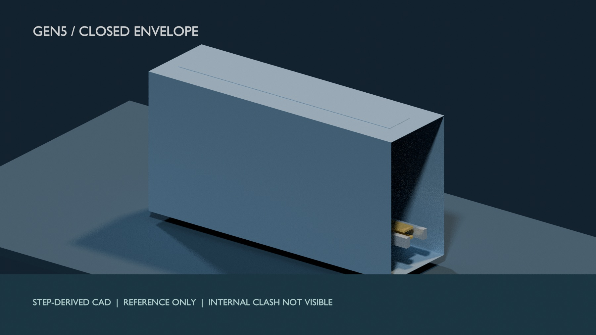 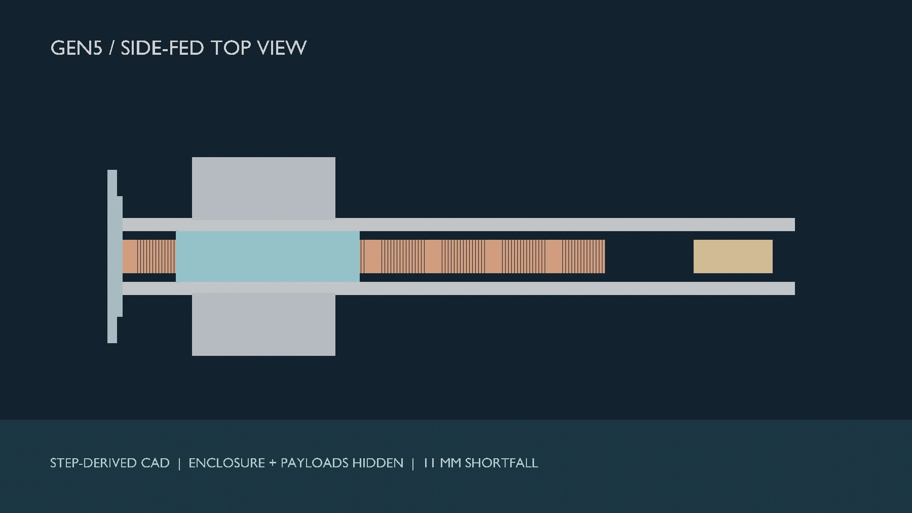

*Left: closed external envelope; the internal clash cannot be seen from outside. Right: enclosure and payloads hidden to inspect the side-fed track/cassette placement. The [exact-solid packaging result](validation/P116_gen5_assembly_packaging.md), rather than pixel measurements, establishes the 11 mm shortfall.*

The [Gen5 STEP parts](cad/step/gen5/), [native FreeCAD document](cad/native/Gen5_Review.FCStd), [FreeCAD assembly STEP](cad/step/gen5/VOLLEY_Review_Assembly_FreeCAD_Gen5.step), [renders](cad/renders/gen5/), [layout](figures/D02_layout.png) and [CAD audit](cad/GEN5_CAD_REVIEW.pdf) are reviewable design artifacts. The reference assembly **fails** the stated side-fed placement screen:

*The two 166 mm cassettes and 205 mm track require 537 mm across an internal 526 mm width before clearance. Exact STEP-solid intersection finds 32,915 mm³ overlap per cassette in the reference placement. [Rebuild and inspect](validation/P116_gen5_assembly_packaging.md).*

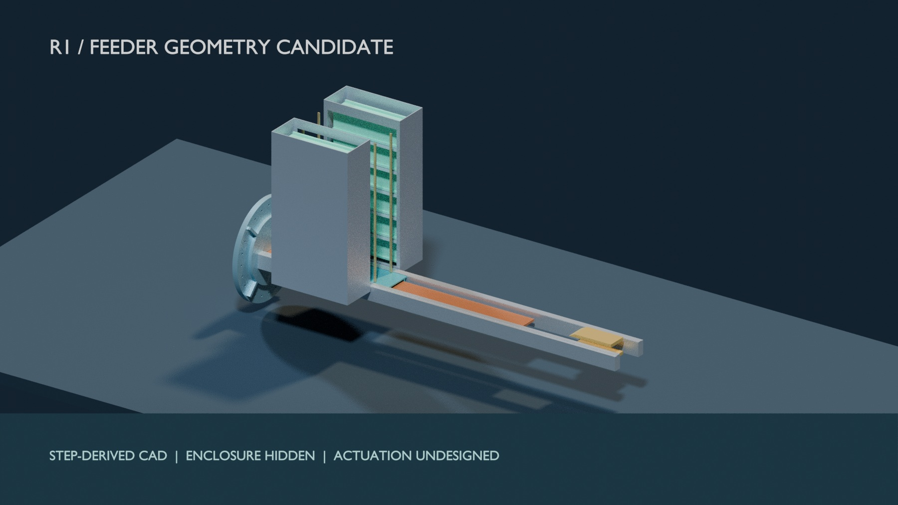 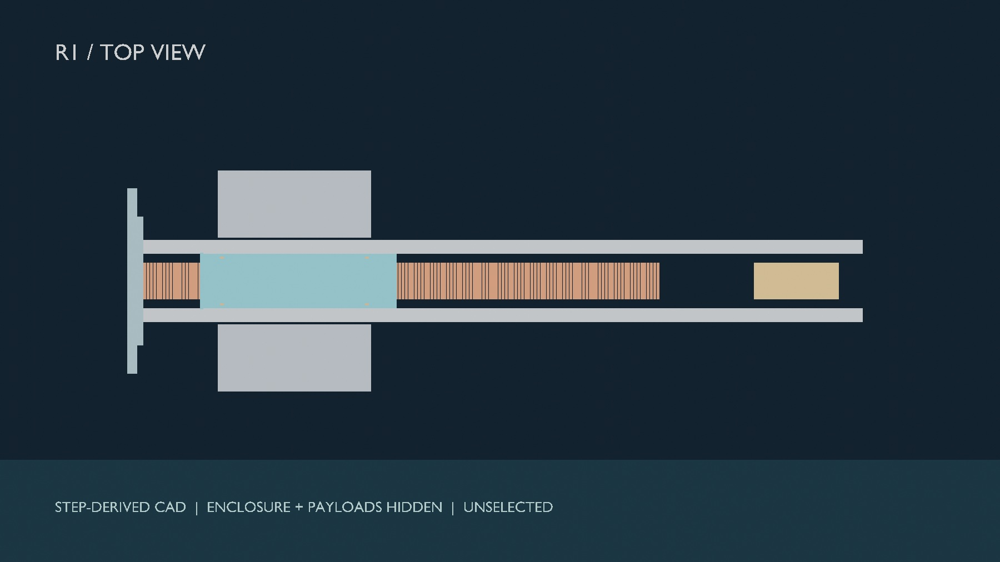

*An [unselected R1 feeder geometry](cad/FEEDER_CANDIDATE_R1.md) widens the enclosure to 570 mm and clears twelve scripted envelope routes and fixed-part swept-box checks. The [native FreeCAD document](cad/native/Feeder_Candidate_R1.FCStd) and [STEP files](cad/step/feeder_candidate_r1/) are review artifacts. No lift mechanism, retention, tolerances, supplier mass or approved host interface is defined; R1 does not change the evaluated Gen5 results.*

The CAD does not provide manufacturing drawings, tolerance stacks, an approved ICD or proof of buildability.

## From study to product

The sequence above is the product intent. The decisive next gates are a named host and deployment ICD; complete installed mass and thermal, power and structural budgets; feeder, retention, recoil and jam-recovery design; payload-specific loads; uncertainty and full-manifest mission closure; then representative calibrated multi-shot hardware testing. The [gap register](OPEN_PROBLEMS.md) keeps failed and unrun items visible.

For the **first Gen6 prototype**, choose a test speed and tolerance from a named mission and payload load limit; do not inherit the 1 km/s target. For the separate high-speed research stream, ideal constant-acceleration scaling gives about **5.1 km of stroke at 10 g** or **204 m at 250 g** for 1 km/s, before losses, arrest, thermal design or payload qualification. A radically different payload class, host or architecture may be required. [Scaling illustration](docs/assets/scaling.svg) · [programme decisions](docs/PROGRAMME_EXECUTION.md).

## Explore the programme

| Repository | What a reader gets |
|:--|:--|
| **This repository** | Full engineering record, code, results, CAD, validation and unresolved defects |
| [VOLLEY-thesis](https://github.com/aaaaaaaaaaaavm/VOLLEY-thesis) | Self-contained final-year manuscript, college review material and local evidence package |
| [VOLLEY-paper](https://github.com/aaaaaaaaaaaavm/VOLLEY-paper) | Self-contained IEEE-formatted manuscript and reproducibility package; venue not yet selected |
| [VOLLEY-lab](https://github.com/aaaaaaaaaaaavm/VOLLEY-lab) | Explored, rejected or gated alternative architectures and the reasons they stopped |

**Reproduce and audit:** [verification entry point](tools/verify_all.sh) · [four-repository adversarial review](docs/FOUR_REPO_AUDIT_2026-10-09.md) · [figure index](docs/FIGURE_INDEX.md) · [literature](docs/LITERATURE.md) · [prior art](docs/PRIOR_ART.md) · [change history](CHANGELOG.md). Review acceptance bands and failures before citing any headline number.
