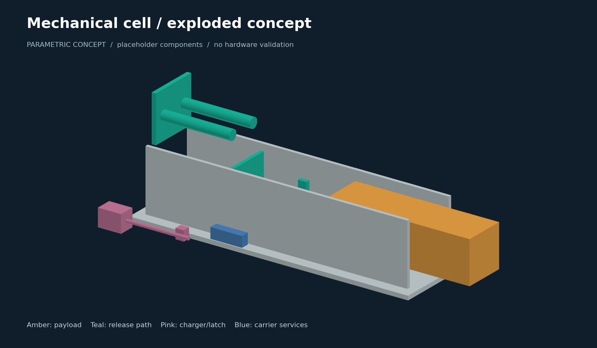

# Current mechanical and lunar concept CAD

Adityavardhan Mishra

All dimensions are in mm; +X is departure. These are named component envelopes,
not native Fusion timelines, selected parts or manufacturing-ready drawings.
MC-L2 uses an 80 mm working-stroke target. The carrier bus/tank intentionally
contain overlapping system envelopes. Do not infer installed mass or clearance
approval from these models.

| Assembly | STEP | STL |
|---|---|---|
| Mechanical cell | [Download](mechanical_cell.step) | [Download](mechanical_cell.stl) |
| Four-cell bank | [Download](four_cell_bank.step) | [Download](four_cell_bank.stl) |
| Lunar carrier | [Download](lunar_carrier.step) | [Download](lunar_carrier.stl) |
| Larger-payload pallet | [Download](large_payload_pallet.step) | [Download](large_payload_pallet.stl) |

[Interactive viewer](https://aaaaaaaaaaaavm.github.io/VOLLEY/lunar.html#architecture)
· [Engineering review](../../docs/LUNAR_VISUAL_REVIEW.md)
· [Fusion handoff](../../docs/CURRENT_CELL_FUSION_HANDOFF.md)
· [Generator](build_concepts.py)

