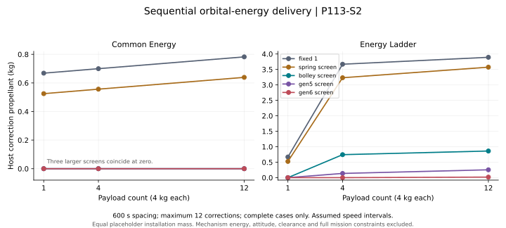

# Sequential delivery: orbital energy and host resources

Generated by `analysis/campaign_allocation.py`. Do not hand-edit.

**P113 and E5 remain open. No mechanism or provider is selected.**

This screen propagates the host between scheduled releases, solves burn mass loss
and recoil together, and retains partial deliveries. Targets specify semi-major
axis only, not complete destination states or circular orbits. The same placeholder
installed dry mass is used for all screens. This is not a hardware mass comparison.

[Frozen criteria](../validation/P113_S2_campaign_allocation.md) ·
[Full event histories](../analysis/results/campaign_allocation.json) ·
[Programme decisions](PROGRAMME_EXECUTION.md)



## Twelve payloads, 600 s spacing, at most twelve host corrections

Assumed 300 kg dry host, 10 kg fuel, 2 kg protected reserve, 220 s Isp, 4 kg payloads.
Every interval is hypothetical, including the 0.5 m/s lower limit. Even the fixed
1 m/s comparator may choose prograde or retrograde release without a slew penalty.

| Mission | Screen | Delivered | Host delta-v, m/s | Fuel used, kg | Corrections | Stop |
|---|---|---:|---:|---:|---:|---|
| COMMON_ENERGY | fixed_1 | 12/12 | 4.7287 | 0.78230 | 12 | none |
| COMMON_ENERGY | spring_screen | 12/12 | 3.8723 | 0.63899 | 12 | none |
| COMMON_ENERGY | bolley_screen | 12/12 | 0.0000 | 0.00000 | 0 | none |
| COMMON_ENERGY | gen5_screen | 12/12 | 0.0000 | 0.00000 | 0 | none |
| COMMON_ENERGY | gen6_screen | 12/12 | 0.0000 | 0.00000 | 0 | none |
| ENERGY_LADDER | fixed_1 | 12/12 | 25.0813 | 3.89265 | 12 | none |
| ENERGY_LADDER | spring_screen | 12/12 | 23.1166 | 3.57355 | 12 | none |
| ENERGY_LADDER | bolley_screen | 12/12 | 5.8510 | 0.86125 | 4 | none |
| ENERGY_LADDER | gen5_screen | 12/12 | 1.7327 | 0.25370 | 2 | none |
| ENERGY_LADDER | gen6_screen | 12/12 | 0.1093 | 0.01753 | 1 | none |

Fuel and delta-v for incomplete cases cover only their delivered prefix.
They cannot be ranked against complete deliveries as if the mission were equal.

## What this calculation can decide

It exposes the coupling between release authority, repeated host corrections,
remaining manifest mass and assumed burn-count limits. Greedy minimum-current-burn
selection is not global campaign optimisation. A larger interval can change the
subsequent trajectory, so no monotonic campaign advantage is assumed.

The sweep contains 180 cases: two energy missions, three manifests, two schedules,
five speed screens and three correction-count limits. All failures remain in JSON.

## What remains before an architecture decision

Full target states and time windows, release-time optimisation, finite burns and
minimum impulse, real restart/coast limits, attitude restoration, mechanism energy
and consumables, payload dispersion, clearance/recontact, J2/drag and lifetime,
complete installed mass/volume and common-mode failure exposure are omitted.
The 120 km perigee guard only prevents propagating an unsuitable reference host;
it is not a disposal, payload-orbit or collision-safety acceptance test.

Both providers still need to supply interfaces. No common-stage mass credit or
flight reliability follows from this resource screen. BOLLEY cage acceptance and
Gen6 contact/trim problems remain independent of these hypothetical speed intervals.

## Reproduce

```bash
python3 analysis/campaign_allocation.py
python3 analysis/campaign_allocation.py --check
python3 -m pytest tests/test_campaign_allocation.py
```
