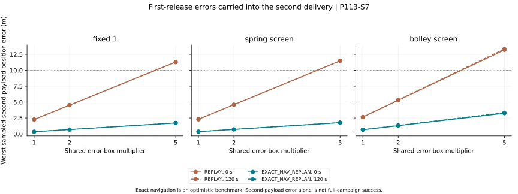

# Coupled release errors and navigation policy

Generated by `analysis/coupled_release_campaign.py`. Do not hand-edit.

**P113, E5 and P92 remain open. This is the first bounded N1 increment, not an operational campaign or hardware ranking.**

Unlike S6, the actual retained-host state after the first release is carried through the coast, next transfer and second release. Both payloads must meet the existing 10 m and 0.01 m/s bands at 3600 s.

**2508 attempted histories. Numerical verification: PASS.** Every mission and search failure is retained in JSON.

## Shared calibration bias: complete-campaign acceptance

| Screen | Coast delay (s) | Policy | Box scale | Both delivered within bands | Worst second position error (m) | Worst second velocity error (m/s) | Max fuel used (kg) |
|---|---:|---|---:|---:|---:|---:|---:|
| fixed_1 | 0 | REPLAY | 1 | 64/64 | 2.263527 | 0.002836 | 4.374740 |
| fixed_1 | 0 | REPLAY | 2 | 58/64 | 4.527089 | 0.005672 | 4.374740 |
| fixed_1 | 0 | REPLAY | 5 | 11/64 | 11.317978 | 0.014180 | 4.374740 |
| fixed_1 | 0 | EXACT_NAV_REPLAN | 1 | 64/64 | 0.344939 | 0.000734 | 4.374781 |
| fixed_1 | 0 | EXACT_NAV_REPLAN | 2 | 58/64 | 0.689877 | 0.001467 | 4.374823 |
| fixed_1 | 0 | EXACT_NAV_REPLAN | 5 | 11/64 | 1.724714 | 0.003668 | 4.374947 |
| fixed_1 | 120 | REPLAY | 1 | 64/64 | 2.255965 | 0.002833 | 4.710967 |
| fixed_1 | 120 | REPLAY | 2 | 58/64 | 4.511966 | 0.005665 | 4.710967 |
| fixed_1 | 120 | REPLAY | 5 | 11/64 | 11.280186 | 0.014163 | 4.710967 |
| fixed_1 | 120 | EXACT_NAV_REPLAN | 1 | 64/64 | 0.344728 | 0.000732 | 4.711017 |
| fixed_1 | 120 | EXACT_NAV_REPLAN | 2 | 58/64 | 0.689455 | 0.001464 | 4.711066 |
| fixed_1 | 120 | EXACT_NAV_REPLAN | 5 | 11/64 | 1.723656 | 0.003661 | 4.711214 |
| spring_screen | 0 | REPLAY | 1 | 64/64 | 2.300523 | 0.002846 | 4.192175 |
| spring_screen | 0 | REPLAY | 2 | 56/64 | 4.601079 | 0.005693 | 4.192175 |
| spring_screen | 0 | REPLAY | 5 | 14/64 | 11.502933 | 0.014232 | 4.192175 |
| spring_screen | 0 | EXACT_NAV_REPLAN | 1 | 64/64 | 0.355461 | 0.000755 | 4.192216 |
| spring_screen | 0 | EXACT_NAV_REPLAN | 2 | 56/64 | 0.710926 | 0.001511 | 4.192258 |
| spring_screen | 0 | EXACT_NAV_REPLAN | 5 | 14/64 | 1.777347 | 0.003776 | 4.192382 |
| spring_screen | 120 | REPLAY | 1 | 64/64 | 2.294346 | 0.002837 | 4.563896 |
| spring_screen | 120 | REPLAY | 2 | 56/64 | 4.588727 | 0.005674 | 4.563896 |
| spring_screen | 120 | REPLAY | 5 | 14/64 | 11.472069 | 0.014184 | 4.563896 |
| spring_screen | 120 | EXACT_NAV_REPLAN | 1 | 64/64 | 0.355156 | 0.000749 | 4.563946 |
| spring_screen | 120 | EXACT_NAV_REPLAN | 2 | 56/64 | 0.710316 | 0.001498 | 4.563996 |
| spring_screen | 120 | EXACT_NAV_REPLAN | 5 | 14/64 | 1.775822 | 0.003746 | 4.564146 |
| bolley_screen | 0 | REPLAY | 1 | 64/64 | 2.640848 | 0.003056 | 2.777987 |
| bolley_screen | 0 | REPLAY | 2 | 44/64 | 5.281704 | 0.006112 | 2.777987 |
| bolley_screen | 0 | REPLAY | 5 | 20/64 | 13.204314 | 0.015282 | 2.777987 |
| bolley_screen | 0 | EXACT_NAV_REPLAN | 1 | 64/64 | 0.648511 | 0.001163 | 2.778028 |
| bolley_screen | 0 | EXACT_NAV_REPLAN | 2 | 44/64 | 1.297040 | 0.002325 | 2.778069 |
| bolley_screen | 0 | EXACT_NAV_REPLAN | 5 | 20/64 | 3.242738 | 0.005813 | 2.778192 |
| bolley_screen | 120 | REPLAY | 1 | 64/64 | 2.668999 | 0.002992 | 3.181084 |
| bolley_screen | 120 | REPLAY | 2 | 44/64 | 5.338009 | 0.005985 | 3.181084 |
| bolley_screen | 120 | REPLAY | 5 | 20/64 | 13.345093 | 0.014963 | 3.181084 |
| bolley_screen | 120 | EXACT_NAV_REPLAN | 1 | 64/64 | 0.666374 | 0.001142 | 3.181136 |
| bolley_screen | 120 | EXACT_NAV_REPLAN | 2 | 44/64 | 1.332760 | 0.002284 | 3.181187 |
| bolley_screen | 120 | EXACT_NAV_REPLAN | 5 | 19/64 | 3.331980 | 0.005709 | 3.181342 |

## What changed when a coast was charged

| Screen | Nominal fuel, no delay (kg) | Nominal fuel, 120 s delay (kg) | Added fuel (kg) |
|---|---:|---:|---:|
| fixed_1 | 4.374740 | 4.710967 | 0.336227 |
| spring_screen | 4.192175 | 4.563896 | 0.371721 |
| bolley_screen | 2.777987 | 3.181084 | 0.403097 |

Replanning reduces second-payload error in these sampled cases but cannot correct an already released first payload. Complete-campaign acceptance therefore does not follow from the improved second event alone. Retained local search failures also prevent a universal claim that replanning succeeds.

## Independent release-only corners

| Screen | Delay (s) | Policy | Complete accepted histories |
|---|---:|---|---:|
| fixed_1 | 0 | REPLAY | 16/16 |
| fixed_1 | 0 | EXACT_NAV_REPLAN | 16/16 |
| fixed_1 | 120 | REPLAY | 16/16 |
| fixed_1 | 120 | EXACT_NAV_REPLAN | 16/16 |
| spring_screen | 0 | REPLAY | 16/16 |
| spring_screen | 0 | EXACT_NAV_REPLAN | 16/16 |
| spring_screen | 120 | REPLAY | 16/16 |
| spring_screen | 120 | EXACT_NAV_REPLAN | 16/16 |
| bolley_screen | 0 | REPLAY | 16/16 |
| bolley_screen | 0 | EXACT_NAV_REPLAN | 16/16 |
| bolley_screen | 120 | REPLAY | 16/16 |
| bolley_screen | 120 | EXACT_NAV_REPLAN | 16/16 |

## What the policies mean

REPLAY applies the nominal inertial transfer, pre-release correction and release vector to the evolving actual host. EXACT_NAV_REPLAN observes the host exactly at transfer start and second release, re-solves the transfer and commands the pre-release correction using that state. It cannot repair the first payload after separation. Both policies retain the same release calibration bias.

Common state errors are inserted once before the first release, in its nominal radial/tangential frame. The shared family uses 0.1 m per position axis, 0.0001 m/s per velocity axis, 0.0005 m/s speed bias and 0.005 degrees direction bias, scaled together. A separate 16-corner release-only family varies the two releases independently. Neither family is a covariance model or success probability.

All three authority screens share targets, order and release times (1200/3000 s). Their first commands are frozen at the best S4 candidate for that schedule. The 120 s variant re-solves the nominal second transfer after a coast; it does not simply delay an unchanged command. The wider bolley_screen is an assumed authority interval, not demonstrated BOLLEY or current-cell performance.

## Verification

| Check | Result |
|---|---|
| adaptive_refinement | PASS |
| case_count | PASS |
| circular_limit | PASS |
| coast_invariants | PASS |
| first_error_reaches_second | PASS |
| independent_rk4 | PASS |
| mass_accounting | PASS |
| momentum | PASS |
| relative_velocity | PASS |
| reserve | PASS |
| s4_zero_reproduction | PASS |
| zero_duration | PASS |

Independent fixed-step RK4, analytic circular motion, zero-error S4 reproduction, tighter adaptive reruns, momentum/relative-velocity/mass conservation and coast-only invariant checks are recorded in JSON. Local root failures remain failed searches, not proofs of an impossible mission.

## Resource and safety boundary

Each actual impulse is charged against the changing host mass with a protected 2 kg reserve. The output records burn and coast histories, fuel, delta-v and ideal payload-relative release kinetic energy. That energy is not actuator input, charger power or thermal loss. The protected reserve is not a calculated disposal solution.

The 120 s coast is a scheduling assumption. It does not demonstrate plume clearance, collision avoidance, attitude settling or a minimum safe delay. Pre-release impulses are still instantaneous. No host control authority, sensor covariance, finite-burn error, installed-system advantage or hardware tolerance has been established.

## Next gate

Add realistic navigation/update error and finite attitude/burn/clearance/resource models before extending to four/twelve payloads and replenishment. Keep cislunar C0–C2 carrier/release requirements separate before freezing N2 dimensions. A useful control benchmark does not close N1.

[Frozen criteria](../validation/P113_S7_coupled_release_campaign.md) · [Full histories](../analysis/results/coupled_release_campaign.json) · [Programme restart](RESTART_20260917.md)

Reproduce: `python analysis/coupled_release_campaign.py --check`.
