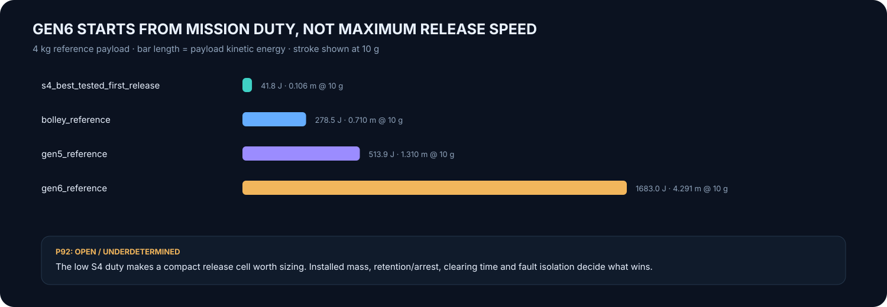

# Gen6 clean-sheet architecture trade

Generated by `analysis/gen6_architecture_trade.py`. Do not hand-edit.

**P92 remains OPEN. Current evidence is sufficient to narrow the next work, not to select hardware.**

[Frozen criteria](../validation/P92_architecture_trade.md) ·
[Machine-readable result](../analysis/results/gen6_architecture_trade.json) ·
[Programme](PROGRAMME_EXECUTION.md)

## The first thing S4 changes

For the 4 kg reference payload, the best tested S4 fine-grid campaign uses a
**4.569852 m/s** first release for the BOLLEY, Gen5 and existing Gen6 authority screens.
That does not make this speed a product requirement. It does make a clean-sheet 29 m/s starting requirement indefensible.

| Duty screen | Payload KE, J | Impulse, N·s | Ideal stroke at 10 g, m | Ideal stroke at 25 g, m |
|---|---:|---:|---:|---:|
| s4_best_tested_first_release (4.569852 m/s) | 41.767 | 18.279 | 0.106 | 0.043 |
| bolley_reference (11.800000 m/s) | 278.480 | 47.200 | 0.710 | 0.284 |
| gen5_reference (16.029000 m/s) | 513.858 | 64.116 | 1.310 | 0.524 |
| gen6_reference (29.009000 m/s) | 1683.044 | 116.036 | 4.291 | 1.716 |

The 25 g column is a study sensitivity, not a universal CubeSat qualification limit.

## Arrangement fault consequence, 12-payload reference

| Arrangement | One blocked mechanical path | Shared command/power loss | Installed mass |
|---|---|---|---|
| Independent bays | 11 potentially deliverable, 1 stranded | 0 potentially deliverable unless services are separated | UNKNOWN |
| Banks | 2/3/4/6-payload bank sensitivity: 10/9/8/6 potentially deliverable | 0 potentially deliverable unless services are separated | UNKNOWN |
| Shared magazine/path | 0 potentially deliverable, 12 stranded | 0 potentially deliverable | UNKNOWN |

This is consequence topology only. No reliability probability is invented.

## Mechanism evidence

| Candidate | Current role | Installed mass | Known blocker / reason it cannot be selected yet |
|---|---|---:|---|
| conventional_selected_spring | competent baseline | UNKNOWN | source-backed current dispenser/spring mass and repeatability for the selected duty |
| programmable_stored_energy_pusher | clean-sheet candidate | UNKNOWN | retention + adjustable store + pusher/arrest sizing at the S4 low-speed duty, with mass and reset burden |
| short_stroke_electromechanical_pusher | clean-sheet candidate | UNKNOWN | force/stroke/current/thermal sizing for a compact direct pusher rather than the frozen Gen5 track |
| existing_gen6_gas_guide | existing comparator | UNKNOWN | contact/release credibility and complete installed pressure-system burden unresolved |
| gen5_electromagnetic | frozen comparator | 126.6 kg | 3U dispenser mass comparison fails |
| bolley_cooperative_interface | cooperative-payload comparator | UNKNOWN | selected winding hot switching/protection, tolerances and complete installed mass remain open |

## Disposition

There is no weighted score and no selected Gen6 mechanism.

The clean-sheet candidates are underdetermined because their complete installed burdens do not yet exist in the record. The existing gas guide and Gen5 have known blockers; BOLLEY still carries cooperative-interface and electrical/package closure. Selecting a winner now would be presentation, not engineering.

The smallest useful next work is therefore:

- Size one adjustable stored-energy release cell at 4.569852 m/s and at the next mission-earned authority point; include retention, pusher, arrest/reset and installed mass.
- Size one compact electromechanical release cell to the same force/stroke duty; include current, power electronics, thermal recovery and moving-part arrest.
- Give independent bay, 2/3/4/6-payload bank and shared-magazine arrangements actual support/retention mass and envelope instead of topology alone.
- For the existing gas guide, correct P103/P108 contact/release physics and close the installed vessel/valve/support/consumable mass before it can compete on burden.
- For BOLLEY, close the selected A9f/A5h electrical path and complete packaged interface mass before treating its 11.8 m/s mission screen as installed capability.

A candidate earns P92 only after the required mission duty, installed burden and rejection reasons for alternatives are source-backed. A render does not close the decision.
