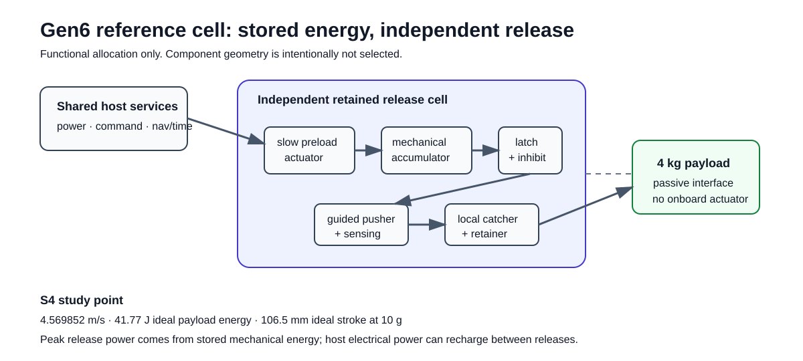

# Clean-sheet Gen6 reference architecture

Generated by `analysis/reference_architecture.py`. Do not hand-edit.

**Reference selected for the next calculations; P92/P113 remain open. No hardware has been built or tested.**

S4 changed the useful question. The bounded two-payload screen did not reward release authority above 4.569852 m/s in its best tested BOLLEY/Gen5/existing-Gen6 campaigns. That number is not a product requirement, but it is enough to test whether Gen6 still needs to look like an eight-metre launcher.

It does not. For a 4 kg payload, 4.569852 m/s is 41.77 J of ideal payload energy. At a 10 g constant-acceleration screen the ideal stroke is 106.5 mm and the acceleration lasts 46.6 ms. The terminal constant-force payload power is 1.79 kW. That is a compact release-cell problem, not evidence for an 8 m guide.



## What moves forward

The next Gen6 reference is **independent retained cells with a motor-charged mechanical accumulator and a short guided pusher**. A small actuator charges the accumulator before release; preload/position is the commanded release-energy variable; an independent latch releases the pusher; a local catcher keeps the pusher with the host after the payload clears. Shared power, command and host navigation remain common-mode services and are not disguised as independent.

This is a reference architecture, not a final mechanism. Spring form, latch, bearings, catcher, motor/gearbox and cell structure are deliberately unselected. The point is to move peak release power out of the host bus, remove the historical eight-metre dependency, keep the payload passive, and isolate a blocked mechanical path to one cell.

## Physics screen

| speed (m/s) | accel (g) | ideal energy (J) | ideal stroke (m) | time (ms) | force (N) | terminal power (kW) |
|---:|---:|---:|---:|---:|---:|---:|
| 4.56985 | 5 | 41.77 | 0.213 | 93.2 | 196.1 | 0.90 |
| 4.56985 | 10 | 41.77 | 0.106 | 46.6 | 392.3 | 1.79 |
| 4.56985 | 25 | 41.77 | 0.043 | 18.6 | 980.7 | 4.48 |
| 11.8 | 5 | 278.48 | 1.420 | 240.7 | 196.1 | 2.31 |
| 11.8 | 10 | 278.48 | 0.710 | 120.3 | 392.3 | 4.63 |
| 11.8 | 25 | 278.48 | 0.284 | 48.1 | 980.7 | 11.57 |
| 16.029 | 5 | 513.86 | 2.620 | 326.9 | 196.1 | 3.14 |
| 16.029 | 10 | 513.86 | 1.310 | 163.5 | 392.3 | 6.29 |
| 16.029 | 25 | 513.86 | 0.524 | 65.4 | 980.7 | 15.72 |
| 29.009 | 5 | 1683.04 | 8.581 | 591.6 | 196.1 | 5.69 |
| 29.009 | 10 | 1683.04 | 4.291 | 295.8 | 392.3 | 11.38 |
| 29.009 | 25 | 1683.04 | 1.716 | 118.3 | 980.7 | 28.45 |

The old high-speed points show why they must not be inherited as requirements. Even at the 25 g study ceiling, 16.029 m/s needs about 0.524 m of ideal constant-acceleration stroke and 29.009 m/s needs about 1.716 m. At the S4 point, the same screen needs only 42.6 mm. Mission need now has to justify every extra metre and joule.

At 4.569852 m/s, a stored-energy path would need 69.61 J, 59.67 J or 52.21 J of input energy at assumed 60%, 70% or 80% release-path efficiency. Those are sensitivity values, not measured efficiencies.

## Arrangement trade

| arrangement | blocked path consequence | disposition |
|---|---|---|
| independent retained cells | one cell; unrelated cells remain mechanically retained and available | REFERENCE |
| small banks with shared local path | can strand the affected bank downstream of the blockage | BACKUP |
| shared magazine/path | can strand all downstream payloads | COMPARATOR |

Independent cells take the reference position because the failure topology is explicit: a jammed pusher does not mechanically strand the rest of the manifest. That may cost more structure and actuators. The installed-mass trade is still open, so this is not yet a P92 closure.

## Release-concept trade

| concept | control variable | installed mass | disposition |
|---|---|---|---|
| motor-charged mechanical accumulator | pre-release accumulator preload/position | UNKNOWN | REFERENCE |
| direct short-stroke electromechanical pusher | commanded force/position/current trajectory | UNKNOWN | BACKUP |
| compact gas pusher | charge pressure/mass and valve timing | UNKNOWN | BACKUP |
| existing long gas guide | gas charge/pressure | PARTIAL | HISTORICAL_COMPARATOR |
| frozen Gen5 electromagnetic LSM | electrical pulse/current waveform | MODELLED | HISTORICAL_COMPARATOR |
| BOLLEY cooperative interface | cooperative electromagnetic payload/interface interaction | UNKNOWN | COOPERATIVE_PATH |

The direct electromechanical pusher remains the clean backup. It is mechanically compact, but at the S4 point a 10 g idealized push reaches about 1.79 kW of terminal payload power; a real actuator would need more electrical input. Once local energy storage is added to avoid that bus pulse, the architecture starts converging on the same idea as the motor-charged accumulator. Compact gas remains a backup, but it carries seal, valve and gas-system uncertainties that the clean-sheet reference does not need to import. The long gas guide and Gen5 remain evidence-rich comparators, not erased history. BOLLEY stays a cooperative path.

## Reference cell, deliberately only one level deeper

Functional chain: independent launch retention → slow preload actuator → mechanical accumulator → preload measurement → independent latch → short guided pusher → payload clears → local catcher/retainer → post-release state sensing.

The first hardware-facing work should therefore be small. A bench coupon can measure force-displacement, latch release repeatability, pusher friction, exit velocity/tip-off and catcher load before a flight-like cell is designed. The release-energy setting should be frozen before each shot and the acceptance bands written before the coupon is built.

## What would kill this reference

- measured release repeatability cannot meet the mission-derived terminal-state error budget
- latch/pusher shock or tip-off exceeds the payload/interface limit once that limit is declared
- friction/tolerance sensitivity consumes the useful preload-control range
- catcher loads or required stroke make the installed cell non-compact
- installed mass per successfully delivered payload loses to a bank/shared-path alternative after common-mode reliability is charged
- required recharge energy/power or thermal rejection is incompatible with the named host

If one of those fires, the backup is not automatically the old gas guide. The same mission and installed-burden screens are rerun against direct electromechanical, compact gas, banked layouts and BOLLEY.

## Still open before P92 can close

- mission-derived release/navigation uncertainty budget
- clearing and attitude-settling interval
- installed mass and envelope for all candidates
- accumulator force-displacement law and cycle life
- latch repeatability and release shock
- pusher friction, guidance, separation contact and tip-off
- catcher dynamics and retained post-release state
- host power/thermal/interface limits
- provider accommodation

[Frozen criteria](../validation/P92_reference_architecture.md) · [S4 campaign](MANIFEST_TIMING.md) · [Mission/redesign workstream](workstreams/MISSION_AND_REDESIGN.md)

## Reproduce

```bash
python3 analysis/reference_architecture.py
python3 analysis/reference_architecture.py --check
python3 -m pytest tests/test_reference_architecture.py
```
