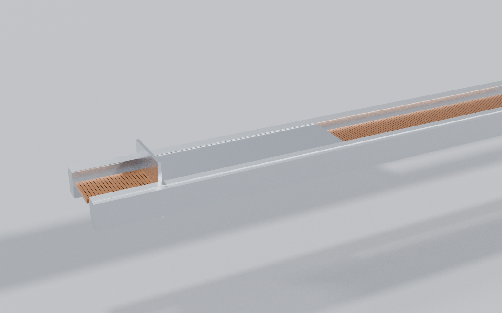
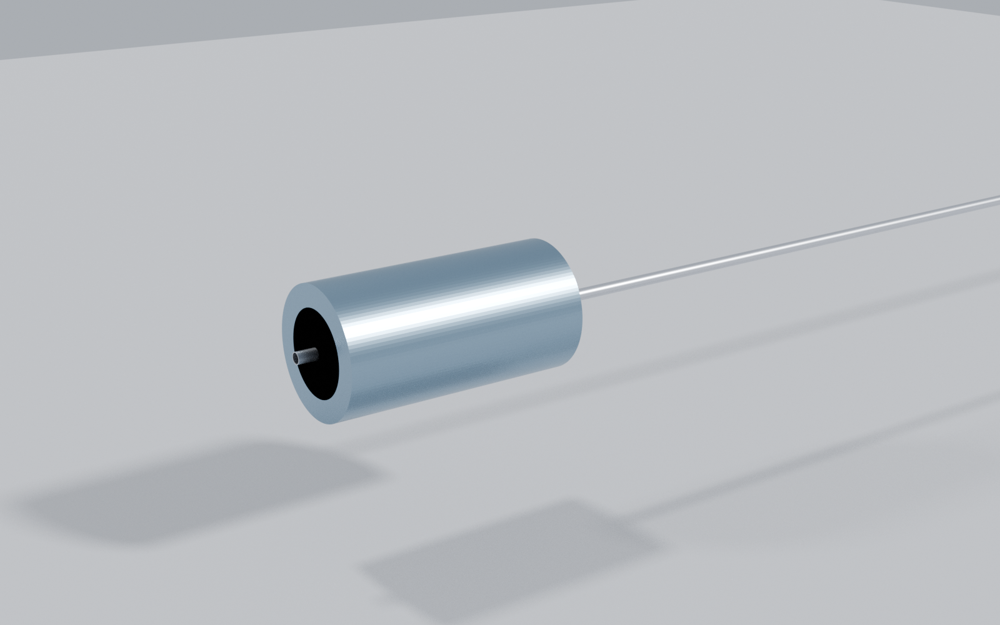

# Six generations, and what each one was for

**This is the design's history as a sequence of machines, not a changelog.** The per-generation
records — one file each, to a common structure — are in
[`docs/generations/`](generations/README.md). Each generation
exists because the one before it failed at something specific, and each is named here with what
it fixed and what it cost. `cad/CHANGELOG_CAD.md` carries the per-file detail; this page carries
the argument.

**Three matter today**, and they are not the same three a reader expects:

| | | |
|---|---|---|
| **Gen4** | *the last one modelled by hand* | The renders on the front page. **Never exported** |
| **Gen5** | *the frozen baseline* | Script-built, self-checking, and what every number is computed against |
| **Gen6** | *the current design target* | A different machine. **No mover, no stator, no bank, no brake** |

**Gen3 is a fourth that will not go away**, because the sled mass every performance figure
descends from was measured off its solids.

---

## The three, side by side

| | **Gen4** | **Gen5** | **Gen6** |
|---|---|---|---|
| **Status** | provisional, superseded | **frozen baseline** | **current design target** |
| **Adopted** | 2026-08-03 | 2026-08 | 2026-08-14, [ADR-032](adr/032-gen6-stage-integrated-gas-store.md) |
| **How it was built** | by hand, nine Fusion documents | **generated** from `cad/parameters.json` | generated from the same file |
| **Committed STEP** | **none — P43** | eight parts | six parts |
| **Reproducible from a clean clone** | no | **yes, byte-identically** | **yes, byte-identically** |
| **Drive** | linear synchronous motor | linear synchronous motor | **cold gas, closed adiabatic expansion** |
| **Moving mass recovered** | reusable sled | reusable sled | **carriage, not recovered** |
| **Energy store** | supercapacitor bank | supercapacitor bank | **2 L chamber at 50 bar** |
| **Arrest** | eddy brake | eddy brake | **none — nothing to stop** |
| **Structure** | its own track and enclosure | its own track and enclosure | **a rail a spent upper stage provides** |
| **Exit velocity** | *not established* | **16.029 m/s at 10.07 g** | **30.535 m/s at 25 g**, zero-friction; **29.009** at the full tolerable friction (**P67**) |
| **Stroke** | 1.3 m accelerating, release at 1.5 m | same | **2.18 m** |
| **Dry mass** | — | **126.6 kg** | 11.45 kg added, plus ~5.4 kg of store |
| **Per 3U satellite** | — | **10.547 kg dry** | **1.403 kg added** — and **1.403–3.271** once the stage credit is read hostilely (**P68**) |
| **Velocity control** | — | designed loop, **0.0274 m/s at 3σ** | **1.113 % at 3σ**, 93.4 % of it seal friction (**P67**) |

**Read the last two rows together.** Gen6 is better on velocity and on added mass per satellite,
and **worse on the thing the product is sold on.** Gen5 commanded velocity through a closed loop
designed against phase margin; Gen6's shot is 133 ms of open-loop expansion and its spread is
whatever the hardware repeats to.

---

## The three, as pictures

<table>
<tr>
<td width="33%"> <b>Gen4 — drawn by hand.</b> Fusion, nine documents, more modelled detail than any generation since. <b>No committed STEP export</b>, and its stations disagree with the analysis model (<b>P43</b>). The annotation is drawn on by <code>cad/tools/prepare_renders.py</code>, and its velocity is now read from the result rather than typed (<b>P72</b>).</td>
<td width="33%"> <b>Gen5 — generated.</b> Eight parts from <code>cad/parameters.json</code>, rebuildable byte-identically. Plainer than Gen4 because every feature must trace to a parameter, and no parameter describes a fillet. The copper band is the stator; the sled sits on it.</td>
<td width="33%"> <b>Gen6 — what is left after deletion.</b> A rail the host stage provides, a drive tube, a pre-charged chamber and its reservoir. <b>No stator, no sled, no bank, no brake.</b> The visual difference is the architecture, not the renderer.</td>
</tr>
<tr>
<td> <b>Gen4, track and stator.</b> Side elevation. Gen4 stows the sled at s = 300 mm and releases at s = 1200, against the 1500 mm <code>analysis/</code> assumes.</td>
<td> <b>Gen5, sled on the stator.</b> The rollers in this image are in their channels for the first time: until 2026-08-16 both sat outside them in every committed STEP (<b>P71</b>), found by building the machine a second time in a different kernel.</td>
<td> <b>Gen6, the store.</b> A 2 L chamber charged to 50 bar and fired as a closed adiabatic expansion, fed from a 9.55 L reservoir at 200 bar. <b>There is no regulator</b> — A41 closed P63 by deleting the component rather than pricing it.</td>
</tr>
</table>

<b>Gen4 is a Fusion render; Gen5 and Gen6 are Cycles renders of the committed STL sets, by
<a href="../cad/tools/render_blender.py"><code>cad/tools/render_blender.py</code></a>. They are not
directly comparable as images.</b> Gen4 carries hand-modelled detail and Fusion's own materials;
the other two carry only what a parameter describes. <b>Where they differ in shape, that is the
design; where they differ in finish, that is the tool.</b>

---

## Gen4 — the last one drawn by a person

**What it was for.** Gen3 accelerated through a uniform 1.30 m stator and released at 1500 mm,
using a parametric sled. Gen4 rebuilt the assembly around the **actual 488 mm sled** and gave the
brake a physical interaction interval, without extending the track.

**What it cost, and it is still being paid.** Gen4 exists **only in Fusion**. It has never been
exported, its export gate is deliberately closed, and its stations disagree with the analysis
model — **release at s = 1200 mm where `analysis/` assumes 1500**, and a 340 mm Halbach array that
leaves the stator edge at 1051.5 mm. **P43.**

**So the pictures on the front page show a machine no file in `cad/step/` matches**, and the
caption under them says so. The velocity annotated on them was also two corrections stale until
2026-08-16 (**P72**) — it is now read from the result at render time rather than typed in.

## Gen5 — the first one a script could rebuild

**What it was for.** `cad/parameters.json` carries its own warning: Fusion user parameters are
document-scoped and *"will silently drift across the nine documents."* Gen4 is the proof — nine
hand-maintained documents, no export, and stations that disagree with the analysis.

**Gen5 is generated.** `cad/build_gen5.py` reads the parameter file and emits eight STEP parts.
It **cannot drift**, it regenerates byte-identically from a clean clone, and it matches ADR-015:
derive, never paste. It is the fix P39 pointed at.

**What it cost.** A script-built model is a **geometry and interface model, not a manufacturing
model** — no fillets, fasteners, harness routing or tolerancing, and `parameters.json` carries no
tolerances to give them. **That is why Gen4's renders look more finished than Gen5's**: someone
drew detail into Fusion that no parameter describes.

**And being generated did not make it right.** On 2026-08-16 a second implementation in a
different CAD kernel found **both sled rollers outside their channels** in every Gen5 STEP ever
produced — one inboard in the stator gap, one outboard of the longeron, the sled asymmetric about
y = 0 (**P71**). Every guard here compares a generated artifact against the script that generated
it, so both agreed. See [`../cad/scad/README.md`](../cad/scad/README.md).

## Gen6 — a different machine, arrived at by deletion

**What it was for.** Five runs, none of which set out to change the architecture:

| | |
|---|---|
| **A35** | attributed every kilogram to the requirement causing it, and found **49.23 kg survives every requirement deletion in all 64 corners** |
| **A36** | closed the manifest route — 2.0 kg/satellite first reached at **N = 116**, which does not package |
| **A37** | made the stage the machine |
| **A38** | showed tip-off does not bind at 25 g |
| **A39** | replaced the spring with gas |

**What it deletes.** No mover, no stator, no supercapacitor bank, no power electronics, no eddy
brake, no return stroke. **29.75 kg deleted outright**; charging is **25–131 W**, which is solar.

**What it costs, stated rather than absorbed.** Three of Gen5's crossed kill criteria are
**dissolved rather than passed** — a criterion that no longer applies has not been met, and
`KILL_CRITERIA.md` says so in those words. The store took four runs to get right: **A40 killed the
fixed-orifice implementation** at 14.16 m/s against a 30 m/s band, A41 specified the pre-charged
chamber, A42 found its reservoir sized on gas the bottle cannot give back, and **A43 found the
bottle does not warm back up** — 17 460 s against a 1200 s cadence.

**And the mass case is thinner than the decision record claimed.** ADR-032's first falsifier fires:
the break-even on the stage credit is **8.4 %, not 30 %**, and **58.6 % of that credit is the
enclosure** — a skin belonging to a vehicle nobody has agreed to lend. **P68.**

---

## What none of them are

**Nothing has been built, fired or measured at any scale.** That is **E4**, it is open, and six
generations of CAD do not touch it. Gen4 was drawn, Gen5 and Gen6 were generated, and all three
are model outputs. [`B1_ORDER.md`](B1_ORDER.md) is still the order that changes the category of
evidence rather than its degree, and it has not been placed.
