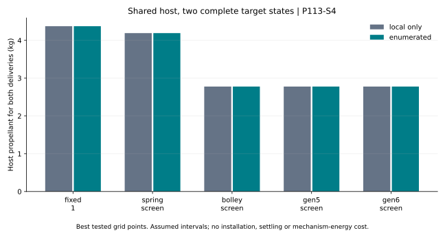

# Two-payload terminal-state campaign

Generated by `analysis/manifest_timing.py`. Do not hand-edit.

**P113/E5 remain open. These are best tested campaigns, not global optima or hardware rankings.**

Two 4 kg payloads share one 300 kg dry host with 10 kg fuel and a 2 kg reserve.
Both must reach prescribed 450 km circular-orbit states, 5 km and 25 km ahead
of the reference host at 3600 s. Acceptance tests position AND velocity.

[Frozen criteria](../validation/P113_S4_manifest_timing.md) ·
[Every case and search](../analysis/results/manifest_timing.json) ·
[Programme](PROGRAMME_EXECUTION.md)



## Best tested campaign on the fine grid

| Assumed screen | Fuel, kg | First target | Release times, s | First speed, m/s | Local-only fuel, kg |
|---|---:|---|---|---:|---:|
| fixed_1 | 4.374740 | phase_5km | [1200, 3000] | 1.000000 | 4.374740 |
| spring_screen | 4.192175 | phase_5km | [1200, 3000] | 2.000000 | 4.192175 |
| bolley_screen | 2.777987 | phase_5km | [1200, 3000] | 4.569852 | 2.777987 |
| gen5_screen | 2.777987 | phase_5km | [1200, 3000] | 4.569852 | 2.777987 |
| gen6_screen | 2.777987 | phase_5km | [1200, 3000] | 4.569852 | 2.777987 |

44 of 100 schedule/order/screen cases have an accepted campaign.
Failed searches and interrupted deliveries remain in the JSON; missing roots are not proofs of infeasibility.

## Controls and interpretation

Each comparator receives both target orders and the same increasing release-time pairs
from 600, 1200, 1800, 2400 and 3000 s. Coarse selection uses 1200 and 2400 s.
For each first arc the speed search contains endpoints, midpoint and the locally
fuel-minimizing speed. The local-only column restricts that same search to the last choice.
The second transfer begins with the actual retained host state and mass after the first release.

Up to four ideal impulses are allowed: initial transfer, first pre-release correction,
post-first-release transfer and final pre-release correction. The two impulses around
the first release are charged separately and act on different retained masses.
No clearing time, plume exclusion or attitude recovery is represented.

An accepted full campaign is stronger evidence than two independently initialized
deliveries, but these controls are still an idealized screen. Installation mass is the
same placeholder for all candidates. No mechanism energy or qualification claim follows.
The release intervals, including the 0.5 m/s minimum, remain hypothetical.

A selected time at 600 or 3000 s, or an adjacent pair, may be constrained by the grid.
Equal coarse/fine values do not establish convergence. Discrete first-speed grids differ
between intervals; an apparent reversal is not proof that less available authority is better.
All fixed-order, coarse/fine and local/enumerated selections are retained in the JSON.

## Next decisions

Do not add more payloads merely to multiply cases. First quantify the effect of required
clearing/settling intervals, release/navigation errors and installed burden. Compare
independent bays, banks and the shared path with explicit failure consequences.
Those constraints can change the ranking and still govern mechanism selection.

## Reproduce

```bash
python3 analysis/manifest_timing.py
python3 analysis/manifest_timing.py --check
python3 -m pytest tests/test_manifest_timing.py
```
