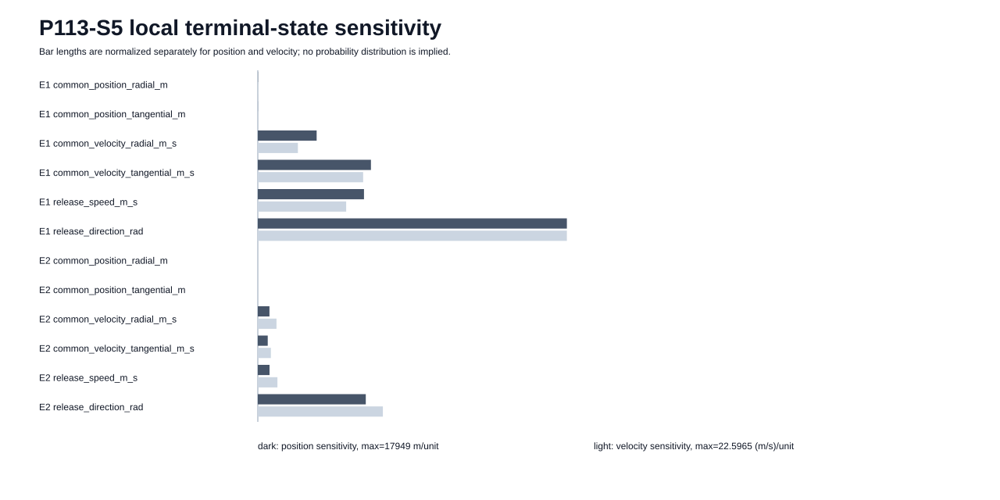

# Operational uncertainty around the S4 campaign

Generated by `analysis/operational_uncertainty.py`. Do not hand-edit.

**P113, E5 and P92 remain open. This is local deterministic sensitivity, not a probability of mission success or a hardware tolerance specification.**

The nominal case is the accepted S4 `bolley_screen` fine-grid enumerated campaign, order `['phase_5km', 'phase_25km']`, release times [1200, 3000] s. S4 uses this as a bounded comparator, not a flight requirement.



## One-at-a-time local linear allowances

The values below use the remaining margin inside S3/S4's existing 10 m position and 0.01 m/s velocity bands. They are **LOCAL_LINEAR_ALLOWANCE** values only. They are not claimed navigation performance, mechanism accuracy or provider requirements.

| Payload event | Perturbation | Position sensitivity | Velocity sensitivity | Local linear allowance | Verification |
|---|---|---:|---:|---:|---|
| 1: phase_5km | common_position_radial_m | 7.73869 m/unit | 0.00878272 (m/s)/unit | 1.13859 input unit | PASS |
| 1: phase_5km | common_position_tangential_m | 2.83005 m/unit | 0.00217999 (m/s)/unit | 3.53348 input unit | PASS |
| 1: phase_5km | common_velocity_radial_m_s | 3414.8 m/unit | 2.93106 (m/s)/unit | 0.00292841 input unit | PASS |
| 1: phase_5km | common_velocity_tangential_m_s | 6569.09 m/unit | 7.701 (m/s)/unit | 0.00129852 input unit | PASS |
| 1: phase_5km | release_speed_m_s | 6165.53 m/unit | 6.46109 (m/s)/unit | 0.00154772 input unit | PASS |
| 1: phase_5km | release_direction_rad | 17949 m/unit | 22.5965 (m/s)/unit | 0.000442543 rad | PASS |
| 2: phase_25km | common_position_radial_m | 1.44017 m/unit | 0.00157649 (m/s)/unit | 6.3432 input unit | PASS |
| 2: phase_25km | common_position_tangential_m | 0.840977 m/unit | 0.000737216 (m/s)/unit | 11.8909 input unit | PASS |
| 2: phase_25km | common_velocity_radial_m_s | 677.895 m/unit | 1.3668 (m/s)/unit | 0.00731636 input unit | PASS |
| 2: phase_25km | common_velocity_tangential_m_s | 574.476 m/unit | 0.955605 (m/s)/unit | 0.0104646 input unit | PASS |
| 2: phase_25km | release_speed_m_s | 681.95 m/unit | 1.43639 (m/s)/unit | 0.00696187 input unit | PASS |
| 2: phase_25km | release_direction_rad | 6271.85 m/unit | 9.14503 (m/s)/unit | 0.00109349 rad | PASS |

## Schedule headroom only

The two stored release epochs are separated by **1800 s**. The first and second releases have **2400 s** and **600 s** remaining to the 3600 s terminal epoch.

Study markers of 30, 60, 120 and 300 s are compared only to those timestamp gaps. Passing a marker does not establish host slew, settling, thermal recovery or manoeuvre capability. Those remain E5/provider inputs.

## What this changes

This run exposes which release-state terms consume the terminal-state bands fastest and therefore which quantities need explicit mission bounds before a release-cell tolerance is chosen. Common navigation error and mechanism-relative error remain separate in the ledger; a precise pusher cannot remove a common host-state error.

The next campaign step is to combine declared navigation/pointing bounds and clearing/settling assumptions with the evolving-host campaign, then charge installed burden and failure topology. Do not convert these local linear allowances into hardware requirements without that step.

## Verification

Overall declared numerical checks: **PASS**. The JSON retains positive/negative perturbations, half-step convergence, basis vectors, momentum residuals and source hashes.

## Reproduce

```bash
python3 analysis/operational_uncertainty.py
python3 analysis/operational_uncertainty.py --check
python3 -m pytest tests/test_operational_uncertainty.py
```
