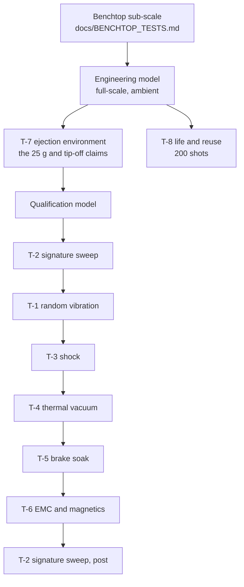

# Qualification and environmental test plan

**Status: written, none of it run.** Nothing in this project has been built, so every entry
below is a specification. It exists because a design study with eight analysis run sheets and
no test campaign has only described half of what qualifying hardware requires, and because
the levels an VOLLEY unit must survive are already what sets the 25 g payload cap the whole
architecture is designed around.

Read alongside `validation/` (the analyses) and `docs/BENCHTOP_TESTS.md` (the cheap
sub-scale experiments that come first). Levels reference NASA GEVS (GSFC-STD-7000) and the
CubeSat Design Specification, both of which the paper already cites.

**Nothing here is a substitute for the launch provider's own ICD.** Where this plan and a
vehicle's user guide disagree, the user guide wins.

---

## 0. What the deployer must survive, and what it must not inflict

Two directions, and they are easy to conflate:

| | The deployer as payload | The deployer as source |
|---|---|---|
| Sees | Launch loads from the vehicle | |
| Inflicts | | Ejection loads and stray field on the CubeSats it carries |
| Governing | Vehicle user guide, GEVS protoflight | CubeSat Design Specification, 25 g cap, magnetic keep-out |

The second column is the unusual one. A spring deployer imparts 1-2 m/s and is magnetically
inert; VOLLEY carries a Halbach array centimetres from satellites it has not built, and fires
a 330 A pulse next to them. **T-6 and T-7 exist for that reason and have no counterpart in a
spring dispenser's qualification.**

---

## T-1: Random vibration, protoflight

| | |
|---|---|
| Level | GEVS protoflight, 14.1 grms, 20-2000 Hz, 3 axes |
| Duration | 60 s per axis |
| Article | Full deployer, loaded with 12 mass simulators |
| Closes | **E4**, and the launch-restraint half of **E10** |

**Pass criteria.** No change in first mode > 5 % between pre- and post-test signature sweeps
(a shift means something loosened). Retention gates hold the six-satellite stack preload,
the analysis says 5.9 kN through two D6 A-286 pins at margin 1.2, and margin 1.2 is thin
enough that this test is the one that matters. Launch locks hold the sled. No mass simulator
moves in its cassette.

**What this is really testing.** `sizing.py` gives the track a first mode of 48 Hz
pinned-pinned and 109 Hz fixed-fixed against a 70-100 Hz secondary-structure convention. The
design *specifies* end-fixed mounting to clear it. If the as-built joint is anywhere between
pinned and fixed (which is what A4 had to bracket for the chassis plate) the real mode may
sit inside the primary band. **This is the single most likely qualification failure.**

## T-2: Sine sweep and low-frequency

Vehicle-specific, typically 5-100 Hz at 1.25x flight limit. Pre- and post-signature sweeps
either side of every other test in this plan; they are how you detect damage that a visual
inspection misses.

## T-3: Shock

Pyroshock or equivalent at the separation-system level, per the vehicle ICD. **The concern is
not the deployer surviving it but the magnets:** shock is the credible path to cracking a
sintered NdFeB block or breaking a magnet bond. `sizing.py` gives the bond 0.118 MPa against
10 MPa allowable at a margin of 84, which is comfortable, but that figure is quasi-static and
shock is not.

**Pass criteria.** No change in airgap field measured before and after (a cracked or partly
demagnetised block shows up as a field change before it shows up as anything else).

## T-4: Thermal vacuum

| | |
|---|---|
| Level | 8 cycles, −40 °C to +60 °C, ≤ 1x10⁻⁵ torr, dwell to stabilisation |
| Article | Full deployer, powered, firing into the brake at temperature |
| Closes | **E11**, part of **E4**, and the operational half of **E21** |

**Pass criteria.** A full 12-shot campaign at both temperature extremes with exit velocity
within the declared dispersion band. Bakeout mass loss per ASTM E595: TML ≤ 1.0 %, CVCM
≤ 0.1 %, the materials rule (B16) already specifies E595-compliant selection, and this is
where that gets tested rather than asserted.

**Why this one is load-bearing.** Three open items converge here and nowhere else.
`sizing.py` puts the N45SH remanence temperature coefficient at −0.11 %/K over ±40 K, moving
the thrust constant ∓4.4 %, so **velocity dispersion across the thermal range is a claim this
test either supports or destroys.** **E19** (eddy heating inside the magnet blocks, not
modelled anywhere) can only be observed in vacuum, where there is no convection to hide it.
And **E21** (vacuum tribology of rollers reused twelve times, at 1.48 kN per pair) has no
analysis behind it at all, this is the first time the roller interface would run in its real
environment.

## T-5: Thermal cycling and brake soak

The eddy brake absorbs 1.29 kJ per shot into a 0.86 kg copper fin: a 3.9 K adiabatic rise per
shot, 47 K over a twelve-shot campaign if it never radiated. **Fire twelve shots at the
minimum inter-shot cadence** and instrument the fin. This is the direct test of a number the
paper quotes, and it is cheap once T-4 hardware exists.

## T-6: EMC and magnetic cleanliness

| | |
|---|---|
| Level | MIL-STD-461 RE102/CE102 class, tailored to the vehicle ICD |
| Closes | **E12**, and validates the keep-out behind **P3** |

Radiated emissions during a 330 A pulse, and, the part with no spring-deployer precedent,
**static field at the payload envelope.** `verify_field.py` gives 22.7 / 4.3 / 0.4 mT at
10 / 20 / 50 mm behind the array. **Pass criteria:** measured field at the cassette payload
envelope within 20 % of that model, and inside the magnetometer limit of whatever satellite
is manifested. A customer flying a magnetometer or a magnetorquer needs this number measured,
not modelled, and the far-field values are the least trustworthy row in the whole field model.

## T-7: Ejection environment inflicted on the payload

The test that decides whether "unmodified CubeSat" is true.

**Instrument a 3U mass simulator** with accelerometers and rate gyros, on the real machine,
through the real stroke. **Pass criteria:** axial acceleration ≤ 25 g (the model says 10.7 g,
so there is margin to lose); tip-off within the declared band, **noting that the band itself
is unresolved**, since `validation/A7_separation_chrono.md` declares ≤ 5 °/s citing NRCSD-E
while the sibling NRCSD ICD says 2 °/s (`docs/LANDSCAPE.md`); and lateral and rotational
loads inside CDS qualification.

## T-8: Life and reuse

The sled is reused twelve times per campaign and the machine is intended to be
multi-mission. **Run 200 shots**, ten times a campaign, and inspect rollers, rails, magnet
bonds and the retention-gate mechanism between blocks. Closes the reuse half of **E21** and
gives **E20** its first measured arrest profile.

---

## Sequence, and what gates what

Signature sweeps bracket the environmental block because that is how damage is detected. T-7
and T-8 come **first**, on an engineering model, because they test claims the design rests on
and if the 25 g or tip-off numbers fail there, the qualification model should not be built
to that design.

## What this plan costs, honestly

Nothing here is affordable on a student budget. A protoflight vibration and TVAC campaign at
an Indian test house is a five-to-six-figure rupee proposition per article before the article
itself exists, and `analysis/cost.py` puts recurring hardware alone above ₹1.3 M with every
price assumed.

**That is the argument for `docs/BENCHTOP_TESTS.md`.** Four of the claims above can be tested
at sub-scale for the price of the magnets, and doing so would give this project its first
measured number, which it does not currently have at any scale (**E4**).
