> **Superseded by ADR-030, 2026-08-13; annotated 2026-08-21.** The audit note below is retained
> as history and is no longer the operating point. **Current: 10.54 N per kA/m, 16.029 m/s,
> 10.07 g, 47.0 J recovered over a 39 mm regenerative section, 1162 J to the brake, 18.8 % net
> efficiency, and a 9.0 K per-shot brake-fin transient.** ADR-030 both depth-resolved the thrust
> constant and shortened the regenerative stator from 240 mm to 39 mm, because 240 mm of regen
> plus a 300 mm eddy fin were oversubscribed in a 339 mm section (**P28**). Every recovery figure
> below predates that. **P97.**

> **Numerical audit correction, 2026-08-03.** The current operating point is 11.03 N per
> kA/m, 16.388 m/s, 10.53 g, 291.4 J recovered, 934.7 J to the brake, and 20.99% net
> efficiency. A13's former residual-rate/cadence conclusion is superseded, A6's 3.7e-8
> result is only a fixed-shape sensitivity, and the corrected brake-fin transient is 7 K
> per shot. Values below that describe earlier audit states are retained as history.
# Results, in charts

Everything here is drawn by GitHub from text, no image files. Every value traces to a
field in `analysis/results/*.json`, named under each chart, and nothing has been rounded
in a direction that flatters it.

**These are model outputs.** Nothing in this file has been measured, and only two results
carry an independent cross-check. See [`PROVENANCE.md`](PROVENANCE.md).

---

## Where the energy goes

2881 J leaves the capacitor bank per shot and **296 J comes back**, so the net draw is
2585 J. 547 J of it ends up as payload kinetic energy, and that is the **21.2 %** figure.

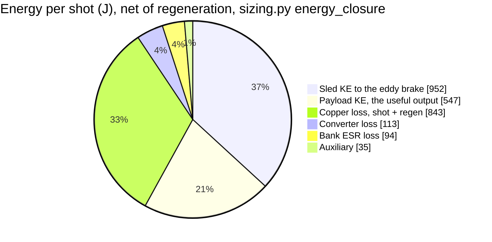

Accounted 2583 J against 2585 J net drawn, 100.0 % closure.

**The regeneration credit is new and it reverses a five-year-old flat statement**, so the
history matters more than the number. This page said until 2026-07-31 that the figure carried
*no regeneration credit, because the sled's 1291 J is dissipated in the eddy brake by design*.
The 2025 decision it rested on argued only that the motor cannot **arrest** the sled, which is
still true and still why the brake exists. It never argued that no energy could be taken back,
and nobody asked, because the previous regeneration claim had been a double-count and crediting
zero felt safe. [`../validation/A11_regen_braking.md`](../validation/A11_regen_braking.md)
asked: 240 mm of added stator returns 296.6 J, **23.0 % of the sled's energy**, at the same
sheet-current rating and with peak current below the shot's own. **952 J still goes to the
brake**, which is why this supplements the arrest decision rather than replacing it.

Efficiency was 32 % until 2026-07-29; adopting the CAD-derived 9.445 kg sled moved it to 20 %,
because more of the same mechanical work goes into a mass that is braked away and the longer
157 ms pulse accrues more copper loss. The ESR correction of 2026-07-30 moved it to 19 %.
Regeneration moved it to **21.2 %**. Every one of those steps is a correction to a published
number, and two of the three moved it the wrong way.

**A closing budget is weaker evidence than it looks, and this chart is the reason.** Until
2026-07-30 it closed at 100.0 % without the 86 J ESR slice, because both sides of the ledger
omitted the same term: the draw it balanced against came from the same model that was missing
the loss. A circuit simulation with a real series resistance found the gap. Closure proves the
arithmetic is consistent, not that the physics is complete. Recorded as P24. Source:
`analysis/results/sizing.json` to `energy_closure`.

An earlier version of this project claimed 52 % efficiency by crediting 55 % of the sled's
energy back as regeneration. That was double-counting, and the correction, 52 % to 32 %, is
recorded as A25/A27 in [`INVENTORY.md`](INVENTORY.md). **A11's 23.0 % is not that claim
returning**, and the difference is worth being precise about: the 55 % was asserted against an
arrest architecture that throws the energy away, while 23.0 % is integrated against 240 mm of
stator that has to be built, at a rated current the winding already carries, with the copper it
burns subtracted and the brake still absorbing 952 J. It is less than half the retracted figure
and it has a run sheet.

---

## Why the conjunction claim was reframed

This is the most instructive chart in the repository. It plots the 30-day minimum
satellite-to-stage approach distance against ejection velocity.

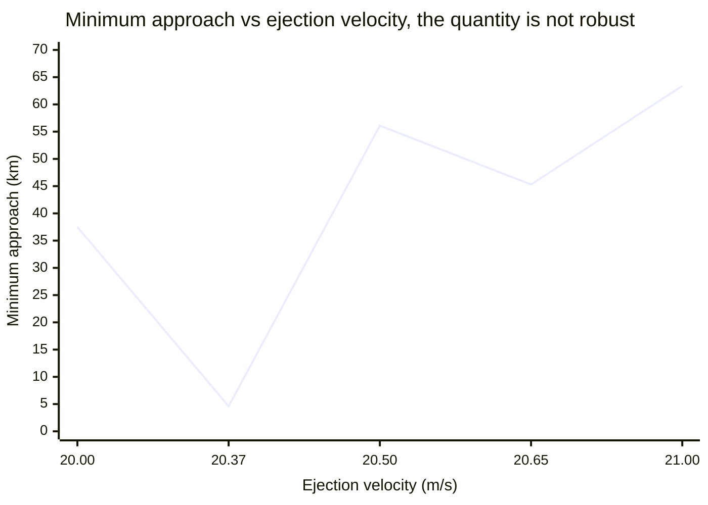

A ±2.5 % change in velocity moves the answer by more than an order of magnitude, from
4.6 km to 63.4 km. It is a near-resonant beat sample, not a design property. The paper
originally quoted a single figure (45.3 km) as a safety result. It now rests on the
**phase realignment period**: 9.9 days at the current operating point, which is robust,
plus mandatory per-shot collision avoidance and host-stage disposal before first realignment.
The sweep above was computed at the superseded 20.37 m/s point and is kept as the evidence
for P1: the fragility is a property of the beat geometry, not of any one velocity.

Source: the P1 sweep table in [`OPEN_PROBLEMS.md`](../OPEN_PROBLEMS.md), computed by
`analysis/astro.py` `conjunction()`. `validation/A6_conjunction_cara.md` specifies the
quantitative replacement, probability of collision, which integrates over the covariance
instead of sampling one geometry.

---

## Payload family

Exit velocity is force-limited, so heavier classes go slower at lower acceleration. Only
the 3U case is designed; 6U and 12U are arithmetic from the same thrust constant, with no
mechanism or cassette behind them (`OPEN_PROBLEMS.md` E9).

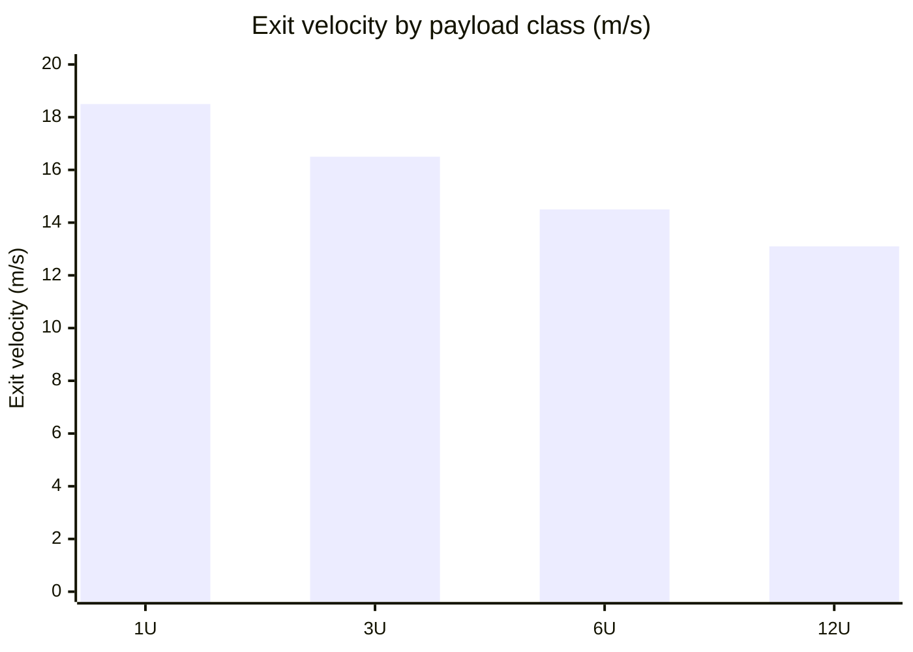

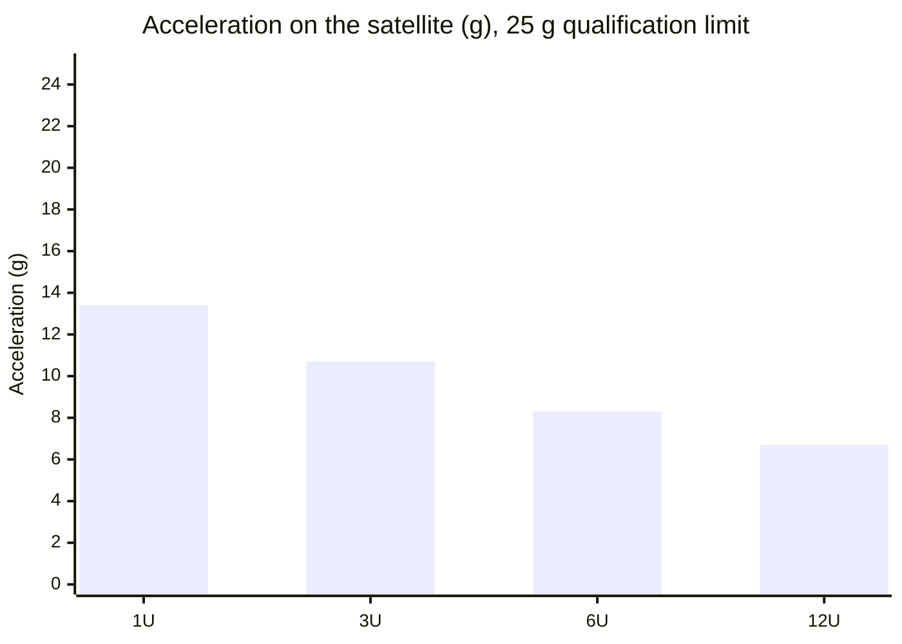

Every class now sits well inside the 25 g qualification limit, the 1U case peaks at 13.4 g,
against 23.4 g before the CAD-derived sled mass was adopted. The machine is no longer
acceleration-limited but **thrust-and-mass limited**, so more than half the qualification
margin goes unused and recovering velocity means removing mass or raising current, not
shortening the stroke. Source:
`analysis/results/motor_results.json` to `family`.

---

## Seeding: the actual value proposition

Time to spread a constellation 30° apart, by ejection velocity, against the
differential-drag baseline.

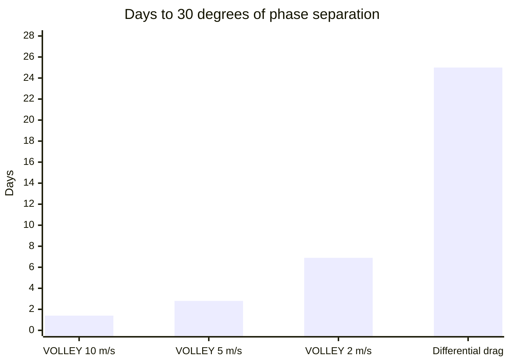

Source: `analysis/results/astro_results.json` to `seeding_days`. **Caveat worth reading:**
the 25-day comparator is a model output of `astro.py`, not a measurement. Foster et al.
published *flown* differential-drag phasing results for 12 Planet Labs CubeSats at 510 km;
replacing the modelled baseline with the measured one is the cheapest credibility
improvement available to this project (`docs/RELATED_WORK.md`).

---

## Stray field falloff

Sets the magnetic keep-out for satellites still in the cassettes.

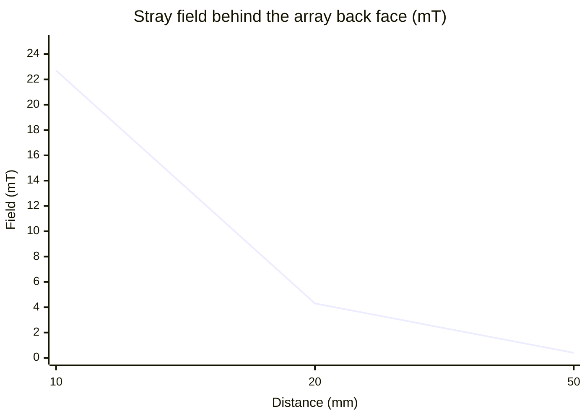

Source: `analysis/results/field_verification.json` to `stray_field`. The 20 mm and 50 mm
values were wrong in the published paper (4.7 and 1.0 mT) and were corrected against the
script, P3, logged in [`CHANGELOG.md`](../CHANGELOG.md) as P2-03. Far-field values are small
differences of large numbers and remain the least trustworthy row here.

---

## The sled mass conflict: settled 2026-07-29

Two estimates of the same part disagreed by 94 %, and the headline exit velocity hung off
which one was right. **The CAD calculation won, and the rule that decided it was written first.**

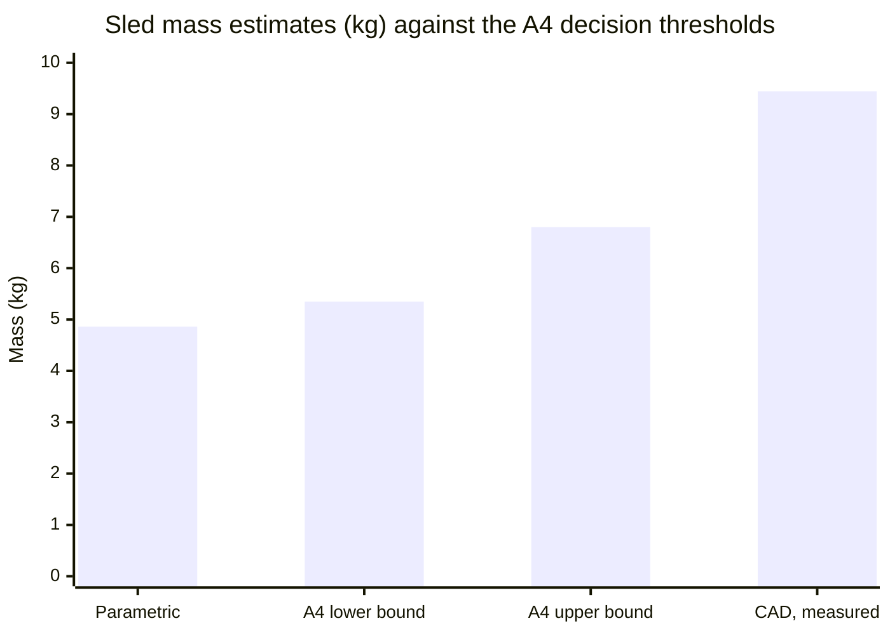

The two middle bars are **not measurements**: they are the decision rule declared in
[`validation/A4_sled_structural.md`](../validation/A4_sled_structural.md) before the analysis
runs:

| Outcome | Consequence declared in advance | |
|---|---|---|
| ≤ 5.35 kg | Parametric model stands. 20.37 m/s holds, P5 and P8 close | |
| 5.35-6.80 kg | Neither estimate right. Scripts move, then the paper | |
| **≥ 6.80 kg** | **The headline changes and the paper changes materially** | **fired** |

Fixing the thresholds in advance was the point, because after the run the temptation is to
pick whichever threshold preserves the nicer number. The CAD result came in at **9.445 kg**,
well past the top band; A4 then ran and found the drawn plate passes all three structural
bands, so nothing forces a lighter chassis either. `analysis/` moved first and the paper
followed, the first time a script value has changed in this project.

What it cost: exit velocity 20.37 to **16.54 m/s**, efficiency 32 % to **20 %** (19 % after
the ESR correction, 21.2 % after regeneration). What it did
not cost: the lifetime multiplier fell only x1.80 to **x1.62**, because lifetime is a weak
function of Δv. The mission case survives considerably better than the machine spec does.

---

## Validation status

> **This diagram was superseded on 2026-08-10 and is retained as history.** It shows A1, A4, A6,
> A7 and A8 as "specified, not run"; **all five have since run**, and the record now stands at
> **24 run sheets through A27**. The live status is
> [`validation/README.md`](../validation/README.md) — a table rather than a diagram, because the
> diagram stopped being maintainable at about a dozen entries and then silently went stale, which
> is the failure this note exists to stop repeating.

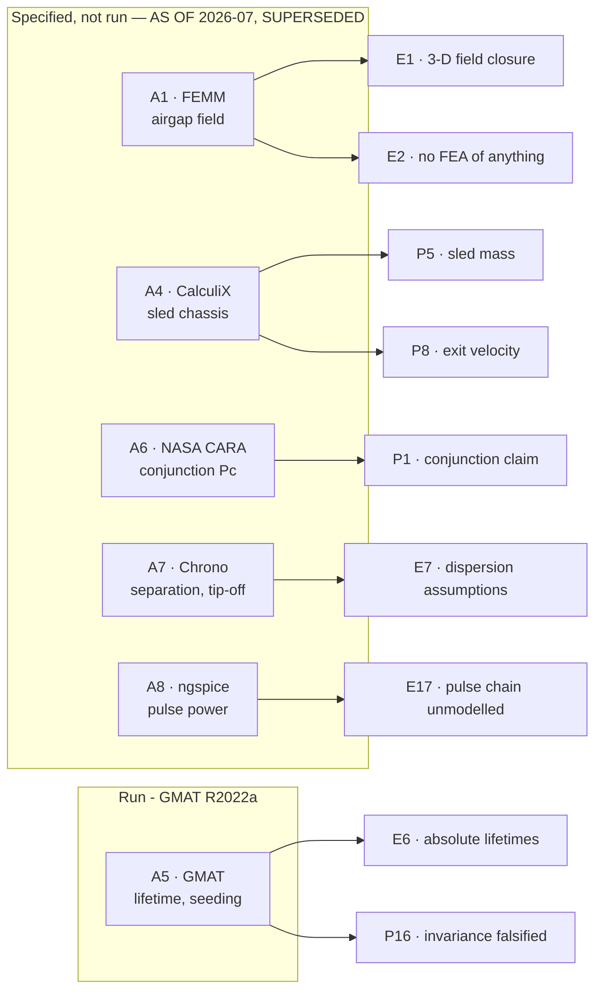

Six analyses, each with its acceptance band declared before the run. Progress so far:

| Analysis | Status |
|---|---|
| A1 airgap field | `░░░░░░░░░░` specified |
| A4 sled chassis | `████████░░` **run, as-drawn plate passes all 3 bands**; lightest-chassis question open |
| A5 lifetime & seeding | `████████░░` **run, FAIL (P16), and now superseded: it was propagated at 20.37 m/s (P19)** |
| A6 conjunction Pc | `░░░░░░░░░░` specified |
| A7 separation & tip-off | `███████░░░` **modelled by A23** — A7's multibody run still not done |
| A8 pulse-power chain | `████████░░` **run, all bands met, 2 findings; netlist still at the old operating point (P19)** |

## GMAT cross-check (A5): first real validation output

GMAT R2022a was installed and run headless. This is the first number in this project
produced by something other than its own scripts.

> **Read this section as history, not as current validation.** Every GMAT run below was
> propagated at **20.37 m/s**, the rated velocity before the CAD-derived sled mass was adopted
> on 2026-07-29. The current point is 16.39 m/s and the script multiplier is x1.62, so the
> absolute numbers here no longer describe the design. **What does survive is the
> falsification**, P16 is about the shape of the model, not the velocity, and a uniform
> density scale cannot move a ratio at any Δv. Re-running A5 is scheduled in
> [`ROADMAP.md`](ROADMAP.md); the staleness is logged as P19.

### Decay rate over a bounded 30-day window

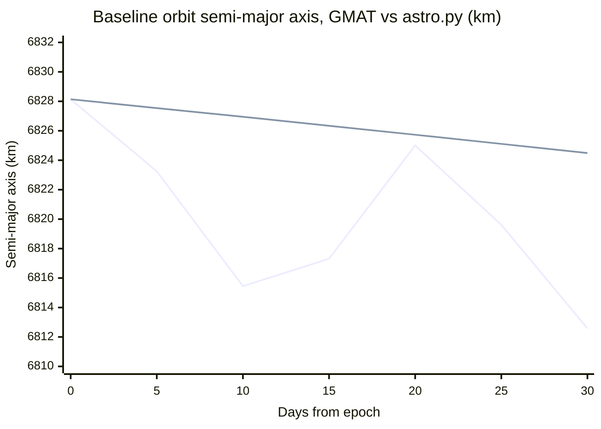

First line GMAT, second `astro.py`. The GMAT curve wanders because **reported SMA is
osculating**, short-period J2 and lunisolar terms run 12.2 km peak to peak here, several
times the decay over the whole window. `astro.py` integrates mean elements, so its curve is
smooth. Differencing the endpoints of the two would be meaningless; the honest comparison is
the fitted rate:

| | Decay rate | Method |
|---|---|---|
| GMAT | **−0.1618 km/day** | least squares over 31 daily samples, residual RMS 4.24 km |
| `astro.py` | **−0.1216 km/day** | 30-day Cowell integration, `cowell_sma_after()` |
| Ratio | **1.33x** | GMAT decays faster |

**A 33 % difference in absolute decay rate is not a failure**, and E6 says so in advance:
`astro.py` uses a static exponential atmosphere at "mean activity" while GMAT uses MSISE90
at F10.7 = 150, and those are not the same thing. The claim this project defends is the
ratio between boosted and unboosted lifetimes, not the years.

An internal consistency check fell out of it: a 1.33x faster decay predicts the
high-activity case reaching 120 km at 190 / 1.33 ≈ 143 days. GMAT's full run gives
**144.5 days**. The bounded window and the full decay agree with each other.

### Full decay runs: the x1.80 claim, checked, and the invariance falsified

All three activity levels propagated to the 120 km floor. Two pass. The third does not, and
it takes the abstract's claim with it.

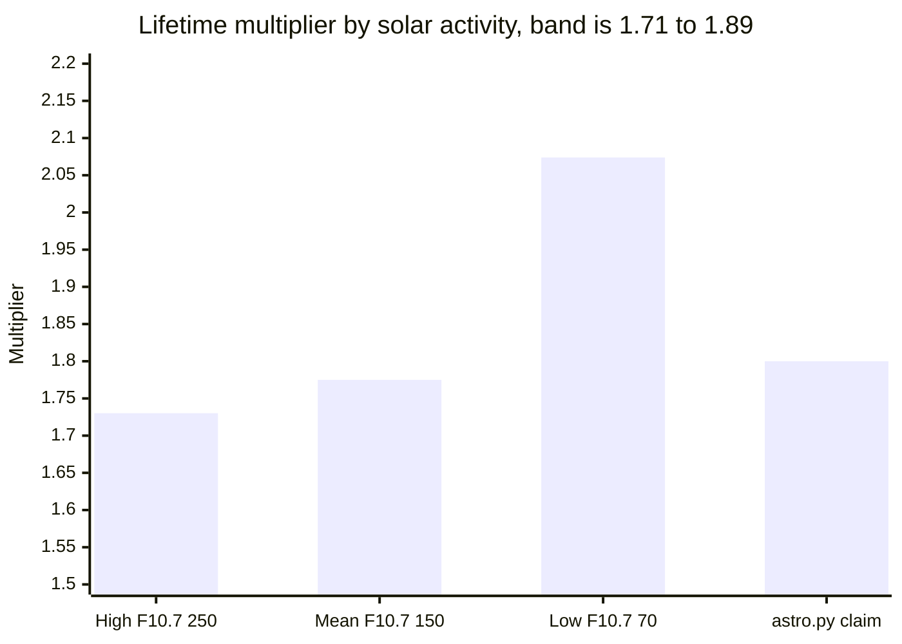

| Solar activity | Baseline | Boosted | Multiplier | vs x1.80 | Band ±5 % |
|---|---|---|---|---|---|
| High (F10.7 = 250) | 144.5 d | 250.0 d | **1.7302** | −3.88 % | pass |
| Mean (F10.7 = 150) | 429.9 d | 763.1 d | **1.7750** | −1.39 % | pass |
| **Low (F10.7 = 70)** | 2359.1 d | 4892.4 d | **2.0739** | **+15.21 %** | **FAIL** |

**Spread across the three: 18.48 %, against the ≤5 % invariance band declared before the
run. A5's verdict is `FAIL`.**

The point value is not what died here. At mean and high activity an independently
implemented force model, MSISE90, 20x20 gravity, lunisolar third bodies, SRP, RK89,
reproduces x1.80 to within 4 %. What died is the claim that the ratio is *invariant* across
solar activity, which is the property the paper's Limitations section nominates as "the
defensible result" and the abstract states outright.

### Why `astro.py` could never have found this

The reason the project believed the ratio was invariant is visible in one sweep. `astro.py`
models solar activity as a uniform multiplicative scale on density. Drive that scale over a
**40x range** and the multiplier does not move:

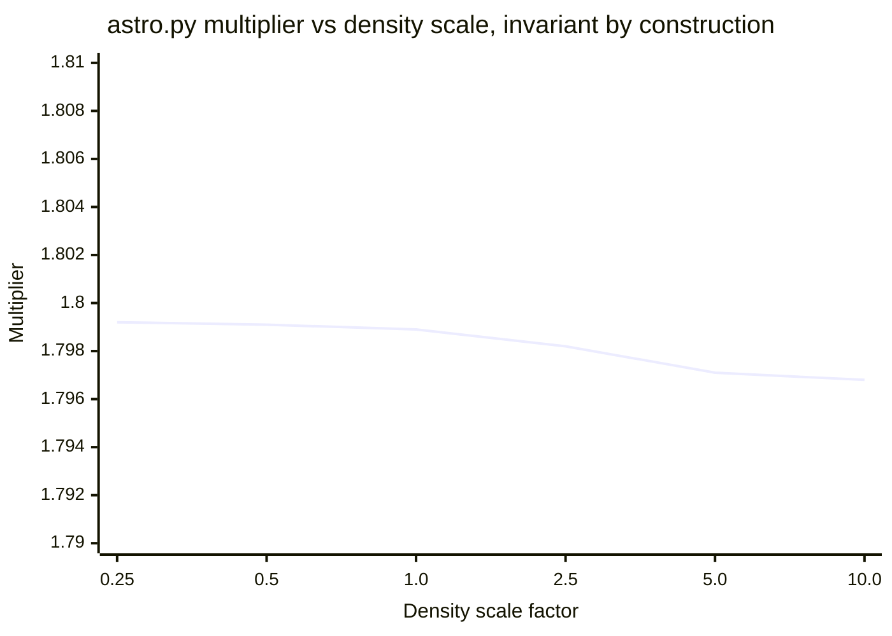

Constant to 0.1 % across a factor of forty. That is not a physical result, a uniform
density factor divides both lifetimes by the same number, so the ratio cancels. The model
cannot report anything else. MSIS instead changes the *shape* of the density, altitude
profile with F10.7, and because the boosted orbit's apogee sits some 37 km above the
baseline's, the two orbits sample that changed shape differently. The ratio then moves:
1.73 at high activity, 2.07 at low.

Reproducible from `analysis/astro.py` `lifetime()` with no edits to the script.

### What else did not agree

The absolute lifetimes, and **the error changes sign across the range**: GMAT is 2.5x
longer than `astro.py` at low activity, 9 % shorter at mean, 23 % shorter at high. E6
predicted absolute disagreement in advance; it did not predict a sign change, which is the
same profile-shape effect seen from the other side.

Verdict, force models, per-level numbers and run metadata:
[`validation/results/A5_astro.json`](../validation/results/A5_astro.json). Full write-up as
[`OPEN_PROBLEMS.md`](../OPEN_PROBLEMS.md) **P16**.

> **The parser earned its keep here.** Its first run read a decay file GMAT was still
> writing, took the partial decay as final, and produced a confident `FAIL`. It now refuses
> to report a multiplier unless the run actually reached the 120 km floor. A validation
> harness that reports a failure it cannot substantiate is worse than no harness.
