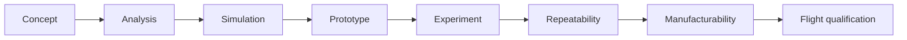

# Roadmap

> **The dates below are assumed, not fixed.** They are written against a standard Indian
> final-year calendar, thesis submission around **April, May 2027**, viva **May, June 2027**,
> placement season running from now. If your actual dates differ, correct this file first;
> everything downstream is sequenced from it.
>
> Last updated **2026-08-05**.

This project publishes its own defects; [`../OPEN_PROBLEMS.md`](../OPEN_PROBLEMS.md) carries the
register and its live count, derived by `tools/register_status.py` rather than restated here
([ADR-021](adr/021-freeze-the-register.md)). That is deliberate, and it only reads as rigour if
there is also a plan for closing them. This is that plan.

> **The register was frozen on 2026-08-10 and the priority changed with it.** Closing entries is
> no longer the top of this roadmap. **B-1 is** — it is the only available act that changes the
> project's category rather than its contents, from a design study with no measurements to one
> with a measured number. See [`B1_ORDER.md`](B1_ORDER.md), which is a purchase order rather than
> a procedure, and ADR-021 for why the emphasis moved.

---

## Where this stands today

| | |
|---|---|
| Maturity | TRL 2-3. Phase I analysis and committed Gen3 CAD complete; the Fusion Gen4 open assembly is provisional; **nothing built or measured** |
| Rated performance | **16.0 m/s at 10.1 g**, from a sled mass computed from CAD solid volumes, not estimated |
| Efficiency | **18.5 %** electrical-to-payload, net of the regeneration adopted 2026-07-31 (A11) |
| Validations run | **41 run sheets, A1 through A42** — A3 and A26 were never written; A21-R is a re-run *(updated 2026-08-16; this line read "24, A1 through A27" for six days, and before that read "10 of 12" for three weeks. It is a hand-maintained count in a repository that generates its other counts, which is why it keeps going stale)* |
| Of those | **three failed outright** — A5 (invariance), A13 (host attitude) and A40 (the fixed-orifice gas drive). Several missed individual bands, and **three times a declared band caught a bug in the analysis rather than the design** (A19, A20, A2) |
| External review | **35 questions answered or conceded** — [`REVIEW_RESPONSES.md`](REVIEW_RESPONSES.md). **20 answered, 14 partial or scoped, 1 open.** It produced **eight new register entries (E29–E35, P45)** — more than it found wrong |
| Biggest single gap | **Nothing has been measured at any scale** (E4). Unchanged, and **B-1 is still unordered** |
| Largest open defect | **P26** — the bank cannot source the shot on purchasable cells. **A25 found a flywheel clears the ceiling** at 35 mΩ against 68, at mass parity (P45) |
| Live correction held | **P46** — Kt is a centre-plane value and **4.42 % high** (10.5386 against 10.5386). v_exit would fall to **16.029 m/s**. **Baseline deliberately not changed** pending A2 band 4 |
| Reliability | **E30**: the design needs **r ≥ 0.99326** per element per cycle to beat a spring on delivered life. **r is unmeasured**, so the claim cannot yet be made |
| Paper | Source and PDF current as of 2026-08-10, 13 pages, zero undefined references |

---

## Next: by end of August 2026

**0. Establish the Gen4 finite-stator operating point.** *Closes P32 and E27; gates every
Gen4 export and public render.* The working open assembly uses a 900 mm acceleration stroke,
and the final 148.5 mm occurs after the Halbach array reaches the stator edge. Implement a
position-dependent force calculation before quoting velocity, energy, efficiency or thermal
loads for Gen4. Keep the Phase I baseline frozen until the result and affected validations are
classified. See [`GEN4_STATUS.md`](GEN4_STATUS.md) and ADR-019.

**1. ~~A1, the airgap field.~~ DONE 2026-07-29.** *Closed the 2-D half of E1; gave E2 its
first electromagnetic FEA.*
A meshed 2-D magnetostatic FEM (scikit-fem P1 + gmsh, 141 k elements) gives
**Kt = 11.026 N per kA/m against 11.03 (ratio 0.9997**) with ripple 0.97 %
against 0.99 %. FEMM was not needed; a differential-FEM solve is what E2 actually asked for.
Two of seven bands missed, both with causes identified and **neither a model error**: P20 (the
run sheet's array-surface reference was mis-specified, against the correct double-sided value
the FEM matches to 0.06 %) and P21 (2-D has infinite depth and cannot test far field).
**What is now the top gap: nothing has been measured at any scale.**

**2. ~~Re-run A8.~~ DONE 2026-07-30 as A8-R.** *Closed half of P19.*
Re-run at the current operating point with bands re-declared first. It failed its
energy-closure band at 97.0 %, and the missing term was **bank ESR**, which the circuit deck
carried and no analysis script did. That became **P24**, and chasing it produced **P26**.

**3. Answer the rib-stiffened chassis question.** *Closes P5, P8, E2 properly.*
A4 says the drawn plate passes with a 17x stress margin, so mass can come out, but nobody
has designed the lighter chassis, which makes the 60 % pocketing row in
`docs/DESIGN_OPTIONS_exit_velocity.md` unsupported. Until this is settled, re-running A5
just banks another stale result.

## Then: September to November 2026

**4. A7, separation and tip-off.** *Closes E7; gates the momentum-transfer option.*
Retry `pychrono` from conda-forge (it is not on PyPI, which is the likely cause of the
"not installable" note). **Check the acceptance band against its source first**, the run
sheet declares ≤5 °/s citing NRCSD-E, and the sibling NRCSD ICD says 2 °/s.

**5. ~~Cost the momentum-transfer release properly.~~ DONE 2026-07-31.** *Attacks P8 from a
new direction.* Re-modelled against the current draw and with regeneration applied to the
recoiling sled: the two **compound** rather than compete, taking efficiency **21.0 to 31.8 %**
and brake duty **1268 to 687 J**, for 45.1 J of spring energy and 46 mm of guided rail. It
still defers as **PII-1**, and `docs/DESIGN_OPTIONS_exit_velocity.md` now states why the risk
is not comparable to regeneration's: this one adds a cocked spring to the release path and its
failure mode is a tumbling customer satellite.

**6. ~~Close P17.~~ DONE 2026-07-31 as A12.** Bands and an adoption rule declared in advance,
then a **second independent method** — a surface Maxwell-stress integral against magpylib's
volume integral — agreeing to 2.2 %. `sizing.py` adopted 2686.6 N: attraction 3.68 to
**2.69 kN**, plate stress 33 to **24 MPa**. A4 is not re-run; it was loaded 37 % heavy and is
therefore conservative. A12 also found that **P17's explanation of its own finding was
backwards**, and the retention gate never depended on it.

## Then: December 2026 to February 2027

**7. Re-run A5** once the mass is settled, at the current operating point. Days of wall
time for the low-activity leg; schedule it, do not babysit it.

**8. ~~A6, conjunction Pc.~~ RUN 2026-07-31 in reduced form; **P1 stays open**.*
No GMAT, no CARA, no Space-Track, so a 2-D Pc against `astro.py`'s own propagator
with an assumed covariance. **Three of five bands came back void**: at 14 to 63 km miss
distances Pc underflows and a spread of zeros is not a number. The run found
a corrected result instead — the old 3.7e-8 value is only a fixed-shape sensitivity. A covariance-independent slab bound is **4.4e-5 at the campaign-minimum geometry**, below any
action threshold. A bound is not a probability, so A6-as-specified still stands.

**9. Run A9, decay against flown CubeSats.** `validation/A9_tle_decay.md`, bands already
declared, script already written (`validation/tle/fit_decay.py`). Needs only a machine with
ordinary internet and a free Space-Track account, it is blocked here by network policy, not
by difficulty. **This is the only analysis specified anywhere that compares the model against
something that happened** rather than against another model.

**10. Replace the modelled comparator with flown data.** Foster et al.'s differential-drag
results for Planet Labs are open-access (arXiv 1806.01218, 1509.03270). The cheapest
credibility improvement available: one modelled number becomes one measured number.

## Before submission: March to April 2027

**11. ~~Rebuild the paper~~**: done 2026-07-29; TeX Live installed and the PDF now matches source.
**12. Final consistency sweep**: every number in every document against
`analysis/results/*.json`, the way the 173-value reproduction check was run against what is now a 611-field set.
**13. Thesis document** assembled from the paper, the CAD record and the validation
history.

---

## Where this sits in the validation chain

Dossier §7 defines the chain every feature must have a path along:

| Rung | Status |
|---|---|
| Concept | complete, `docs/adr/`, `DECISION_LOG.md` |
| Analysis | complete, `analysis/`, **611 result fields** across eight scripts |
| **Simulation** | **where the project is.** **9 of 11** validations run, A5 and the ngspice A8 run now predate the 2026-08-03 quadrature correction; A1 and A10--A13 were propagated |
| Prototype | **specified, none built**: `docs/BENCHTOP_TESTS.md` |
| Experiment | specified, none run |
| Repeatability | **no rung yet.** Nothing has been run twice by anyone |
| Manufacturability | **opened 2026-07-29**: `docs/MANUFACTURING.md`, analysis about manufacturing rather than manufacturing evidence |
| Flight qualification | specified, none run, `docs/QUALIFICATION_PLAN.md` |

**The honest reading:** the project is one rung along a chain of eight, and the two rungs after
it need money and a bench rather than more analysis. B-1, a Halbach pair on a gaussmeter,
is the cheapest step onto the next rung and would be the project's first measured number at
any scale.

## What is deliberately not on this list

**Hardware.** E4 records that nothing has been built. That has not changed, but as of
2026-07-29 the protocol exists: `docs/BENCHTOP_TESTS.md` specifies four sub-scale experiments
with bands declared in advance, and `docs/QUALIFICATION_PLAN.md` specifies the full campaign.
**B-1 (a Halbach pair on a gaussmeter) costs roughly the price of two magnets and is the
single highest-value thing anyone could do to this project.** It is listed here rather than in
the dated sequence above because it depends on a budget and a bench, not on a date.

**Anything that would move a number without an analysis behind it.** The standing rule holds:
record the discrepancy, run the analysis, propagate once.
