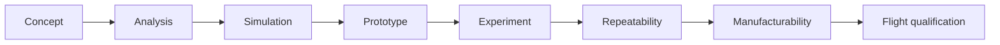

# Roadmap

> **The dates below are assumed, not fixed.** They are written against a standard Indian
> final-year calendar, thesis submission around **April, May 2027**, viva **May, June 2027**,
> placement season running from now. If your actual dates differ, correct this file first;
> everything downstream is sequenced from it.
>
> Last updated **2026-07-29**.

This project publishes its own defects, twenty-seven numbered problems and twenty-four open
engineering items. That is deliberate, and it only reads as rigour if there is also a plan
for closing them. This is that plan.

---

## Where this stands today

| | |
|---|---|
| Maturity | TRL 2-3. Analysis and CAD complete; nothing built or measured |
| Rated performance | **16.5 m/s at 10.7 g**, from a sled mass measured in CAD, not estimated |
| Validations run | **4 of 9**: A1 and A8 are at the current operating point; A5 still predates it (P19) |
| Biggest single gap | ~~Kt single-method~~ **closed 2026-07-29 by A1** (FEM agrees to 0.07 %). Now: nothing has been measured at any scale (E4) |
| Paper | Source and PDF both current as of 2026-07-29, rebuilt, 10 pages, zero undefined references |

---

## Next: by end of August 2026

**1. ~~A1, the airgap field.~~ DONE 2026-07-29.** *Closed the 2-D half of E1; gave E2 its
first electromagnetic FEA.*
A meshed 2-D magnetostatic FEM (scikit-fem P1 + gmsh, 141 k elements) gives
**Kt = 11.228 N per kA/m against 11.22 (ratio 1.0007**) with ripple 1.25 %
against 1.26 %. FEMM was not needed; a differential-FEM solve is what E2 actually asked for.
Two of seven bands missed, both with causes identified and **neither a model error**: P20 (the
run sheet's array-surface reference was mis-specified, against the correct double-sided value
the FEM matches to 0.06 %) and P21 (2-D has infinite depth and cannot test far field).
**What is now the top gap: nothing has been measured at any scale.**

**2. Re-run A8.** *Closes half of P19.*
Minutes of work, `validation/spice/emocd_shot.cir` needs its `.param` line moved to the
current operating point. Re-read the declared bands **before** running, not after.

**3. Answer the rib-stiffened chassis question.** *Closes P5, P8, E2 properly.*
A4 says the drawn plate passes with a 17x stress margin, so mass can come out, but nobody
has designed the lighter chassis, which makes the 60 % pocketing row in
`docs/DESIGN_OPTIONS_exit_velocity.md` unsupported. Until this is settled, re-running A5
just banks another stale result.

## Then: September to November 2026

**4. A7, separation and tip-off.** *Closes E7; gates the momentum-transfer option.*
Retry `pychrono` from conda-forge (it is not on PyPI, which is the likely cause of the
"not installable" note). **Check the acceptance band against its source first**, the run
sheet declares ≤5 °/s citing NRCSD-E, and the sibling NRCSD ICD says 2 °/s.

**5. Cost the momentum-transfer release properly.** *Attacks P8 from a new direction.*
`docs/DESIGN_OPTIONS_exit_velocity.md` shows it recovers the full velocity shortfall for
41.8 J against a 2630 J shot, and for 43 mm of guided rail against the 673 mm that
lengthening the stroke would need. It needs a mechanism design and A7 behind it. This is
the most promising unexplored direction in the project.

**6. Close P17.** Write the run sheet with a band declared **in advance**, then propagate
`sizing.py` once, the corrected attraction moves plate stress, retention-gate sizing and
the A4 load together.

## Then: December 2026 to February 2027

**7. Re-run A5** once the mass is settled, at the current operating point. Days of wall
time for the low-activity leg; schedule it, do not babysit it.

**8. A6, conjunction Pc.** ~50 lines of scipy against the OEM ephemerides
`validation/gmat/` already emits. E18's covariance problem stands regardless, so state the
assumption rather than pretending to a covariance that does not exist.

**9. Run A9, decay against flown CubeSats.** `validation/A9_tle_decay.md`, bands already
declared, script already written (`validation/tle/fit_decay.py`). Needs only a machine with
ordinary internet and a free Space-Track account, it is blocked here by network policy, not
by difficulty. **This is the only analysis specified anywhere that compares the model against
something that happened** rather than against another model.

**10. Replace the modelled comparator with flown data.** Foster et al.'s differential-drag
results for Planet Labs are open-access (arXiv 1806.01218, 1509.03270). The cheapest
credibility improvement available: one modelled number becomes one measured number.

## Before submission: March to April 2027

**11. ~~Rebuild the paper~~**: done 2026-07-29; TeX Live installed and the PDF now matches source.
**12. Final consistency sweep**: every number in every document against
`analysis/results/*.json`, the way the 173-value reproduction check was run.
**13. Thesis document** assembled from the paper, the CAD record and the validation
history.

---

## Where this sits in the validation chain

Dossier §7 defines the chain every feature must have a path along:

| Rung | Status |
|---|---|
| Concept | complete, `docs/adr/`, `DECISION_LOG.md` |
| Analysis | complete, `analysis/`, 179 result fields |
| **Simulation** | **where the project is.** 3 of 9 validations run, all predating the current operating point (P19) |
| Prototype | **specified, none built**: `docs/BENCHTOP_TESTS.md` |
| Experiment | specified, none run |
| Repeatability | **no rung yet.** Nothing has been run twice by anyone |
| Manufacturability | **opened 2026-07-29**: `docs/MANUFACTURING.md`, analysis about manufacturing rather than manufacturing evidence |
| Flight qualification | specified, none run, `docs/QUALIFICATION_PLAN.md` |

**The honest reading:** the project is one rung along a chain of eight, and the two rungs after
it need money and a bench rather than more analysis. B-1, a Halbach pair on a gaussmeter,
is the cheapest step onto the next rung and would be the project's first measured number at
any scale.

## What is deliberately not on this list

**Hardware.** E4 records that nothing has been built. That has not changed, but as of
2026-07-29 the protocol exists: `docs/BENCHTOP_TESTS.md` specifies four sub-scale experiments
with bands declared in advance, and `docs/QUALIFICATION_PLAN.md` specifies the full campaign.
**B-1 (a Halbach pair on a gaussmeter) costs roughly the price of two magnets and is the
single highest-value thing anyone could do to this project.** It is listed here rather than in
the dated sequence above because it depends on a budget and a bench, not on a date.

**Anything that would move a number without an analysis behind it.** The standing rule holds:
record the discrepancy, run the analysis, propagate once.
