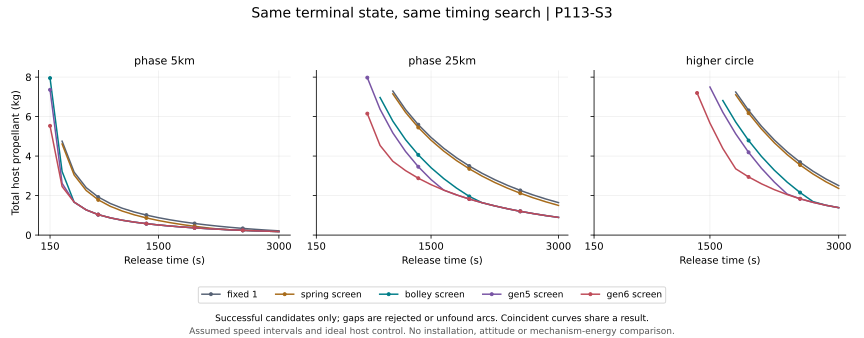

# Terminal-state delivery and release timing

Generated by `analysis/terminal_timing.py`. Do not hand-edit.

**P113/E5 remain open. Best tested timing is not a global optimum or selected mechanism.**

One 4 kg payload must reach a prescribed circular-orbit position AND velocity at 3600 s.
All five hypothetical speed screens receive the same host controls, target states and
release-time grid. The host can burn at time zero and immediately before release.
Transfer arcs come from a bounded seed search; failed searches do not prove infeasibility.

[Criteria](../validation/P113_S3_terminal_timing.md) ·
[All searches and events](../analysis/results/terminal_timing.json) ·
[Programme decisions](PROGRAMME_EXECUTION.md)



## Best accepted point on each timing grid

300 kg assumed dry host including equal placeholder installation, 10 kg fuel,
2 kg reserve, 220 s Isp. No mechanism energy, slew or settling penalty is charged.
Every speed range is hypothetical, including the 0.5 m/s lower limit.

| Target | Screen | Coarse fuel, kg | Fine fuel, kg | Fine release, s | Status |
|---|---|---:|---:|---:|---|
| phase_5km | fixed_1 | 0.21507 | 0.21507 | 3000 | BEST_TESTED |
| phase_5km | spring_screen | 0.17936 | 0.17936 | 3000 | BEST_TESTED |
| phase_5km | bolley_screen | 0.17936 | 0.17936 | 3000 | BEST_TESTED |
| phase_5km | gen5_screen | 0.17936 | 0.17936 | 3000 | BEST_TESTED |
| phase_5km | gen6_screen | 0.17936 | 0.17936 | 3000 | BEST_TESTED |
| phase_25km | fixed_1 | 1.64452 | 1.64452 | 3000 | BEST_TESTED |
| phase_25km | spring_screen | 1.50156 | 1.50156 | 3000 | BEST_TESTED |
| phase_25km | bolley_screen | 0.89498 | 0.89498 | 3000 | BEST_TESTED |
| phase_25km | gen5_screen | 0.89498 | 0.89498 | 3000 | BEST_TESTED |
| phase_25km | gen6_screen | 0.89498 | 0.89498 | 3000 | BEST_TESTED |
| higher_circle | fixed_1 | 2.50452 | 2.50452 | 3000 | BEST_TESTED |
| higher_circle | spring_screen | 2.36196 | 2.36196 | 3000 | BEST_TESTED |
| higher_circle | bolley_screen | 1.38908 | 1.38908 | 3000 | BEST_TESTED |
| higher_circle | gen5_screen | 1.38908 | 1.38908 | 3000 | BEST_TESTED |
| higher_circle | gen6_screen | 1.38908 | 1.38908 | 3000 | BEST_TESTED |

The two phase targets are 5 km and 25 km ahead along the 450 km reference circle.
The higher-circle target is 460 km at the unperturbed host terminal angle.
Out-of-plane position/velocity are identically zero. This is not plane-change capability.

## Interpretation limits

Unlike the preceding energy-only screen, accepted payloads meet both Cartesian
position and velocity bands at the same epoch. This does not establish an operational
rendezvous, clearance, collision avoidance, or compatibility with an actual launcher.
The timing search and initial host burn are available to every comparator.

The fine grid contains the entire coarse grid. An equal best value establishes no
continuous-time convergence. A best point at 3000 s is on the search boundary,
not a bracketed optimum. Missing branches, narrow feasible windows, finite burns
and different manoeuvre schedules may change the answer. No reliability, installed
mass advantage, multi-payload optimum or flight readiness follows from fuel alone.

## Next decision

Use these terminal-state requirements to define a bounded multi-payload scheduling
problem, then add navigation/release uncertainty, attitude recovery, installed mass
and independent-bank versus common-path failure exposure. Keep conventional controls.

## Reproduce

```bash
python3 analysis/terminal_timing.py
python3 analysis/terminal_timing.py --check
python3 -m pytest tests/test_terminal_timing.py
```
