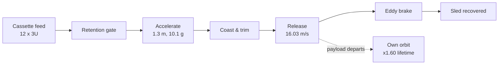
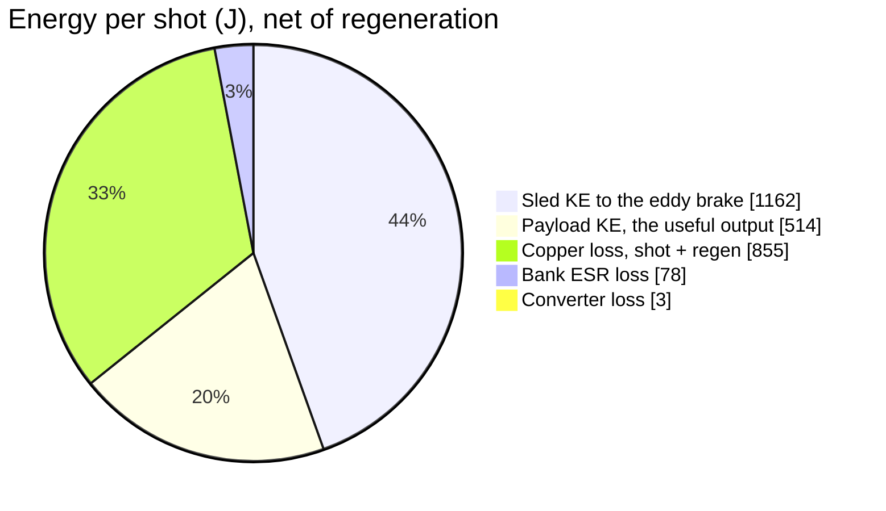
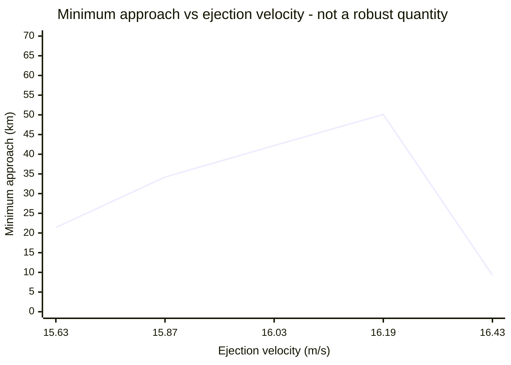

# VOLLEY: an electromagnetic orbital CubeSat deployer

Wiki landing page. Source of truth stays in the repository:
[aaaaaaaaaaaavm/VOLLEY](https://github.com/aaaaaaaaaaaavm/VOLLEY). This page summarises
what exists and points at it; when the two disagree, the repository is right.

**Read [`PROVENANCE.md`](https://github.com/aaaaaaaaaaaavm/VOLLEY/blob/main/docs/PROVENANCE.md)
before citing anything here.** Every quantity on this page is a model output. None of it
has been measured, tested, or reviewed by a third party.

<p align="center">
  
</p>

---

## What it is

CubeSats flown as rideshare secondaries inherit the primary customer's orbit. The spring
that ejects them adds 1-2 m/s, enough to drift clear of the stage, not enough to change
an orbit. A satellite with no propulsion of its own stays there for life.

VOLLEY replaces the spring with an ironless double-sided Halbach linear synchronous motor
driving a reusable magnetic sled along a 1.5 m track. Twelve 3U CubeSats feed from two
transverse cassettes and fire one at a time. The customer satellite is never modified,
the magnets ride the sled, not the payload.

The target regime is the gap between spring deployers (~2 m/s) and propulsive orbital
transfer vehicles (hundreds of m/s).

### The design target moved on 2026-08-14

Everything on this page describes **Gen5**, which is the measured baseline and the record of what
a self-contained deployer costs.
[ADR-032](https://github.com/aaaaaaaaaaaavm/VOLLEY/blob/main/docs/adr/032-gen6-stage-integrated-gas-store.md)
set a different target: **the payload accelerated directly, by cold gas, along a rail a spent
upper stage provides.** No mover, no pulse-power chain, no brake, no return stroke.

| | Gen5 | Gen6 |
|---|---|---|
| What moves | 9.445 kg sled + payload | **payload only** |
| Energy | supercapacitor bank, ~17 kW for 162 ms | **one 1.71 L gas bottle for twelve shots** |
| Structure | 126.6 kg of deployer | **the spent stage** |
| Added hardware | — | **11.45 kg containment + ~3 kg store** |

Five runs built it, and none set out to: **A35** attributed every kilogram to the requirement
causing it and found **88.67 kg survives every requirement deletion in all 64 corners** — 70.06 %
of dry mass, 7.39 kg per satellite against a 2.0 kg criterion (**P95**: A35's own run sheet still
prints the pre-A46 49.23 kg); **A36**
closed the manifest route; **A37** made the stage the machine; **A38** showed tip-off does not
bind; **A39** replaced the spring with gas.

**Nothing in Gen6 is measured.** Its fluid system is unsized, its cradle mechanism does not exist,
and no launch provider has agreed to lend a stage — which is why the manuscript and this page
still describe Gen5.

<table>
<tr>
<td width="50%"><br><sub><b>Interior.</b> Track, stator, sled, cassette. The payload leaves along the track axis.</sub></td>
<td width="50%"><br><sub><b>ESPA interface.</b> Ring flange, 24 bolt holes. The payload departs <b>away from</b> the flange.</sub></td>
</tr>
<tr>
<td width="50%"><br><sub><b>Track and stator.</b> Side elevation, breech to muzzle.</sub></td>
<td width="50%"><br><sub><b>Braking.</b> Payload gone; the sled runs on into the eddy brake.</sub></td>
</tr>
<tr>
<td width="50%"><br><sub><b>Sled.</b> Reusable. The magnets never leave the machine.</sub></td>
<td width="50%"><br><sub><b>Exploded.</b> The nine documents. Gen3, the one shot Gen4 has no equivalent of.</sub></td>
</tr>
</table>

<sub>Gen4 Fusion renders, replacing a Gen3 set whose firing-sequence frames showed the payload
leaving <b>through</b> the ESPA flange (P43). <b>Gen4 has no committed STEP export</b> and its
stations are not the analysis model's — it releases at s = 1200 mm where the analysis assumes
1500 mm — so no number on this page comes from Gen4. See
<a href="https://github.com/aaaaaaaaaaaavm/VOLLEY/blob/main/docs/GEN4_STATUS.md">GEN4_STATUS.md</a>.
The payload is a rectangular 3U proxy, not a modelled satellite.</sub>

Spin the geometry in the browser:
[`cad/stl/EMOCD_Assembly_Gen3.stl`](https://github.com/aaaaaaaaaaaavm/VOLLEY/blob/main/cad/stl/EMOCD_Assembly_Gen3.stl)
GitHub renders STL natively. Derived meshes; `cad/step/gen3/` is the master geometry.

## How a shot works



## Maturity

| | |
|---|---|
| TRL | 2-3 |
| Analysis | 68 Python scripts, reproducible, outputs committed as JSON |
| Validation | 65 run sheets, A1–A65, each with its acceptance bands declared **before** its script existed |
| Register | 131 numbered entries, 53 live, including the ones that damage the work's own claims |
| CAD | script-built from `cad/parameters.json`, **Gen6 current**, STEP and STL committed ([`cad/`](https://github.com/aaaaaaaaaaaavm/VOLLEY/tree/main/cad)) |
| FEA | magnetostatic 2-D (A1) and 3-D (A2), structural (A4), CFD (A29) |
| Hardware | **none. Nothing here has been built, fired or measured** |
| Independent review | none |

## Headline results

All figures are script outputs, not measurements.

| Quantity | Value | Script |
|---|---|---|
| Thrust constant | 10.54 N per kA/m, ±1.01 % ripple | `motor_model.py` |
| Exit velocity, 3U | **16.03 m/s at 10.1 g** | `motor_model.py` |
| Electrical to payload efficiency | 18.5 % (2.74 kJ net of regeneration, 514 J delivered) | `motor_model.py` |
| Closed-loop dispersion | 0.0274 m/s (3σ) at a 15.8 m/s setpoint to ±0.10 km apogee | `motor_model.py` |
| Orbital lifetime multiplier | x1.60 at mean activity, **not invariant, see P16** | `astro.py` |
| Semi-major axis change | **+28.8 km**; 0 m by release timing at any cadence | `astro.py`, A21-R |
| 30° of in-track phase | **468 s of waiting** — free, and not a VOLLEY claim (**P56**) | `comparators.py`, A21-R |
| Dry / loaded mass | 126.6 kg / 174.6 kg | `mass_properties.py` |
| Recoil per shot | 64.1 N·s | `astro.py` |
| Track first mode | 109 Hz fixed-fixed (target >70) | `sizing.py` |
| Energy closure | 100.0 % accounted | `sizing.py` |

Payload family (`motor_model.py`): 1U 18.5 m/s at 13.4 g · 3U 16.0 m/s at 10.1 g ·
6U 14.5 m/s at 8.3 g · 12U 13.1 m/s at 6.7 g. The 6U and 12U cases are force-limited
consequences of the 3U design, not designed variants (see E9).

> **These numbers moved down on 2026-07-29.** The headline was 20.37 m/s at 16.3 g against
> a 4.86 kg parametric sled; exact solid volumes from the Gen3 CAD give **9.445 kg** (P15).
> The consequence of each mass band was declared in `validation/A4_sled_structural.md`
> **before** the structural analysis ran, and the CAD result landed in the ≥ 6.80 kg
> branch, "the headline changes and the paper changes materially". A4 has since run and
> the drawn plate passes all three bands, so nothing forces a lighter chassis. Scripts moved
> first, then the paper. 9.445 kg is the as-drawn, unpocketed geometry and A4 reports a 17x
> stress margin, so a rib-stiffened redesign would recover mass; nobody has designed one.

Three results have independent cross-checks: the Halbach airgap field (analytic wave model
vs magpylib to three digits, and again vs a meshed magnetostatic FEM agreeing on the thrust
constant to 0.03 %), orbital decay (orbit-averaged Gauss vs Cowell RK4, 99.4 %), and the
pulse chain (analytic vs ngspice, agreeing on peak current to 0.01 % once the bank's series
resistance was modelled, which is a correction ngspice itself forced: P24). Everything else
is single-sourced and correspondingly weaker.

## Charts





**Read the chart above as the caption says.** A 2.5 % change in ejection velocity moves the
minimum approach from 42.2 km to 9.3 km, which is why this project quotes the **phase realignment
period** as the robust quantity and treats the minimum as a near-resonant beat sample. Recomputed
2026-08-14 at the corrected operating point; it previously plotted a velocity regime three
corrections out of date.

Full set, including the GMAT cross-check, in
[`RESULTS.md`](https://github.com/aaaaaaaaaaaavm/VOLLEY/blob/main/docs/RESULTS.md).

## Design decisions that are locked

These were argued out and should not be silently reopened; reasoning is in
[`docs/DECISION_LOG.md`](https://github.com/aaaaaaaaaaaavm/VOLLEY/blob/main/docs/DECISION_LOG.md).

> **Most of this list is Gen5's, and ADR-032 deleted the subsystems it locks.** On 2026-08-14 the
> design target became **the payload accelerated directly by cold gas along a rail a spent upper
> stage provides** — no mover, no stator, no capacitor bank, no brake, no return stroke. *The
> decisions below were correct for the machine they were made for, and that machine is now Gen5.*
>
> **What survives into Gen6:** the payload g-limit argument, the magazine and its cassettes, the
> retention gate, and the product framing — orbit change rather than phase spacing.
>
> **What Gen6 added and has not settled:** a trim stator at the muzzle
> ([ADR-033](https://github.com/aaaaaaaaaaaavm/VOLLEY/blob/main/docs/adr/033-gen6-trim-stage.md)),
> **suspended on 2026-08-20** by
> [ADR-036](https://github.com/aaaaaaaaaaaavm/VOLLEY/blob/main/docs/adr/036-seal-specification-and-the-trim-stage.md)
> because a seal meeting its own thermal requirement makes it unnecessary — **17.8 N, and P67 has
> never measured it.**

- **Linear synchronous motor, not a coilgun.** The payload's own g-limit caps exit
  velocity near 26-35 m/s whatever the launcher, which erases the coilgun's only
  advantage while keeping its costs: an armature bolted to the customer satellite,
  microsecond pulse timing, and no abort path. **Efficiency is not one of the costs.**
  That argument was made here on a single-stage figure and withdrawn as false; a
  multi-stage coilgun reports 14.9-19.9 %, comparable to this design. See P22.
- **Ironless double-sided Halbach stator**, reusable sled carrying the magnets.
- **Eddy-current brake for arrest.** Motor regeneration alone cannot stop the sled,
  braking force is bounded by the same thrust constant as acceleration.
- **Most of the sled's kinetic energy is dissipated; 23 % of it is recovered.** 240 mm of
  stator downstream of release returns 291 J of the sled's 1268 J to the bank, and the brake
  takes the other 935 J. The 18.5 % figure is electrical-to-payload net of that. This page
  said "not recovered" until 2026-07-31, which was wider than the decision it rested on.
- **No CMGs or thrusters in attached mode**; the host stage absorbs recoil.
- **Two transverse cassettes of six**, alternating feed to keep the centre of mass
  symmetric.
- **Retention gate carries ascent preload straight into structure**, bypassing the
  release mechanism, this is the NanoRacks ball-lock lesson, and it is deliberate.
- **The product is orbit change, not phase spacing.** Satellites released at different times from
  the same host reach different true anomalies **in the same orbit** for no velocity at all — at
  450 km, **30° costs 468 seconds of waiting**. A spring and a clock do phase spacing, and do it
  better, because timing sets an offset that holds while a differential sets a drift a
  propulsion-less satellite cannot null. **What no clock can imitate is +28.8 km of semi-major
  axis and ×1.60 of orbital life.** This page claimed the opposite until 2026-08-14; it is logged
  as **P56**.

## Repository map

| Path | Contents |
|---|---|
| [`analysis/`](https://github.com/aaaaaaaaaaaavm/VOLLEY/tree/main/analysis) | current scripts; these reproduce the numbers above |
| `analysis/femm/` | magnetostatics package: cross-section DXF + run sheet (A1, run 2026-07-29) |
| `analysis/results/` | script outputs as JSON |
| `cad/stl/` | browser-viewable meshes derived from the Gen3 STEP files |
| [`cad/`](https://github.com/aaaaaaaaaaaavm/VOLLEY/tree/main/cad) | `parameters.json` (geometry source of truth), `step/gen1\|gen2\|gen3/` exports (Gen3 current), `renders/`, `CHANGELOG_CAD.md` |
| [`figures/`](https://github.com/aaaaaaaaaaaavm/VOLLEY/tree/main/figures) | every result figure, regenerated from `analysis/` by `tools/make_figures.py` |
| [VOLLEY-paper](https://github.com/aaaaaaaaaaaavm/VOLLEY-paper) | the IEEE manuscript: LaTeX source, PDF, reproducibility package. **No LaTeX lives in this repository** |
| [`legacy/`](https://github.com/aaaaaaaaaaaavm/VOLLEY/tree/main/legacy) | superseded scripts, kept for history, **do not cite** |
| [`docs/`](https://github.com/aaaaaaaaaaaavm/VOLLEY/tree/main/docs) | computation notes C1, C10, FEMM run sheet, decision log, related work |
| [`validation/`](https://github.com/aaaaaaaaaaaavm/VOLLEY/tree/main/validation) | cross-check plan (FEMM, CalculiX, Orekit, CARA, Chrono) with acceptance bands declared before the runs; nothing run yet |
| [`INVENTORY.md`](https://github.com/aaaaaaaaaaaavm/VOLLEY/blob/main/docs/INVENTORY.md) | indexed catalogue of every calculation, decision, and artifact |
| [`OPEN_PROBLEMS.md`](https://github.com/aaaaaaaaaaaavm/VOLLEY/blob/main/OPEN_PROBLEMS.md) | known paper errors and unsolved engineering |
| [`CHANGELOG.md`](https://github.com/aaaaaaaaaaaavm/VOLLEY/blob/main/CHANGELOG.md) | what changed, when, and why |

## Reproducing the numbers

```bash
pip install -r requirements.txt
cd analysis
python3 verify_field.py       # ~10 s   magpylib cross-check of the airgap field
python3 mass_properties.py    # instant parametric mass rollup
python3 motor_model.py        # ~2 min  Kt, shot sim, 800-run closed-loop Monte Carlo
python3 sizing.py             # instant mechanical, thermal, electrical margins
python3 astro.py              # ~10 min decay integrations, 30-day propagations
```

Results land in `analysis/results/*.json`. Order matters: `mass_properties.py` produces
the 4.86 kg sled mass that `motor_model.py` hard-codes as `M_SLED`. Change the mass model
and you must update that constant, re-run the motor model, then update the paper.

## Known errors and open work

The paper once carried four numbers its own scripts did not reproduce, conjunction
minimum, peak current, far-field stray values, and brake fin temperature rise. All four
were found by rebuilding the analysis from scratch and were corrected in `paper.tex` on
2026-07-23; the conjunction claim was also reframed, because that minimum turns out to be
a near-resonant beat sample rather than a design property (a ±2.5 % velocity change moves
it by an order of magnitude). The defects stay documented as P1, P4 for the audit trail.

Open items now, in rough order of how much they move the design:

- **P5 / P8**: CAD sled mass contradicts the parametric assumption; exit velocity
  provisionally 17.88 m/s pending structural FEA.
- **P9**: closed envelope exceeds the ESPA Grande class limit by roughly 44 %; the host
  claim must be re-scoped or the machine repackaged.
- **P10**: enclosure, radiator, and packaged avionics are missing from the mass rollup.
- **P11**: the archived build in `paper/archive/` still carries the uncorrected P1, P4
  values; whether that is the version that was submitted is unconfirmed.
- **P12**: the paper claims an ESPA-Grande-class envelope, which the CAD contradicts by
  ~44 %, and its limitations section still says masses are not from detailed CAD.
- **E1**: three-dimensional field closure; the winding is resolved in 2-D, so end
  effects of a few percent on Kt are uncomputed. The FEMM package (A1) is written but
  has not been run.
- **E2 / E4**: no FEA of anything, no hardware at any level.
- **E14**: disclosure has already happened; the patent position needs settling or
  closing out.

Full list with detail: [`OPEN_PROBLEMS.md`](https://github.com/aaaaaaaaaaaavm/VOLLEY/blob/main/OPEN_PROBLEMS.md).

## How to read the verification status

Nothing in this project has been validated by hardware, FEA, or third-party review, and
no number has been hand-checked against a second method except the two cross-checks noted
above. `INVENTORY.md` indexes every calculation and where it now lives; `PROVENANCE.md`
states plainly what stands behind each claim. Anything added here should carry the same
distinction, and a computed number must never be presented as a measured one.

## Citing

Citation metadata is in
[`CITATION.cff`](https://github.com/aaaaaaaaaaaavm/VOLLEY/blob/main/CITATION.cff). The
paper is *VOLLEY: A Linear-Motor Electromagnetic Deployment System for Deterministic
CubeSat Orbit Seeding from Small Launch Vehicles*. Licence: MIT.

## Author

Adityavardhan Mishra, Department of Mechanical Engineering, Symbiosis Institute of
Technology, Symbiosis International (Deemed University), Pune. Project begun April 2021.
